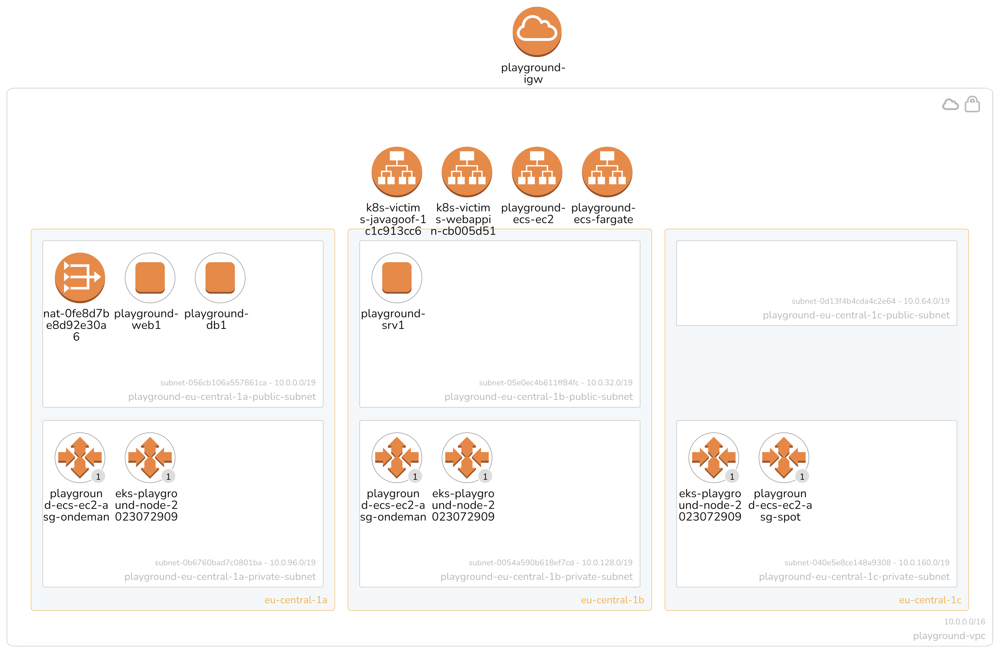

# Playground

Ultra fast and slim playground in the clouds designed for educational and demoing purposes.

In a nutshell:

- Bootstrapping directly from the clouds. It will attempt to upgrade already installed tools to the latest available version.  

  ```sh
  curl -fsSL https://raw.githubusercontent.com/mawinkler/playground-one/main/bin/pgo | bash && exit
  ```

- Management of the environment with the help of an easy to use command line interface `pgo`.
- Based on Terraform >1.5

The Playground One has a modular structure as shown in the following tree:

```
awsone
├── vpc
│   ├── ec2
│   ├── eks
│   |   └── eks-deployments
│   └── ecs
```

As we can see, the configuration `vpc` is the base for the other configurations. One can choose to only create the EC2 instances, EKS cluster or ECS cluster, or even the full stack. Everything will reside in the same VPC.

*Architecture:*



***Documentation***

Full documentation: ***[Playground Pages](https://mawinkler.github.io/playground-pages/)***
