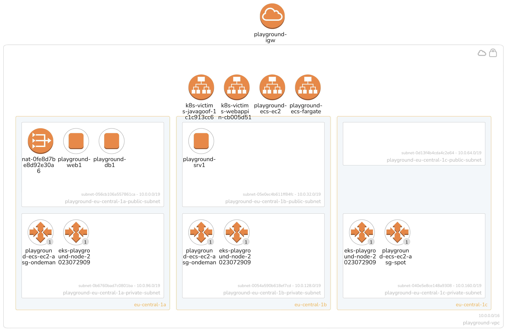
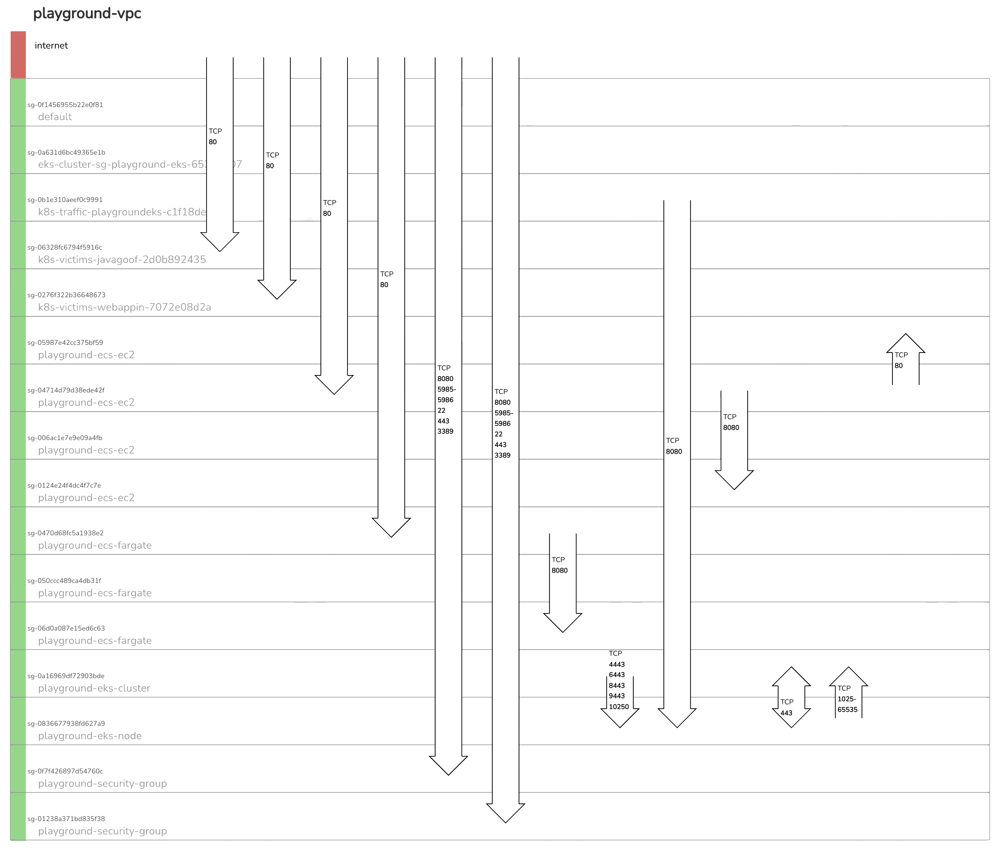

# Playground One Configurations

The Playground One has a modular structure as shown in the following tree:

```
awsone
├── vpc (2-network)
│   ├── ec2 (3-instances)
│   ├── eks (4-cluster-eks)
│   |   └── eks-deployments (8-cluster-eks-deployments)
│   └── ecs (5-cluster-ecs)
```

As we can see, the configuration `vpc` is the base for the other configurations. One can choose to only create the EKS cluster, or ECS cluster, or even the full stack. Everything will reside in the same VPC.

*Architecture:*



*Security Groups:*



The following chapters describe the different configurations on a high level, refer the the dedicated documentation for more details.

## Network

*Configuration located in `awsone/2-network`*

This configuration defines a VPC with the most commonly used architecture, private and public subnets accross three availability zones. It includes everything what a VPC should have, this is amongst others an internet gateway, NAT gateway, security groups, etc. Since a VPC is cheap there's no real need to destroy the networking configuration everyday, just leave it as it is and reuse it the next time. This eases the handling of other components like Vision One XDR for Containers.

## Virtual Instances

*Configuration located in `awsone/3-instances`*

*Depends on `awsone/2-network`*

Basically, a couple of EC2 instances are created with this configuration. Currently these are two linux and one windows instances.

If you store the agent installers for Server and Workload Security in `0-files` the instances will connect to Vision One.

You can optionally drop any file or installer in the `0-files` directory which will then be available in the ec2 instances download folder.

## EKS Cluster

*Configuration located in `awsone/4-cluster-eks`*

*Depends on `awsone/2-network`*

So, this is my favorite part. This configuration creates an EKS cluster with some nice key features:

- Autoscaling from 1 to 10 nodes
- Nodes running as Spot instances to save money :-)
- ALB Load Balancer controller
- Kubernetes Autoscaler
- Optional Fargate profile
- Cluster is located in the private subnets

### Cluster Deployments

*Configuration located in `awsone/8-cluster-deployments`*

*Depends on `awsone/4-cluster-eks`*

Currently, the following deployments are defined:

- Container Security
- Trivy
- Vulnerable Java-Goof
- Vulnerable Web App (openssl)

## ECS Clusters

*Configuration located in `awsone/5-cluster-ecs`*

*Depends on `awsone/2-network`*

Here we're building an ECS cluster using EC2 instances and/or Fargate profile. Key features:

- Two autoscaling groups (on-demand and spot) when using the EC2 variant
- Fargate profile with a mix of on-demand and spot instances
- ALB Load Balancer
- Located in the private subnets
- Automatic deployment of a vulnerable service (Java-Goof)