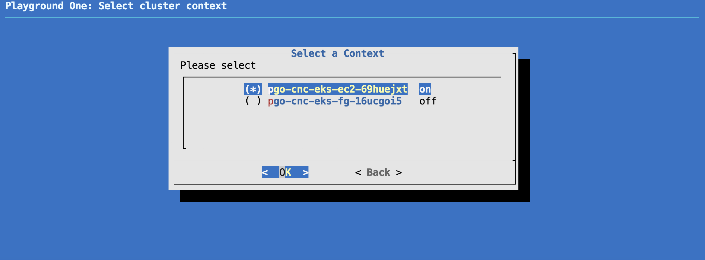

# General Life-Cycle

## Authentication

Playground One is designed to work on Ubuntu Linux or an Ubuntu Cloud9 on AWS. If you're using Cloud9 you will get prompted for your AWS Access and Secret Key. These credentials are never stored on any disk but used to create an EC2 instance role only.

If you're using a *normal* Ubuntu server you manually need to authenticate to AWS and/or Azure by either running

```ssh
aws configure
```

and/or

```ssh
az login --use-device-code
```

## Initialize

Initialize with

```sh
pgo --init all
```

This will prepare all available configurations. No changes done in the clouds yet. You only need to init once after cloning the repository.

If you have changed Playground Ones main configuration using `pgo --config` please rerun `pgo --init all` again to apply eventual changes to the configurations.

## Create the AWS Environment

1. To create the VPC and Network run

    ```sh
    pgo --apply nw
    ```

    This will create your VPC and network in the configured region (see `config.yaml`)

2. If you want your EC2 instances to be connected to Vision One Endpoint Security head over to [Vision One Endpoint Security Server & Workload Protection](../integrations/endpoint-security.md) and come back afterwards.

3. Create Virtual Instances and/or Kubernetes Clusters with demo workload.

    EC2 instances:

    ```sh
    pgo --apply ec2
    ```

    EKS EC2 cluster:

    ```sh
    pgo --apply eks-ec2
    ```

    EKS Fargate cluster:

    ```sh
    pgo --apply eks-fg
    ```

    ECS cluster(s):

    ```sh
    pgo --apply ecs
    ```

4. Create a dedicated (on-prem like) Deep Security environment with activated Computers.

    VPC and Deep Security:

    ```sh
    pgo --apply dsm
    ```

    Activated Linux & Windows Computers:

    ```sh
    pgo --apply dsw
    ```

## Create the Azure Environment

1. Create Kubernetes Cluster with demo workload.

    AKS cluster:

    ```sh
    pgo --apply aks
    ```

## Query Outputs and State

The most relevant information on your configuration can be queried by running

```sh
pgo --output <configuration>
```

Example: `pgo --output ec2`:

```sh
public_instance_id_db1 = "i-072abd953dedaae5d"
public_instance_id_srv1 = "i-0f2c91e08fd054510"
public_instance_id_web1 = "i-048ecedf660236f47"
public_instance_ip_db1 = "3.76.39.227"
public_instance_ip_srv1 = "3.75.219.198"
public_instance_ip_web1 = "18.197.106.33"
public_instance_password_srv1 = <sensitive>
s3_bucket = "playground-awsone-cesh306v"
ssh_instance_db1 = "ssh -i ../playground-key-pair.pem -o StrictHostKeyChecking=no ubuntu@3.76.39.227"
ssh_instance_srv1 = "ssh -i ../playground-key-pair.pem -o StrictHostKeyChecking=no admin@3.75.219.198"
ssh_instance_web1 = "ssh -i ../playground-key-pair.pem -o StrictHostKeyChecking=no ubuntu@18.197.106.33"
public_instance_password_srv1 = "4h1v}Q7Hc9tbGWdM"
```

With this you can always query how to connect to your running EC2 instances. All instances support SSH connections, the Windows Server Remote Desktop as well. For RDP Use the configured `admin` user, the ip address and password for srv1.

## Play with the Playground One

It's a playground, or? Experiment and hopefully learn a few things. For your guidance, there are some prepared scenarios for you to go through. Find them in the navigation pane.

## Switch in between multiple Kubernetes Clusters

If you're using multiple cluster variants simultaneously you can easily switch in between the clusters using the command `pgo-context`.



## Tear Down

If you want to destroy your environment completely or only parts of it

```sh
pgo --destroy <configuration>
```

If you want to tear down everything run

```sh
pgo --destroy all
```

> ***Note:*** The network and VPC are not automatically destroyed. You can do this manually by running `pgo --destroy nw`. Be sure to have the CloudFormation stack of XDR for Containers deleted before doing so. Otherwise it will be in a failed (blackhole) state.
