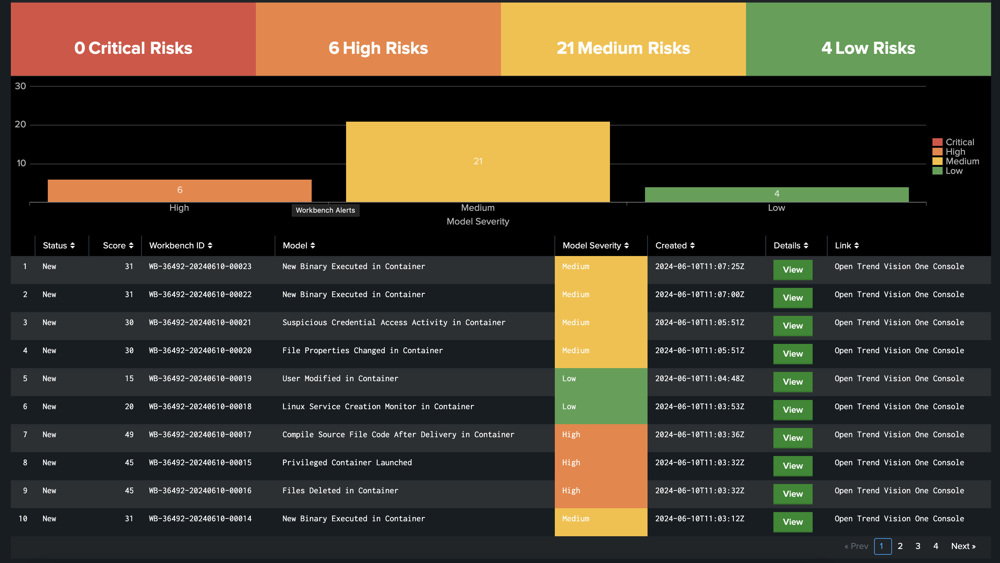
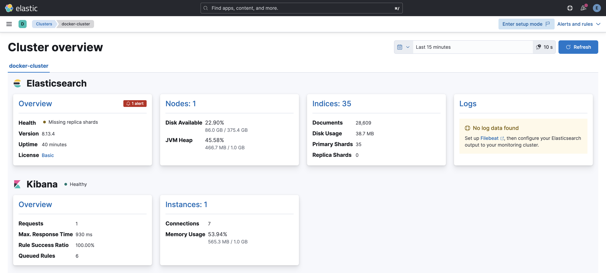

# Playground One Add-Ons

There are not Terraform related add-ons included in the Playground One.

## Cloud Security Posture Management Terraform Template Scanning and Exception Handling

- Located in the Playground One home directury as `cspm`.
  - `tfscanner_exceptions_c1_name.py` - Cloud One using Name tags
  - `tfscanner_exceptions_c1_uuid.py` - Cloud One using unique tags
  - `tfscanner_exceptions_v1_name.py` - Vision One using Name tags
  - `tfscanner_exceptions_v1_uuid.py` - Vision One using unique tags

- The intention of this add-on is to provide a RESTful Api driven exception handling mechanism with Terraform template scanning support. The Python scripts included here implement the following functionality:

  - Create Terrafrom Plan of Configuration and run Conformity Template Scan
  - Set Exceptions in Scan Profile based on Name-Tags or unique Tags assigned to the resource
  - Create Terraform Apply of Configuration
  - Create Terraform Destroy of Configuration
  - Remove Exceptions in Scan Profile or reset the Scan Profile
  - Suppress Findings in Account Profile
  - Expire Findings in Account Profile
  - Run Conformity/Posture Management Bot and request status
  - Download latest Report

- Consult the documentation within the Python scripts `tfscanner_exceptions_c1/v1_uuid.py` and/or `tfscanner_exceptions_c1/v1_name.py` on how to play with this.

## Cloud Security Posture Management Category Compliance

- Located in the Playground One home directury as `cspm`.
  - `category_compliance_c1.py` - Cloud One
  - `category_compliance_v1.py` - Vision One

- Reports the compliance status of the categories by API. It may be limited by the number of days back in and a minimum level of criticality.

## Container Stacks for Third-Party integrations.

- Located in the Playground One home directury as `stacks`.

- Splunk - Spins up a local Splunk which can be used individually or in conjunction with some scenarios of Playground One. These are

  - [Setup Splunk](https://mawinkler.github.io/playground-one-pages/scenarios/bigdata/splunk-setup/)
  - [Integrate Vision One with Splunk](https://mawinkler.github.io/playground-one-pages/scenarios/bigdata/splunk-integrate-vision-one-xdr/)
  - [Integrate V1CS Customer Runtime Security Rules with Splunk](https://mawinkler.github.io/playground-one-pages/scenarios/bigdata/splunk-integrate-vision-one-custom-rules/)
  - 

- Elastic - Creates a local ELK stack to play with.

  - [Setup Elastic (ELK Stack)](https://mawinkler.github.io/playground-one-pages/scenarios/bigdata/elastic-stack/)
  - 

## Migrate Vision Container Security Policy and Runtime Rulesets to Cluster Policies

Automagically migrate a Vision One Container Security Policy with Runtime Rulesets to Cluster Policies, which can be assigend by `kubectl apply -f`. It uses the policy defined in the Playground One config.

```sh
v1cs-migrate-policy2cluster
```

If your Python3 environment does not have the requests library run:

```sh
cd ${ONEPATH}
python3 -m venv venv && source venv/bin/activate
pip install -r requirements.txt
```

The above creates one or multiple `yaml` files with the policy and eventually multiple runtime ruleset definitions.
