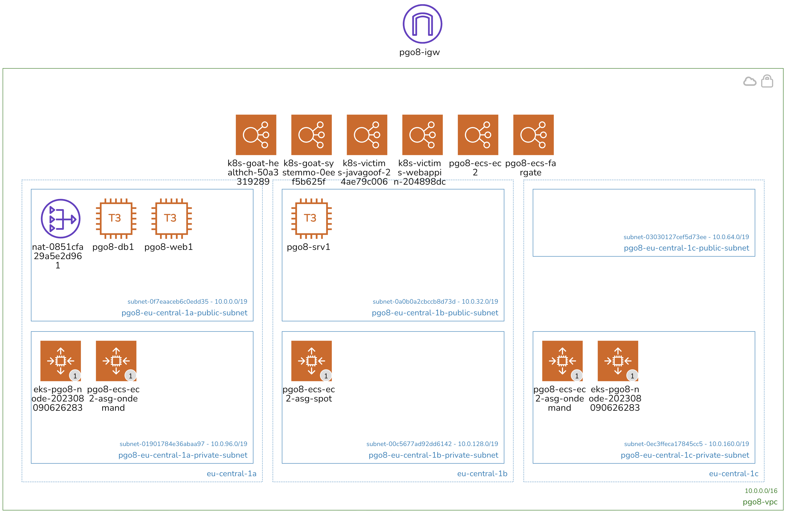

# Playground One Configurations

The Playground One has a modular structure as shown in the following tree:

```
awsone
├── network (2-network)
|   ├── ec2 (3-instances)
|   ├── eks (4-cluster-eks-ec2)
|   |   ├── eks-deployments (8-cluster-eks-ec2-deployments)
|   |   └── scenarios (7-scenarios-ec2)
|   ├── eks (4-cluster-eks-fargate)
|   |   └── scenarios (7-scenarios-fargate)
|   └── ecs (5-cluster-ecs)
└── dsm (9-deep-security)
    └── workload (9-deep-security-workload) 
```

As we can see, the configuration `network` is the base for the other configurations. It creates the VPC, Subnets, Route Tables, Security Groups, etc. One can choose to only create the EKS cluster, or ECS cluster, or even the full stack. Everything will reside in the same VPC.

*Architecture: Example environment name `pgo8`*



*Security Groups: Example environment name `pgo8`*


The following chapters describe the different configurations on a high level, refer the the dedicated documentation for more details.

## Virtual Private Cloud and Network

*Configuration located in `awsone/2-network`*

This configuration defines a network with the most commonly used architecture, private and public subnets accross three availability zones. It includes everything what a VPC should have, this is amongst others an internet gateway, NAT gateway, security groups, etc. Since a VPC is cheap there's no real need to destroy the networking configuration everyday, just leave it as it is and reuse it the next time. This eases the handling of other components like Vision One XDR for Containers.

## Virtual Instances

*Configuration located in `awsone/3-instances`*

*Depends on `awsone/2-network`*

Basically, a couple of EC2 instances are created with this configuration. Currently these are two linux and one windows instances.

If you store the agent installers for Server and Workload Security in `0-files` the instances will connect to Vision One.

You can optionally drop any file or installer in the `0-files` directory which will then be available in the ec2 instances download folder.

## EKS EC2 Cluster

*Configuration located in `awsone/4-cluster-eks-ec2`*

*Depends on `awsone/2-network`*

So, this is my favorite part. This configuration creates an EKS cluster with some nice key features:

- Autoscaling from 1 to 10 nodes
- Nodes running as Spot instances to save money :-)
- ALB Load Balancer controller
- Kubernetes Autoscaler
- Cluster is located in the private subnets

## EKS Fargate Cluster

*Configuration located in `awsone/4-cluster-eks-fargate`*

*Depends on `awsone/2-network`*

This configuration creates a Fargate EKS cluster with some nice key features:

- 100% Fargate
- Nodes running as Spot instances to save money :-)
- An additional AWS managed node group
- Cluster is located in the private subnets

### Cluster Deployments

*Configuration located in `awsone/8-cluster-ec2-deployments`*

*Depends on `awsone/4-cluster-eks-ec2`*

Currently, the following deployments are defined:

- Container Security
- Calico
- Prometheus & Grafana
- Trivy

### Scenarios for EKS EC2

*Configuration located in `awsone/7-scenarios-ec2`*

*Depends on `awsone/4-cluster-eks-ec2`*

Currently, the following (vulnerable) deployments are defined:

- WebApp System-Monitor (see [Escape to the Host System](../scenarios/eks/escape.md))
- WebApp Health-Check (see [ContainerD Abuse](../scenarios/eks/dind-exploitation.md))
- WebApp Hunger-Check (see [Hunger Check](../scenarios/eks/hunger-check.md))
- Java-Goof
- WebApp OpenSSL3
- Nginx

Automated attacks are running every full hour.

### Scenarios for EKS Fargate

*Configuration located in `awsone/7-scenarios-fargate`*

*Depends on `awsone/4-cluster-eks-fargate`*

Currently, the following (vulnerable) deployments are defined:

- Nginx

Automated attacks are running every full hour.

## ECS Clusters

*Configuration located in `awsone/5-cluster-ecs`*

*Depends on `awsone/2-network`*

Here we're building an ECS cluster using EC2 instances and/or Fargate profile. Key features:

- Autoscaling group for spot instances when using the EC2 variant. On-demand autoscaler can be enabled in Terraform script.
- Fargate profile with spot instances. Fargate with on-demand instances can be enabled in Terraform script.
- ALB Load Balancer
- Automatic deployment of a vulnerable service (Java-Goof)

## Deep Security

*Configuration located in `awsone/9-deep-security` and `awsone/9-deep-security-workload`*

This configuration is to simulate an on-premise Deep Security environment meant to be used in integration and migration scenarios. For simulation purposes it creates a dedicated VPC with the most commonly used architecture, private and public subnets accross two availability zones. It includes everything what a VPC should have, this is amongst others an internet gateway, NAT gateway, security groups, etc.

The workload configuration creates a demo configuration for Deep Security and two custom policies. Two linux and one windows instances are created and activated with Deep Security. Some minutes after instance creation the activated computers will run a recommendation scan.

To come:

- Documentation of integration scenarios:
  - DS with V1ES
  - WS with V1ES
- Documentation of migration scenarios:
  - DS --> V1ES
  - WS --> V1ES
