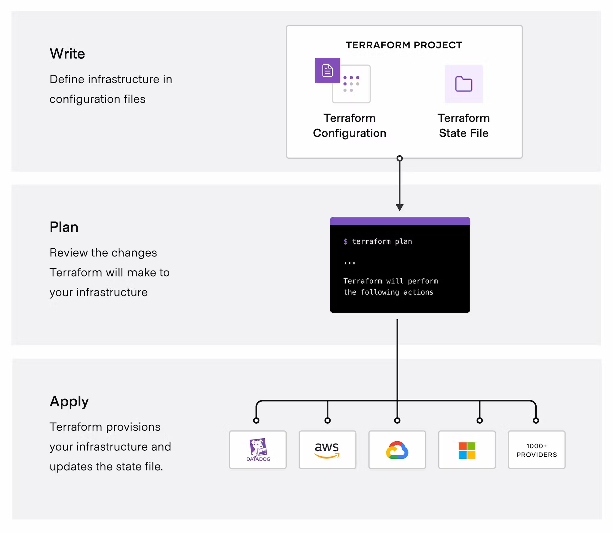

## How it works

The Playground One utilizes Terraform to maintain the environment. For best flexibility and cost optimization it is structured into several Terraform configurations. You can also view these configurations as modules that can be linked together as needed.

> Note: Currently, the only cloud supported is AWS, when required other public cloud providers might follow.

## What is Terraform?

Terraform is an infrastructure as code tool that lets you build, change, and version cloud and on-prem resources safely and efficiently. It is maintained by HashiCorp.

HashiCorp Terraform is an infrastructure as code tool that lets you define both cloud and on-prem resources in human-readable configuration files that you can version, reuse, and share. You can then use a consistent workflow to provision and manage all of your infrastructure throughout its lifecycle. Terraform can manage low-level components like compute, storage, and networking resources, as well as high-level components like DNS entries and SaaS features.

## How does Terraform work?

Terraform creates and manages resources on cloud platforms and other services through their application programming interfaces (APIs). Providers enable Terraform to work with virtually any platform or service with an accessible API.

HashiCorp and the Terraform community have already written thousands of providers to manage many different types of resources and services. You can find all publicly available providers on the Terraform Registry, including Amazon Web Services (AWS), Azure, Google Cloud Platform (GCP), Kubernetes, Helm, GitHub, Splunk, DataDog, and many more.

The core Terraform workflow consists of three stages:

Write: You define resources, which may be across multiple cloud providers and services. For example, you might create a configuration to deploy an application on virtual machines in a Virtual Private Cloud (VPC) network with security groups and a load balancer.

Plan: Terraform creates an execution plan describing the infrastructure it will create, update, or destroy based on the existing infrastructure and your configuration.

Apply: On approval, Terraform performs the proposed operations in the correct order, respecting any resource dependencies. For example, if you update the properties of a VPC and change the number of virtual machines in that VPC, Terraform will recreate the VPC before scaling the virtual machines.
