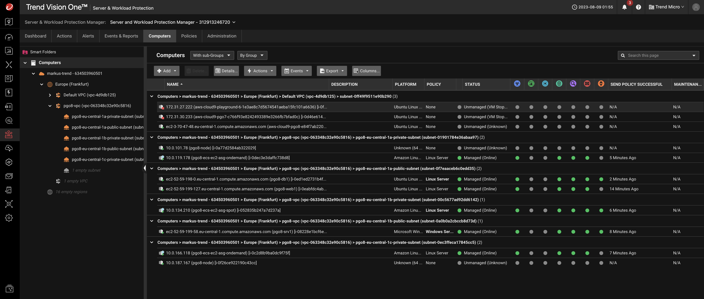

# Vision One Endpoint Security Server & Workload Protection

Three different instances are currently provided by the Playground One with different configurations:

Instance Web1:

- Ubuntu Linux 20.04
- Nginx deployment
- Vision One Endpoint Security Endpoint Sensor for Server & Workload Protection

Instance Db1:

- Ubuntu Linux 20.04
- MySql databse
- Vision One Endpoint Security Endpoint Sensor for Server & Workload Protection

Instance Srv1:

- Windows Server 2022 Standalone Server
- Vision One Endpoint Security Endpoint Sensor for Server & Workload Protection

All instances can be integrated with Vision One Endpoint Security for Server & Workload Protection and have access to the Atomic Launcher (if provided).

The instances are created within a public subnet of Playground One's VPC. They all get an EC2 instance role assigned providing them the ability to access installer packages stored within an S3 bucket.

All instances including the Windows Server are accessible via ssh and key authentication. RDP for Windows is supported in addition to this.

*Server & Workload Protection: Example with full stack deployment*



## Optional: Drop Vision One Installer Packages

If you want the instances automatically to be activated against your Server and Workload Protection Manager instance you need to download the installer packages for Vision One Endpoint Security for Windows and/or Linux from your Vision One instance. You need to do this manually since these installers are specific to your environment.

The downloaded files are named something similar like

`TMServerAgent_Windows_auto_64_Server_and_Workload_Protection_Manager....zip`

and/or

`TMServerAgent_Linux_auto_64_Server_and_Workload_Protection_Manager....tar`.

Similar for the Endpoint Sensors.

Rename them to `TMServerAgent_Linux.tar`, `TMServerAgent_Windows.zip`,  `TMSensorAgent_Linux.tar`, and `TMSensorAgent_Windows.zip` respectively and copy the file(s) to `${ONEPATH}/awsone/0-files`.

## Optional: Server & Workload Protection Event-Based Tasks

Create Event-Based Tasks to automatically assign Linux or Windows server policies to the machines.

Agent-initiated Activation Linux

- *Actions:* Assign Policy: Linux Server
- *Conditions:* "Platform" matches ".\*Linux.\*"

Agent-initiated Activation Windows

- *Actions:* Assign Policy: Windows Server
- *Conditions:* "Platform" matches ".\*Windows.\*"

## Optional: Drop Atomic Launcher Packages

If you want to experiment with Atomic Launcher download the packages (latest Windows and Linux) from [here](https://trendmicro.atlassian.net/wiki/spaces/GRTL/pages/322570154/Atomic+Launcher) and store them in the  `${ONEPATH}/awsone/0-files` directory as well.

Your `${ONEPATH}/awsone/0-files`-directory should look like this:

```sh
-rw-rw-r-- 1 user user 17912014 Aug  1 14:50 atomic_launcher_linux_1.0.0.1009.zip
-rw-rw-r-- 1 user user 96135367 Aug  1 14:50 atomic_launcher_windows_2.zip
-rw-rw-r-- 1 user user        0 Jul 28 06:22 see_documentation
-rw-rw-r-- 1 user user 27380224 Aug  1 14:50 TMServerAgent_Linux.tar
-rw-rw-r-- 1 user user  3303522 Aug  1 14:50 TMServerAgent_Windows.zip
```

The Atomic Launcher is stored within the downloads folder of each of the instances.

The unzip password is `virus`.

You should disable Anti Malware protection und set the IPS module to detect only before using Atomic Launcher :-).
