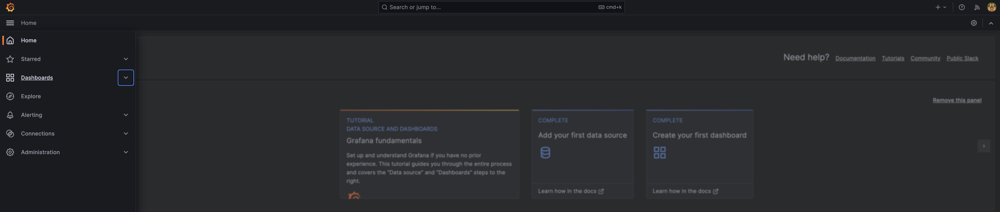
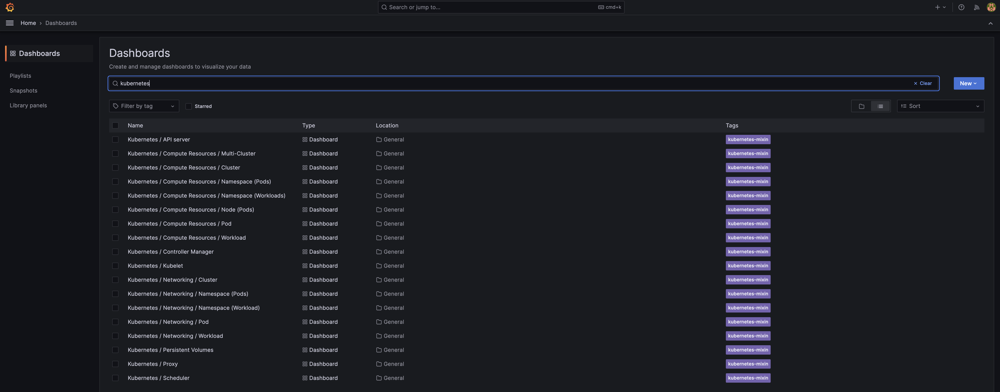
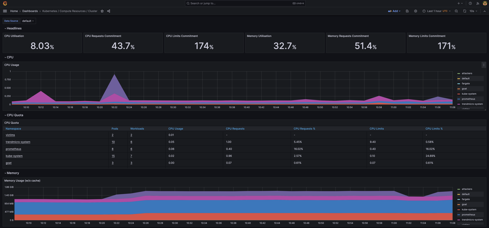

# Prometheus and Grafana

## What is Prometheus?

Prometheus is an open-source systems monitoring and alerting toolkit originally built at SoundCloud. Since its inception in 2012, many companies and organizations have adopted Prometheus, and the project has a very active developer and user community. It is now a standalone open source project and maintained independently of any company. To emphasize this, and to clarify the project's governance structure, Prometheus joined the Cloud Native Computing Foundation in 2016 as the second hosted project, after Kubernetes.

Prometheus collects and stores its metrics as time series data, i.e. metrics information is stored with the timestamp at which it was recorded, alongside optional key-value pairs called labels.

For more elaborate overviews of Prometheus, see the resources linked from the media section.

**Prometheus's main features are:**

- a multi-dimensional data model with time series data identified by metric name and key/value pairs
- PromQL, a flexible query language to leverage this dimensionality
- no reliance on distributed storage; single server nodes are autonomous
- time series collection happens via a pull model over HTTP
- pushing time series is supported via an intermediary gateway
- targets are discovered via service discovery or static configuration
- multiple modes of graphing and dashboarding support

## What is Grafana?

In a nutshell: Dashboard anything. Observe everything.

Query, visualize, alert on, and understand your data no matter where it’s stored. With Grafana you can create, explore, and share all of your data through beautiful, flexible dashboards.

## Playground One Integration

As soon as you create your EKS cluster with Playground One and have Prometheus enabled it Grafana and Prometheus will get deployed. They are already preconfigured for your convenience.

To enable/disable the Prometheus & Grafana combo and set the administrator password run `pgo --configure`

To get the DNS names of Prometheus and Grafana check the outputs of the EKS configuraiton with `pgo -o eks`

```sh
# Example
loadbalancer_dns_grafana = "k8s-promethe-promethe-95d61839fe-676288571.eu-central-1.elb.amazonaws.com"
loadbalancer_dns_prometheus = "k8s-promethe-promethe-a040b2a261-633411715.eu-central-1.elb.amazonaws.com"
```

Copy the Grafana URL to your browser and authenticate with `admin/playground`.

Then head over to Dashboards 



and search for `kubernetes`:



Select any of the dashboards and start playing.


