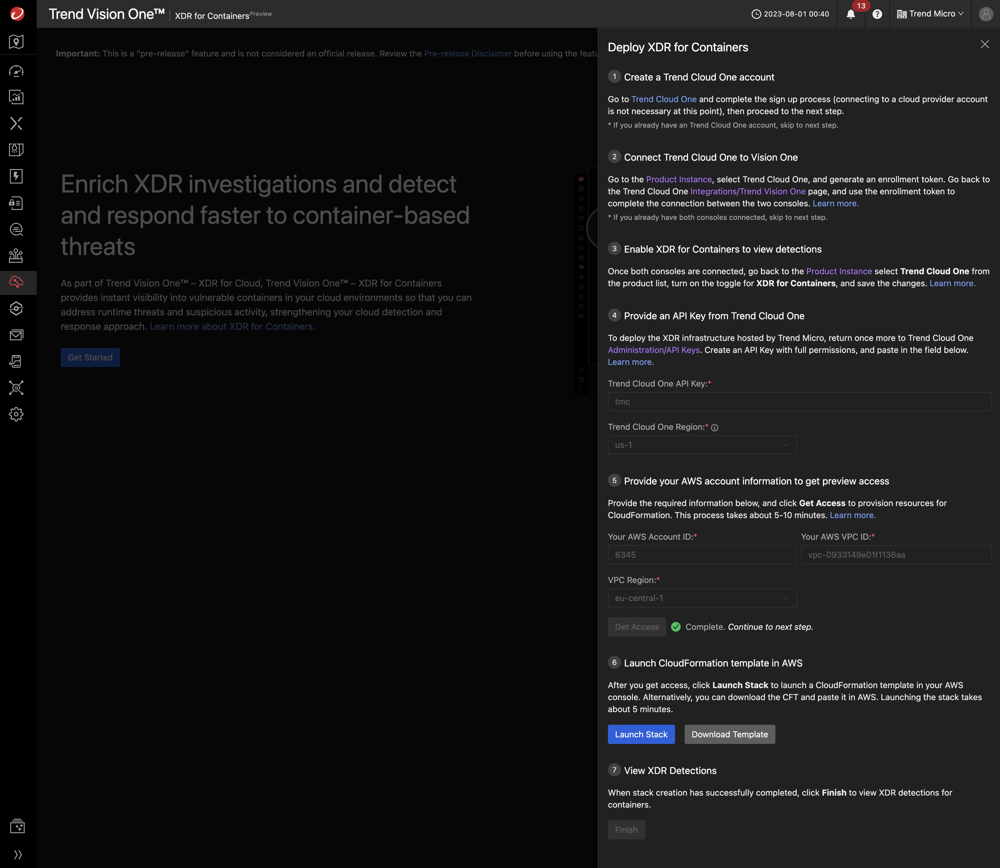

# Vision One XDR for Containers

> ***Note:*** At the time of writing, XDR for Containers is in an early preview stage and only one to be protected VPC is supported. The cluster variants provided by Playground One support Application Load Balancing which is required for XDR for Containers.

You need to create a connection with XDR for Containers by going through the workflow in your Vision One environment.

## Connect XDR for Containers with the Playground One

Before connecting XDR for Containers you need to have the VPC and network of Playground One created already.

```sh
pgo --apply nw
```

> ***Note:*** You don't need to destroy the VPC and network each time because this would mean to disconnect Vision One from it and reestablish the connection the next time. This takes about 20 minutes overall. So leave the VPC as it is.

Required information:

- Trend Cloud One API Key
- Trend Cloud One Region
- AWS Account ID
- AWS VPC ID
- VPC Region

Follow the deployment instructions from Vision One. You can query your `AWS VPC ID` by running `pgo --output nw`.

> ***Note:*** Make sure to deploy the stack in the region of the VPC when pressing `[Launch Stack]`.



All provided clusters from Playground One can be used with XDR for Containers.

## Scenarios

- [Tomcat Remote Code Execution](../scenarios/xdr4c/ecs-tomcat-rce.md)
- [JNDI Injection in HTTP Request](../scenarios/xdr4c/ecs-log4j.md)
- [Apache Struts Multipart Encoding Command Injection (ECS)](../scenarios/xdr4c/ecs-struts.md)
- [Apache Struts Multipart Encoding Command Injection (EKS)](../scenarios/xdr4c/eks-struts.md)
