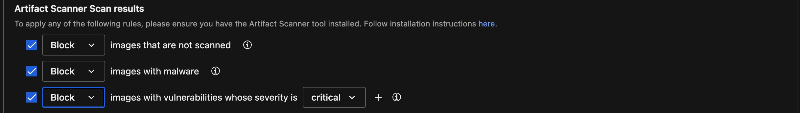

# Scenario: Container Image Vulnerability and Malware Scanning as GitHub Action

***DRAFT***

## Prerequisites

- Vision One Container Security Artifact Scanner API-Key with the following permissions:
  - Cloud Security Operations
    - Container Protection
      - Run artifact scan
- GitHub Account.
- Docker Hub Account (optional).
- Kubernetes Cluster (ideally) with Vision One Container Security deployed.

## About GitHub Actions

GitHub Actions is a continuous integration and continuous delivery (CI/CD) platform that allows you to automate your build, test, and deployment pipeline on GitHub.

GitHub Actions goes beyond just DevOps and lets you run workflows when other events happen in your repository. For example, you can run a workflow to automatically add the appropriate labels whenever someone creates a new issue in your repository.

You can configure a GitHub Actions workflow to be triggered when an event occurs in your repository, such as a pull request being opened, an issue being created or a push happened. Your workflow contains one or more jobs which can run in sequential order or in parallel. Each job will run inside its own virtual machine runner, or inside a container, and has one or more steps that either run a script that you define or run an action, which is a reusable extension that can simplify your workflow.

Workflows are defined as YAML files in the .github/workflows directory in a repository, and a repository can have multiple workflows, each of which can perform a different set of tasks.

In this scenario we're going to create a workflow to automatically build, push and scan a container image with Trend Micro Artifact Scanning. The scan will check the image for vulnerabilities and malware and eventually push it to DockerHub.

## Fork the Scenario Repo

The first step is to fork the scenarios GitHub repo. For this go to [github.com](https://github.com/) and sign in or create a free account if you need to.

Next, you want to create a Fork of the scenarios repo. A fork is basically a copy of a repository. Forking a repository allows you to freely experiment with changes without affecting the original project.

To do this navigate to the repo [playground-one-scenario-github-action](https://github.com/mawinkler/playground-one-scenario-github-action) and click on the `Fork`-button in the upper right.

On the next screen press `[Create fork]` which will bring you back to your account.

## The Repo

The repo containes a very simple Dockerfile and a hidden directory `.github/workflows` with a `yaml`-file.

The Dockerfile specifies the image to build. As we can easily see, it is using the latest `nginx` as the base image and just adds (very obviously) an Eicar.

```Dockerfile
FROM nginx

RUN curl -fsSL http://eicar.eu/eicarcom2.zip -o /usr/share/nginx/html/eicarcom2.zip
```

### The Workflow

The `yaml`-file in `.github/workflows` is more interesting. Let's go through it.

```yaml
name: ci

on:
  push:
    tags: [ v* ]

env:
  REGISTRY: ghcr.io
  IMAGE_NAME: ${{ github.repository }}
  TMAS_API_KEY: ${{ secrets.TMAS_API_KEY }}
  REGION: us-east-1
  THRESHOLD: "critical"
  MALWARE_SCAN: true

jobs:
  docker:
    runs-on: ubuntu-latest
    permissions:
      contents: read
      packages: write

    steps:
      # Prepare the Docker Buildx environment
      - name: Checkout
        uses: actions/checkout@v4
      - name: Set up QEMU
        uses: docker/setup-qemu-action@v3
      - name: Set up Docker Buildx
        uses: docker/setup-buildx-action@v3

      - name: Extract metadata for the Docker image
        id: meta
        uses: docker/metadata-action@v5
        with:
          images: ${{ env.REGISTRY }}/${{ env.IMAGE_NAME }}
          
      # At first, we build the image and save it as a tar ball
      - name: Build and store
        uses: docker/build-push-action@v5
        with:
          context: .
          tags: ${{ steps.meta.outputs.tags }}
          outputs: type=docker,dest=/tmp/image.tar

      # Next step is to scan the build image for vulnerabilities and malware
      - name: Scan
        env:
          SBOM: true # Saves SBOM to sbom.json so you can export it as an artifact later.
        run: |
          # Install tmas latest version
          curl -s -L https://gist.github.com/raphabot/abae09b46c29afc7c3b918b7b8ec2a5c/raw/ | bash

          tmas scan "$(if [ "$MALWARE_SCAN" = true ]; then echo "--malwareScan"; fi)" -r "$REGION" docker-archive:/tmp/image.tar "$(if [ "$SBOM" = true ]; then echo "--saveSBOM"; fi)" | tee result.json

          if [ "$SBOM" = true ]; then mv SBOM_* sbom.json; fi

          echo Analyze result
          fail=0
          [ "${THRESHOLD}" = "any" ] && \
            [ $(jq '.vulnerability.totalVulnCount' result.json) -ne 0 ] && fail=1

          [ "${THRESHOLD}" = "critical" ] && \
            [ $(jq '.vulnerability.criticalCount' result.json) -ne 0 ] && fail=2

          [ "${THRESHOLD}" = "high" ] && \
            [ $(jq '.vulnerability.highCount + .vulnerability.criticalCount' result.json) -ne 0 ] && fail=3

          [ "${THRESHOLD}" = "medium" ] && \
            [ $(jq '.vulnerability.mediumCount + .vulnerability.highCount + .vulnerability.criticalCount' result.json) -ne 0 ] && fail=4

          [ "${THRESHOLD}" = "low" ] &&
            [ $(jq '.vulnerability.lowCount + .vulnerability.mediumCount + .vulnerability.highCount + .vulnerability.criticalCount' result.json) -ne 0 ] && fail=5

          [ $(jq '.malware.scanResult' result.json) -ne 0 ] && fail=6

          [ $fail -eq 6 ] && echo !!! Malware found !!! > malware || true

          [ $fail -ne 0 ] && echo !!! Vulnerability threshold exceeded !!! > vulnerabilities || true

      # Upload Scan Result and SBOM Artifact if available
      - name: Upload Scan Result Artifact
        uses: actions/upload-artifact@v3
        with:
          name: scan-result
          path: result.json
          retention-days: 30

      - name: Upload SBOM Artifact
        uses: actions/upload-artifact@v3
        with:
          name: sbom
          path: sbom.json
          retention-days: 30

      # Fail the workflow if we found malware or reach the vulnerability threshold
      - name: Fail Scan
        run: |
          ls -l
          if [ -f "malware" ]; then cat malware; fi
          if [ -f "vulnerabilities" ]; then cat vulnerabilities; fi
          if [ -f "malware" ] || [ -f "vulnerabilities" ]; then exit 1; fi

      # Login to the registry. Here we just use Docker
      - name: Login to the Container registry
        uses: docker/login-action@v3
        with:
          registry: ${{ env.REGISTRY }}
          username: ${{ github.actor }}
          password: ${{ secrets.GITHUB_TOKEN }}

      # Rebuild the image and push to registry. This is fast since everything is cached.
      - name: Build and push
        id: build
        uses: docker/build-push-action@v5
        with:
          context: .
          platforms: linux/amd64,linux/arm64
          push: true
          tags: ${{ steps.meta.outputs.tags }}

      - name: Summarize the Docker digest and tags
        run: |
          echo 'Digest: ${{ steps.build.outputs.digest }}'
          echo 'Scan: registry:${{ env.REGISTRY }}/${{ env.IMAGE_NAME }}@${{ steps.build.outputs.digest }}'
          echo 'Tags: ${{ steps.meta.outputs.tags }}'

      # Rescan in the registry to support admission control
      - name: Registry Scan
        run: |
          tmas scan "$(if [ "$MALWARE_SCAN" = true ]; then echo "--malwareScan"; fi)" -r "$REGION" registry:${{ env.REGISTRY }}/${{ env.IMAGE_NAME }}@${{ steps.build.outputs.digest }} || true
```

### Secrets

The workflow requires some secrets to be set. Navigate to `Settings --> Security --> Secrets and variables --> Actions --> Secrets`.

Now add the following secret:

- TMAS_API_KEY: `<Your TMAS API Key>`

### Actions

Navigate to `Actions` and enable Workflows for the forked repository.

## Test it

### Create and Push a Tag

Tags are ref's that point to specific points in Git history. Tagging is generally used to capture a point in history that is used for a marked version release (i.e. v1. 0.1). A tag is like a branch that doesn't change.

The above workflow triggers on new tags. Running the below commands will therefore trigger the action:

```sh
git tag v0.1
git push --tag
```

Again, navigate to `Actions` and click on the running workflow to see it's output.

According to the logic in the `Fail Scan` step, whenever a file called `malware` and/or `vulnerabilities` is found in the repos directory, the workflow will fail. These files are created in the `Scan`-step when the vulnerability threshold reached and/or a malware is detected.


At the bottom of the page you can download the `sbom.json` and/or scan `results.json` for review.

### Let the workflow pass... Testing Admission Control

Now, we want the image to be published, even though that it has vulnerabilities and a malware inside. To achieve this in this scenario we simply comment out the following last line in the Fail Scan step of the workflow file:

```yaml
      - name: Fail Scan
        run: |
          ls -l
          if [ -f "malware" ]; then cat malware; fi
          if [ -f "vulnerabilities" ]; then cat vulnerabilities; fi

          # if [ -f "malware" ] || [ -f "vulnerabilities" ]; then exit 1; fi
```

Commit and push the changed workflow and create a new tag.

```sh
git commit . -m "pass" && git push
git tag v0.2 && git push --tag
```

### Configure Vision One Container Protection Policy

Next, ensure to have your Container Security policy set with the following properties:



### Try deployment

Assuming you have access to a Kubernetes cluster with Vision One Container Security deployed and a policy assigned with the setting from above, you can now run

```sh
kubectl run --image=<DOCKERHUB_USERNAME>/<IMAGE_NAME>:<IMAGE_TAG> nginx
```

```sh
Error from server: admission webhook "trendmicro-admission-controller.trendmicro-system.svc" denied the request: 
- malware violates rule with properties { count:0 } in container(s) "nginx" (block).
- vulnerabilities violates rule with properties { max-severity:high } in container(s) "nginx" (block).
```

🎉 Success 🎉
