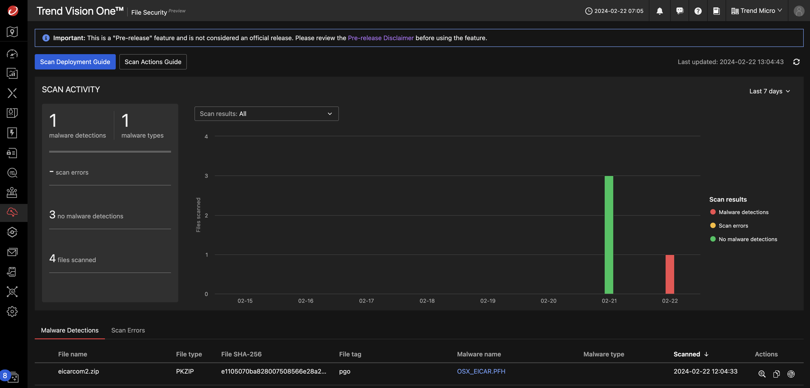

# Scenario: S3 Bucket Malware Scanning

## Prerequisites

- Vision One Cloud Security File Scanner API-Key with the following permissions:
  - Cloud Security Operations
    - File Security
      - Run file scan via SDK
- Know your Vision One region.

> ***Note:*** This scenario uses Playground Ones own S3 Bucket Scanner which is ***not*** the official solution component of Vision One. It uses the File Security Python SDK within a Lambda Function. Scan results will show up on the Vision One console.

## Limitations

- Maximum file size 1GB
- The scanned files are neither tagged nor quarantined, just scanned.

## Architecture

The scanner consists out of the following components:

- A Lambda function triggered by `s3:ObjectCreated` events. It uses the File Security Python SDK via gRPC.
- An S3 Bucket with the permission to notify the Lambda
- An IAM Role and Policy

> ***Note:*** Lambda will use Python 3.11

## The Function Code

Below are the relevant sections of the function code:

```py
import boto3
import json
import os
import urllib.parse

import amaas.grpc

v1_region = os.getenv("TM_V1_REGION")
v1_amaas_key = os.getenv("TM_AM_AUTH_KEY")


def lambda_handler(event, context):

  handle = amaas.grpc.init_by_region(v1_region, v1_amaas_key, True)

  for record in event["Records"]:

    bucket = record["s3"]["bucket"]["name"]
    key = urllib.parse.unquote_plus(record["s3"]["object"]["key"], encoding="utf-8")

    try:
      s3 = boto3.resource("s3")
      s3object = s3.Object(bucket, key)
      buffer = s3object.get().get("Body").read()
      scan_resp = amaas.grpc.scan_buffer(handle, buffer, key, ["pgo"])
      scan_result = json.loads(scan_resp)
      print(f"scanResult -> {str(scan_result)}")

      # Interprete scanResult if tagging or quarantining should be done

    except Exception as e:
      print(e)
      print("Error scan object {} from bucket {}.".format(key, bucket))

  amaas.grpc.quit(handle)
```

## Deployment

Assuming you have set your Vision One API Key and Vision One region with the help of the config tool simply run

```sh
pgo --apply s3scanner
```

The following outputs are created:

```sh
Outputs:

aws_lambda_function_name = "pgo-dev-bucket-scanner-v0ui7ows"
aws_s3_bucket_name = "pgo-dev-scanning-bucket-v0ui7ows"
```

Feel free to review the Lambda function in the AWS console.

## Run Scans

Either head over to the S3 bucket via the console to upload files or use the AWS cli.

Download the `eicarcom2.zip` and upload it to the scanning bucket.

> ***Warning:*** Do not download malicious files on computers with a running anti malware engine!

```sh
# Set your bucket name from the outputs
SCANNING_BUCKET=pgo-dev-scanning-bucket-v0ui7ows

wget https://secure.eicar.org/eicarcom2.zip
aws s3 cp eicarcom2.zip s3://${SCANNING_BUCKET}/eicarcom2.zip
```

## Check on Vision One

When heading over to your Vision One console to `Cloud Security Operations --> File Security` you should see scan results with potentially detected malware.



🎉 Success 🎉
