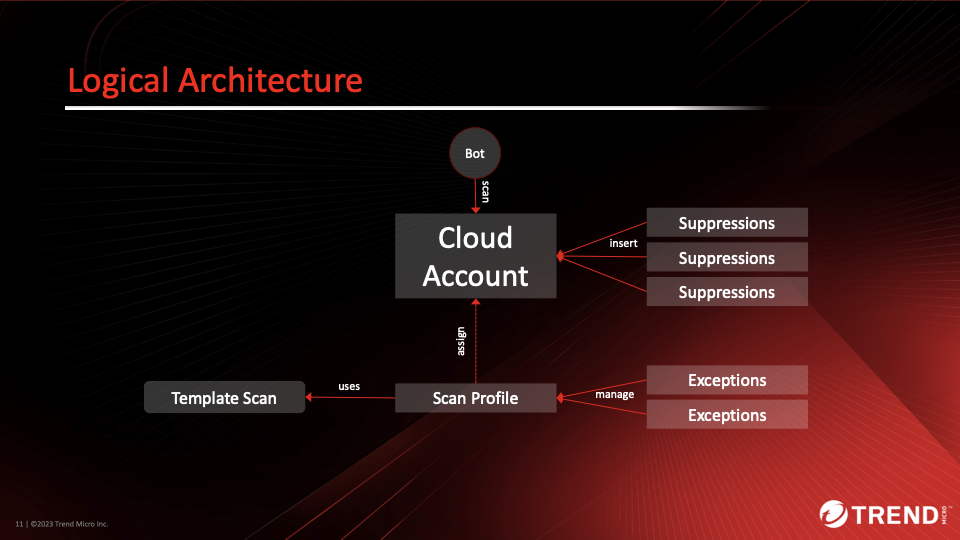
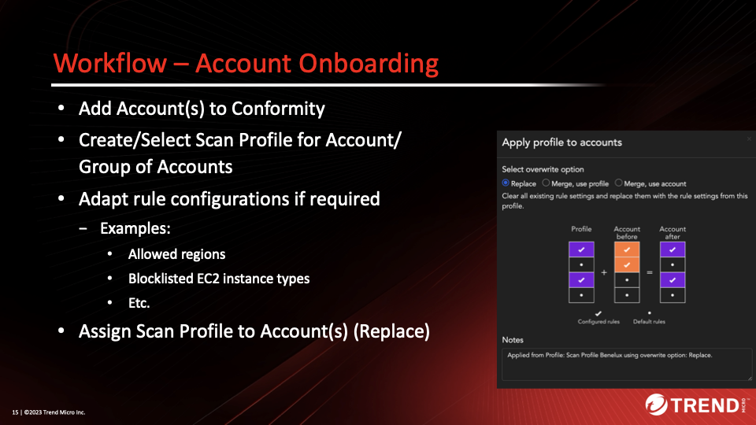

# Scenario: Terraform IaC Scanning in Pipelines with Exception Handling

***DRAFT***

!!! danger "Warning!"

    This scenario does use Cloud One Conformity! The current Vision One Cloud Posture API doesn't support setting a scan profile yet. When this functionality is getting available this scenario will be updated.

## Prerequisites

- Clouud One API-Key with the following permissions:
    - Conformity
        - Full-Access

The provided Python scripts implement the required functionality for Terraform Template Scanning, Exception approval workflows and temporary suppression of findings in Conformity Account Profile. It mainly focuses on the logic to support these kind of scenarios and cannot be used 1-to-1 in real life pipelines without modifications. The implementation assumes that an external workflow engine such as ServiceNow is used for approval workflows, which include an expiration set on the specific exception.

Conformity offers two different variants to “allow” non-compliance:

- Exceptions in rule configuration based on Tags or Resource ID (AWS ARN)
- Suppressions on specific findings

The required functionality as part of the workflow requirements is available via Conformity's REST API in combination with ServiceNow for workflow management.

Logical architecture:



The idea is to create one or more *Scan Profiles* with are used by the template scanner. The *Scan Profile* gets Exceptions assigned so that a template scan result can pass before deployment.


In the above screenshot we have two Scan Profiles with different settings.

Scan Profile contains

- Rule Settings and
- approved Exceptions

Suppressions are set in Account to (temporarily) suppress but report Findings. When Suppression(s) expire, Exceptions in Scan Profile are to be adapted/removed.

The onboarding workflow:



The next graph shows the complete workflow implemented in this scenario:


Things to be aware of:

- Resource IDs (e.g. ARNs) are often unknown at Terraform Plan stage
- Name-Tags might not be granular enough in regards Suppressions
- Tags on resources may be set incorrectly, possibly intentionally
  - Resolution idea (partly implemented):
    - Trigger Template Scan
    - Findings trigger Exemption Workflow
    - Approved Exceptions get a unique ID assigned which is bound to the Resource and Rule ID
    - Allowed non-compliant resources are tagged in the Terraform Template with this unique ID
    - Allows validation before deployment (does the tag match to the resource and Rule ID?)

## Playing through the Workflow

The scenarios offer two different terraform configurations that you can play with for convenience. Effectively it is not limitted to these, the Python script can scan any configuration, even the Playground One configurations of `awsone`.

There are two variants implemented which differ in their approach to identity AWS resources to build:

- `scanner_c1_name.py`: Simply uses name tags on the resources.
- `scanner_c1_uuid.py`: Automatically creates an unique `uuid`-tag for the resources which need to be assigned manually to the resource before deployment to be compliant.

The scripts are located in the `cspm`-directory and assume, that all exeption are granted and expire after seven days.

### Prepare

- Set environment variable C1CSPM_SCANNER_KEY with the API key of the
  Conformity Scanner owning Full Access to Conformity.
- Adapt the constants in the Python script in between `# HERE` and `# /HERE` to your requirements.
- Lines 106ff. 
  ```py
  # HERE
  REGION = "trend-us-1"
  SCAN_PROFILE_ID = "<Scan Profile ID>"
  ACCOUNT_ID = "<Conformity AWS Account ID>"
  SCAN_PROFILE_NAME = "<Scan Profile Name>"
  REPORT_TITLE = "Workflow Tests"
  RISK_LEVEL_FAIL = "MEDIUM"
  # /HERE
  ```

  - Get your `ACCOUNT_ID`:

    ```sh
    curl --location 'https://conformity.trend-us-1.cloudone.trendmicro.com/api/accounts' \
        --header 'Content-Type: application/vnd.api+json' \
        --header 'Authorization: ApiKey <YOUR API KEY>'
    ```
  - Get the `SCAN_PROFILE_ID` and `SCAN_PROFILE_NAME`:

    ```sh
    curl --location 'https://conformity.trend-us-1.cloudone.trendmicro.com/api/profiles' \
    --header 'Content-Type: application/vnd.api+json' \
    --header 'Authorization: ApiKey <YOUR API KEY>'
    ```

### Using Name-Tags

First, we're going the easy route using name tags.

Here's the quick run-through:

```sh
# Run template scan
$ ./scanner_c1_name.py --scan 2-network

# Run approval workflows in engine, here implementing the approved workflow
$ ./scanner_c1_name.py --exclude 2-network

# Run template scan again to verify that the scan result is clean
$ ./scanner_c1_name.py --scan 2-network

# Apply configuration
$ ./scanner_c1_name.py --apply 2-network

# Trigger bot run
$ ./scanner_c1_name.py --bot

# Suppress findings
$ ./scanner_c1_name.py --suppress

# Suppressions are active for 1 week
$ ./scanner_c1_name.py --expire

# Wait for suppressions to expire
$ ./scanner_c1_name.py --expire

# Cleanup
$ ./scanner_c1_name.py --destroy 2-network
$ ./scanner_c1_name.py --reset
$ ./scanner_c1_name.py --expire
```

To be continued...

### Using UUID-Tags

```sh
# Run template scan
$ ./scanner_c1_uuid.py --scan 2-network

# Run approval workflows in engine, here implementing the approved workflow
$ ./scanner_c1_uuid.py --exclude 2-network

# Now add the exclusion tags to the corresponding resources
# in the Terraform template

# Run template scan again to verify that the scan result is clean
$ ./scanner_c1_uuid.py --scan 2-network

# Apply configuration
$ ./scanner_c1_uuid.py --apply 2-network

# Trigger bot run
$ ./scanner_c1_uuid.py --bot

# Suppress findings
$ ./scanner_c1_uuid.py --suppress

# Suppressions are active for 1 week
$ ./scanner_c1_uuid.py --expire

# Wait for suppressions to expire
$ ./scanner_c1_uuid.py --expire

# Cleanup
$ ./scanner_c1_uuid.py --destroy 2-network
$ ./scanner_c1_uuid.py --reset
$ ./scanner_c1_uuid.py --expire
```

For each exception set the script genarates a unique tag which needs to be assigned to the resource definition within the Terraform configuration.

```terraform
locals {
  security_groups = {
    public = {
      name        = "${var.environment}-public-sg"
      description = "Security group for Public Access"
      tags = {
        "39c34a53-7368-40ba-b96b-254877a7d8a5" = "module.ec2.aws_security_group.sg[\"public\"]_EC2-001"
        "bf8d1c3f-a6bb-40af-b0e9-6b8820bcf397" = "module.ec2.aws_security_group.sg[\"public\"]_EC2-033"
      }
      ingress = {
...
    private = {
      name        = "${var.environment}-private-sg"
      description = "Security group for Private Access"
      tags = {
        "d2c3b1ee-8278-4b8c-9adb-e82fd5bb79c0" = "module.ec2.aws_security_group.sg[\"private\"]_EC2-033"
      }
      ingress = {
...
```

This allows to validate, that the unique tag key is assigned to the designated resource and violating rule only.

To be continued...

