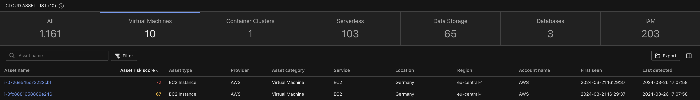
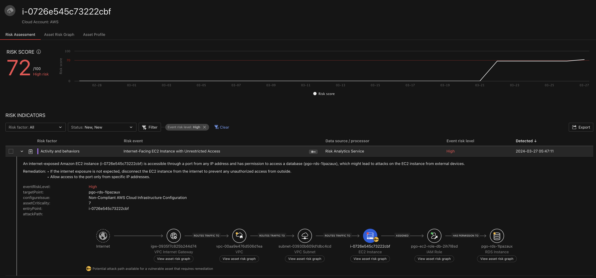
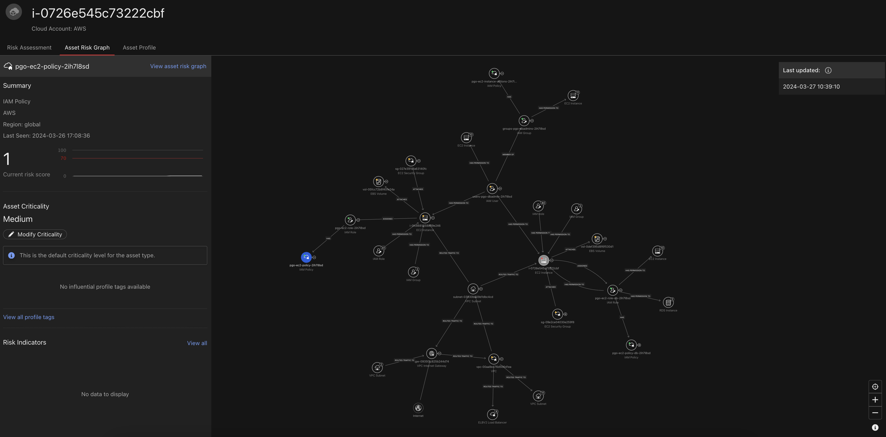
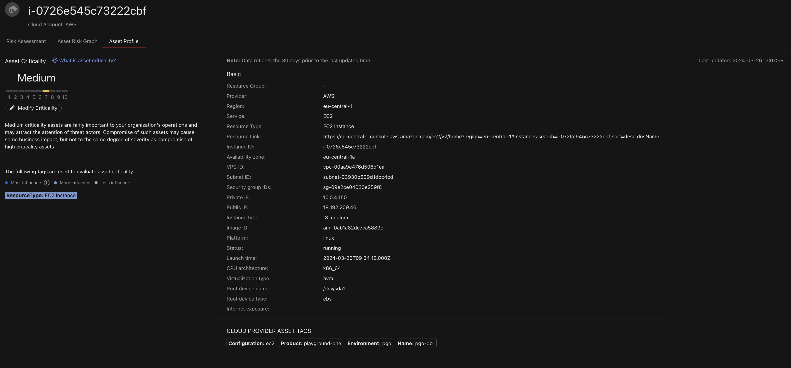
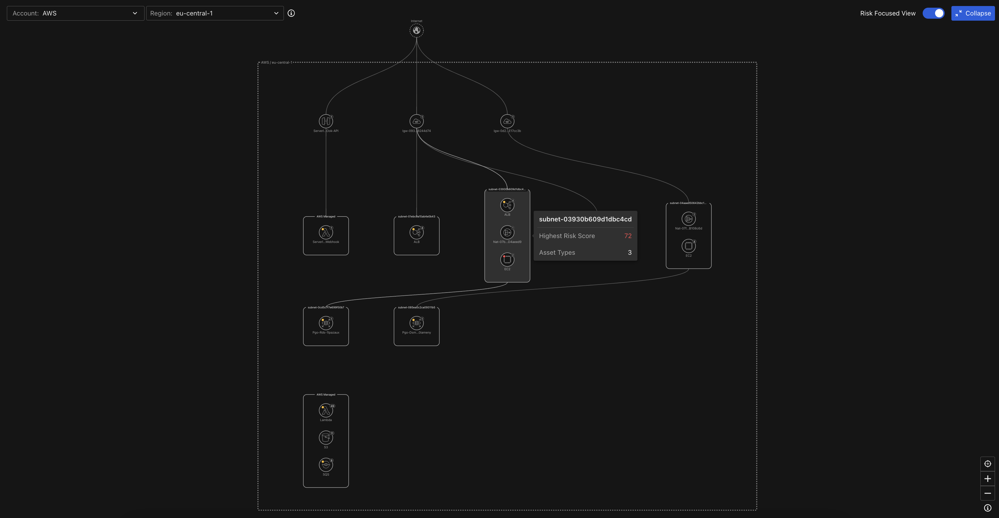

# Scenario: ASRM to detect Predictive Attack Path to RDS via EC2

***DRAFT***

!!! danger "Work in progress!"

    This scenario is not finished yet 

## Prerequisites

- AWS Cloud Account integrated with Vision One

!!! danger "Insecure Configuration"

    Playing through this scenario requires the Playground One to be
    configured insecurely. This is because one of the AWS EC2 Security
    Groups will be configured to `0.0.0.0/0` inbound rules. Depending
    on the governance restrictions you need to comply with you might
    receive a (friendly) notification. 

Ensure to have the Playground One Network up and running:

```sh
# Network configuration
pgo --apply network
```

## Setup

The Playground One configuration for EC2 (`ec2` or `instances`) creates two Linux servers when enabled in the config tool. The one of interest is the `db1` instance since it get's an instance profile assigned which allows read access to RDS. Contrary to all other instances this instance will use a dedicated security group which is open to the internet using the CIDR block `0.0.0.0/0`.

Verify, that you have `EC2 - create Linux EC2`, `EC2 - create RDS Database` and `Vision One ASRM - create Potential Attack Path(s)` enabled in your configuration.

```sh
pgo --config
```

```sh
...
EC2 - create Linux EC2 [true]:
...
EC2 - create RDS Database [true]: 
...
Vision One ASRM - create Potential Attack Path(s) [true]:
...
```

A (free-tier) PostgreSQL dabase is automatically created when applying the configuration. It is not actively used but required to have a target in the potential attack path.

```sh
# With Potential Attack Path enabled
pgo --apply network

# With Linux machines enabled
pgo --apply instances
```

The Linux instances are detected by Vision One ASRM after some time when you configured your CAM stack properly. The full analysis which should lead to a potential attack path for the `db1` instance as seen in the below screenshot can take up to 48hs.



As we can see, there is a high risk EC2 instance listed with a risk score of 72. Following the link of `i-0726e545c73222cbf` will explain us the cause of the risk rating. The instance is detected as an Internet-facing EC2 instance with unrestricted Access.

Additionally, the full potential attack path is shown in the lower half of the screen. It shows that one might be able to reach out to an RDS instance due to the assigned IAM instance role.



Navigating to the tab `Asset Risk Graph` creates a graphical representaion on the currently inspected asset. The instance of interest is the in grey highlighted one. On it's right the EC2 instance role granting database access is shown.

One can easily review the all the dependencies of this instance such as who can access the instance and why, the assigned security group and mounted volumes.



The Asset Profile presents detailed information about the asset such as Region, Availability zone, VPC ID, Public IP, architecture, and tags. Based on the analyses of Vision One, this instance is of Medium criticality. Depending on it's business relevance this could be easily adapted, if required.



Going back to `Attack Surface Discovery --> Cloud Assets` followed by enabling the `Cloud Risk Graph` in the top right we can use the region view, in this case `eu-central-1` to let Vision One visually present us a high level view on what is deployed in the region of interest. The highlighted subnet `subnet-03930b609d1dbc4cd` indicates that an EC2 with a high risk score of 72 exists in it.



🎉 Success 🎉

## Tear Down

At minimum, disable `Vision One ASRM - create Potential Attack Path(s)` in your configuration.

```sh
pgo --config
```

```sh
...
Vision One ASRM - create Potential Attack Path(s) [true]: false
...
```

```sh
pgo --apply network
```
