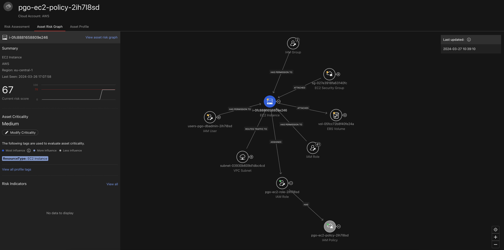

# Scenario: ASRM to detect Potential Attack Path to RDS via EC2

## Prerequisites

- AWS Cloud Account integrated with Vision One

!!! danger "Insecure Configuration"

    Playing through this scenario requires the Playground One to be
    configured insecurely. This is because one of the AWS EC2 Security
    Groups will be configured to `0.0.0.0/0` inbound rules. Depending
    on the governance restrictions you need to comply with you might
    receive a (friendly) notification. 

Ensure to have the Playground One Network up and running:

```sh
# Network configuration
pgo --apply network
```

## Setup

The Playground One configuration for EC2 (`ec2` or `instances`) creates two Linux servers when enabled in the config tool. The one of interest is the `db1` instance since it get's an instance profile assigned which allows read access to RDS. Contrary to all other instances this instance will use a dedicated security group which is open to the internet using the CIDR block `0.0.0.0/0`.

Verify, that you have `EC2 - create Linux EC2`, `EC2 - create RDS Database` and `Vision One ASRM - create Potential Attack Path(s)` enabled in your configuration.

```sh
pgo --config
```

```sh
...
EC2 - create Linux EC2 [true]:
...
EC2 - create RDS Database [true]: 
...
Vision One ASRM - create Potential Attack Path(s) [true]:
...
```

A (free-tier) PostgreSQL dabase is automatically created when applying the configuration. It is not actively used but required to have a target in the potential attack path.

```sh
# With Potential Attack Path enabled
pgo --apply network

# With Linux machines enabled
pgo --apply instances
```

The Linux instances are detected by Vision One ASRM after some time when you configured your CAM stack properly. The full analysis which should lead to a potential attack path for the `db1` instance as seen in the below screenshot can take up to 48hs.


Below the Asset Graph of the high risk instance:


It's profile:


The assigned policy:



And where it's located:


🎉 Success 🎉

## Tear Down

At minimum, disable `Vision One ASRM - create Potential Attack Path(s)` in your configuration.

```sh
pgo --config
```

```sh
...
Vision One ASRM - create Potential Attack Path(s) [true]: false
...
```

```sh
pgo --apply network
```
