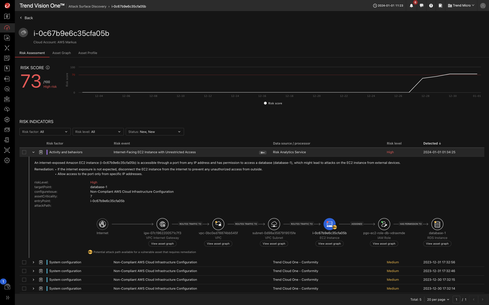
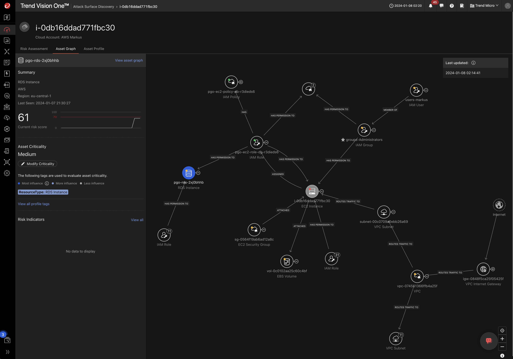

# Scenario: ASRM to detect Potential Attack Path

## Prerequisites

- AWS Cloud Account integrated with Vision One

Ensure to have the Playground One Network up and running:

```sh
# Network configuration
pgo --apply nw
```

## Setup

The Playground One configuration for EC2 (`ec2` or `instances`) creates two Linux servers when enabled in the config tool. The one of interest is the `db1` instance since it get's an instance profile assigned which allows read access to RDS. Contrary to all other instances this instance will use a dedicated security group which is open to the internet using the CIDR block `0.0.0.0/0`.

Verify, that you have `EC2 - create RDS Database` enabled in your configuration.

```sh
pgo --config
```

```sh
...
EC2 - create Linux EC2 [true]:
...
EC2 - create RDS Database [true]: 
...
```

A (free-tier) PostgreSQL dabase is automatically created when applying the configuration. It is not actively used but required to have a target in the potential attack path.

```sh
# With Linux machines enabled
pgo --apply ec2
```

The Linux instances are detected by Vision One ASRM after some time when you configured your CAM stack properly. The full analysis which should lead to a potential attack path for the `db1` instance as seen in the below screenshot can take up to 48hs.



Below the Asset Graph of the high risk instance:



🎉 Success 🎉
