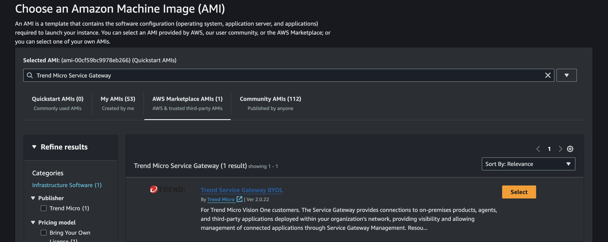
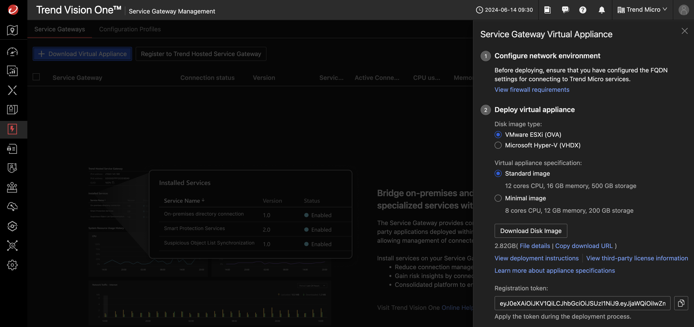
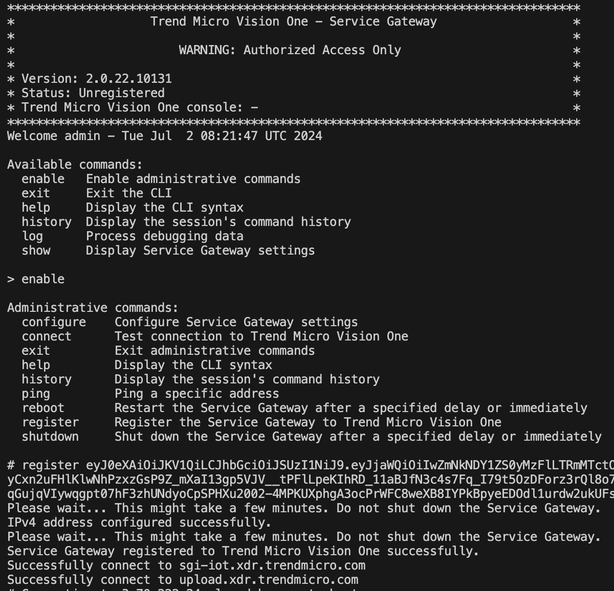

# Scenario: Deploy Vision One Service Gateway on AWS Automatically

## Prerequisites

- Playground One Network
- Activated Marketplace AMI for Trend Service Gateway BYOL

You need to have activated the Trend Service Gateway BYOL AMI in Marketplace once. To do this, on the AWS Console choose the service EC2 and navigate to `Images --> AMI Catalog`. Select the tab `AWS Marketplace AMIs` and seach for `Trend Micro Service Gateway`.



There should only be one AMI shown for your current region. Click on `[Select]` and `[Subscribe on instance launch]`. 


Now, check your Playground One configuration.

Verify, that you have `AWS SG - create Service Gateway` enabled in your configuration.

```sh
pgo --config
```

```sh
...
AWS SG - create Service Gateway [true]:
...
```

```sh
# With SG enabled
pgo --apply network
```

The Service Gateway gets a dedicated AWS Security Group assigned which allows SSH from your configured access IP(s) only. All other ports are only accessible from within the public and private subnets.

## Get the Vision One API Key

In Vision One head over to `Workflow and Automation -> Service Gateway Management` and click on `[Download Virtual Appliance]`.


In this scenario, you do not need to download the virtual appliance as we will be using an AWS Marketplace AMI. Simply copy the registration token shown at the bottom right and save it in a safe place.



## Activate the Service Gateway

Back to your console/shell run the following command (adapt the parameters to your environment):

```sh
pgo --output network
```

```sh
...
sg_va_ssh = "ssh -i /home/markus/projects/opensource/playground/playground-one/pgo-key-pair-oaxuizlr.pem -o StrictHostKeyChecking=no admin@18.194.239.58"
...
```

The interesting value here is `sg_va_ssh`. Run the given command to connect to the Service Gateway.

```sh
ssh -i /home/markus/projects/opensource/playground/playground-one/pgo-key-pair-oaxuizlr.pem -o StrictHostKeyChecking=no admin@18.194.239.58
```



```sh
enable

register <your API Token from the first step>
```

It can take some time for the Service Gateway to show up in the console.

🎉 Success 🎉
