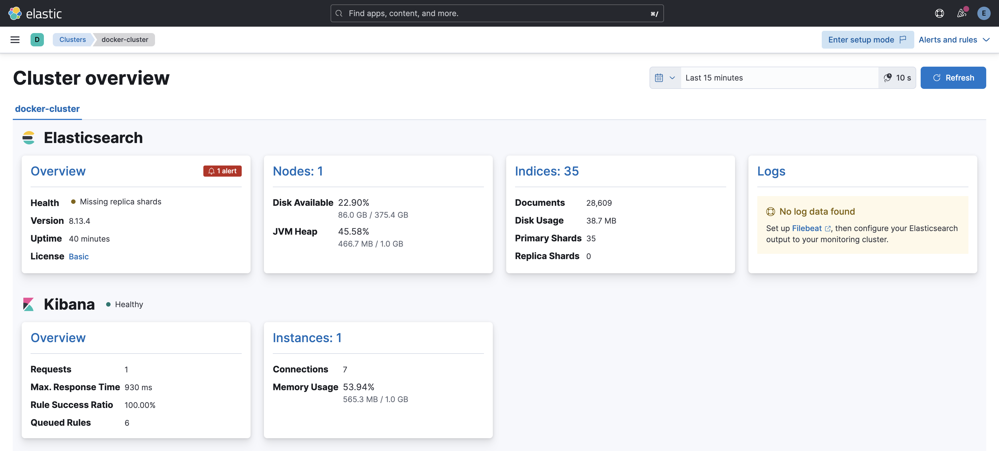

# Get the Elastic Stack (ELK) Up and Running Locally

***DRAFT***

!!! warning "Challenge ahead!"

    This scenario is a bit challenging, but you should be able to get through it.

## Prerequisites

- Docker Engine with Compose enabled
- The host needs at least 8GB RAM available

## Install Compose (if required)

Use the following command to download:

```sh
mkdir -p ~/.docker/cli-plugins/
curl -SL https://github.com/docker/compose/releases/download/v2.3.3/docker-compose-linux-x86_64 -o ~/.docker/cli-plugins/docker-compose
```

Next, set the correct permissions so that the docker compose command is executable:

```sh
chmod +x ~/.docker/cli-plugins/docker-compose
```

To verify that the installation was successful, you can run:

```sh
docker compose version
```

You’ll see output similar to this:

```sh
Output
Docker Compose version v2.3.3
```

Docker Compose is now successfully installed on your system. In the next section, you’ll see how to set up a `docker-compose.yaml` file and get a containerized environment up and running with this tool.

## Start your ELK-Stack

First, change to the working directory.

```sh
# Change to working directory
cd ${ONEPATH}/stacks/elastic
```

Feel free to review the files, especially the `docker-compose.yaml` which creates the stack.

Now run

```sh
docker compose up
```

The first startup requires some minutes to complete.

Optionally, check the certificate for your stack:

```sh
docker cp elastic-es01-1:/usr/share/elasticsearch/config/certs/ca/ca.crt /tmp/.

curl --cacert /tmp/ca.crt -u elastic:TrendMicro.1 https://localhost:9200
```

This should return something similar like this:

```json
{
  "name" : "es01",
  "cluster_name" : "docker-cluster",
  "cluster_uuid" : "wmp-Yz-WQPq4_kfzzyo8wg",
  "version" : {
    "number" : "8.13.4",
    "build_flavor" : "default",
    "build_type" : "docker",
    "build_hash" : "da95df118650b55a500dcc181889ac35c6d8da7c",
    "build_date" : "2024-05-06T22:04:45.107454559Z",
    "build_snapshot" : false,
    "lucene_version" : "9.10.0",
    "minimum_wire_compatibility_version" : "7.17.0",
    "minimum_index_compatibility_version" : "7.0.0"
  },
  "tagline" : "You Know, for Search"
}
```

Try to access your Kibana instance, the main UI of your Elastic Stack, at <http://localhost:5601> and use the following credentials:

- Username: `elastic`
- Password: `TrendMicro.1`

Within Kibana, open the navigation (top left) and head over to `Management -> Stack Monitoring`. There should be a dialog popping up to create `Out-of-the box rules`. Do it.



!!! info "Detached Mode"

    If you want to run the stack continuously restart the stack but append `-d` to activate detached mode.

    `docker compose up -d`

## Tear Down Elastic

If you at some point want to delete your ELK Stack instance run the following command:

```sh
docker compose down -v
```

This will remove all containers, volumes, and the network.
