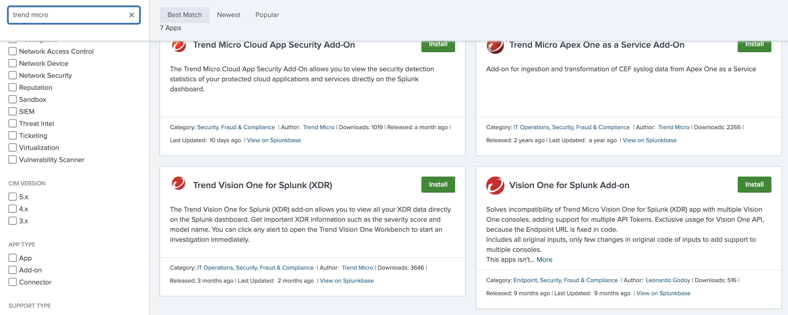
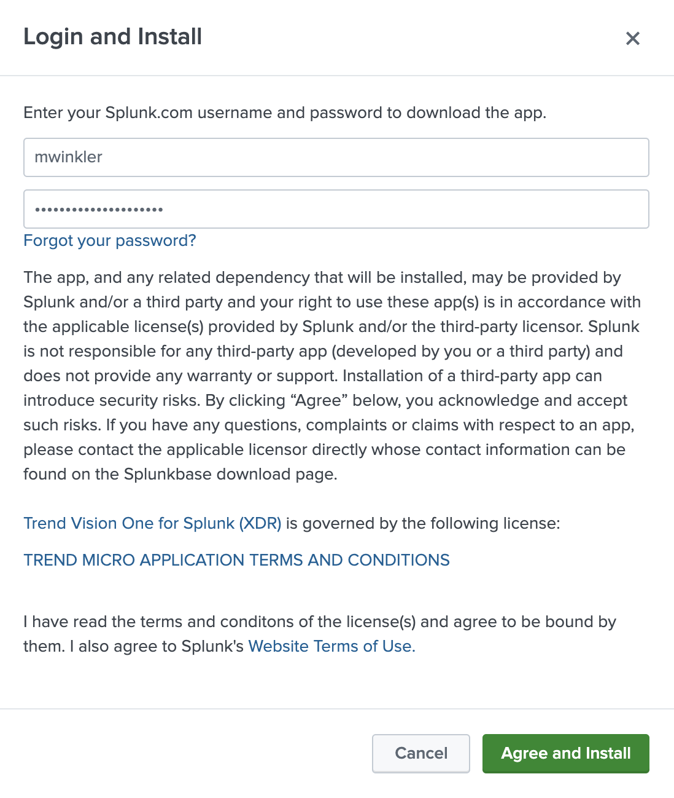
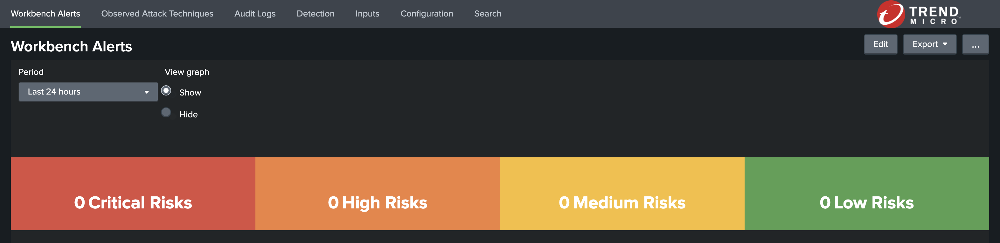
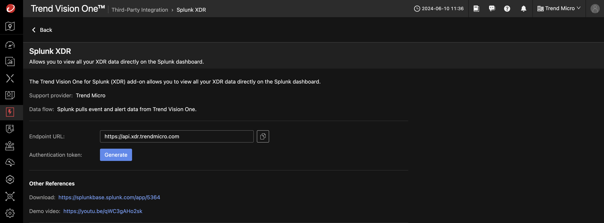
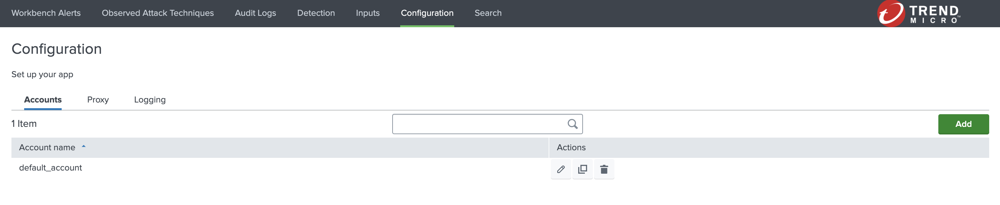
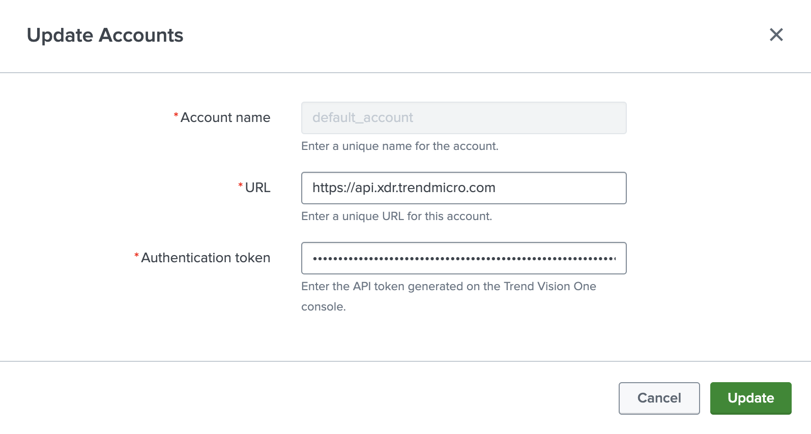
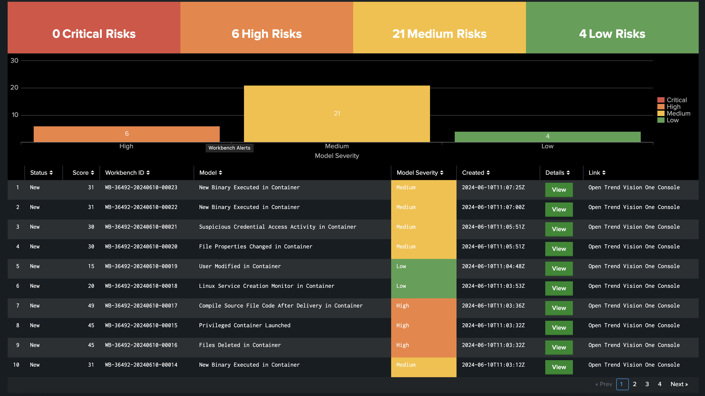

# Integrate Splunk with Vision One XDR

***DRAFT***

## Prerequisites

- Docker Engine with Compose enabled
- Completed Scenario [Splunk Setup](splunk-setup.md)

## Install the Trend Vision One for Splunk (XDR) App

Navigate to `Apps -> Manage Apps` in the top left of your Splunk frontent. Click on the green `[Browse more apps]` button in the top right afterwards.

Now, type `trend micro` in the search bar at the top left and press `[Enter]`.

You should see seven apps as the result, whereby one is `Trend Vision One for Splunk (XDR)`.



Click the green `[Install]`-button.

In the next dialog you will be prompted to enter your personal user credentials of your Splunk account:



You will be promped to restart Splunk. After the successful restart you should see the XDR App as shown below.



## Connect Splunk to Vision One

The XDR App will pull data from Vision One. To allow this we need to head over to Vision One and create an API Key for your Splunk instance.

In Vision One head over to `Workflow and Automation -> Third-Party Ingegration` and filter for `Splunk` in the vendors section. This should filter on four available integration variants. Choose `Splunk XDR` in this case.



Click on `[Generate]` and in the `Add API Key`-dialog on `[Add]`.

Save the generated API Key in a secure location.

Next, go back to your Splunk and the XDR App we just installed. In the apps menu select `Configuration` and click on the pencil button of the `default_account`.



As URL type `https://api.xdr.trendmicro.com` for an US instance of Vision One. Adapt the URL if your instance is located in another region (see [FAQ](../../../faq.md#know-how-to-check-the-region-and-data-center-location-details-in-trend-vision-one)).

As the `Authentication token` paste the API Key generated in Vision One beforehand.



Click `[Update]`.

From now on, any new Workbench Alerts and OATs should show up in Splunk.

## (Optional) Generate Detections Locally

If you want to automatically generate Workbenches and OATs deploy any of the provided Scenario configurations of Playground One (EKS with EC2 or Fargate, or Kind).

Below, how to do this using the built in Kind cluster:

***Prerequisite: Vision One Container Security configured in Playground One configuration.***

```sh
pgo --init kind
pgo --apply kind
pgo --apply scenarios-kind
```

The Kind scenarios will generate findings every full hour.


