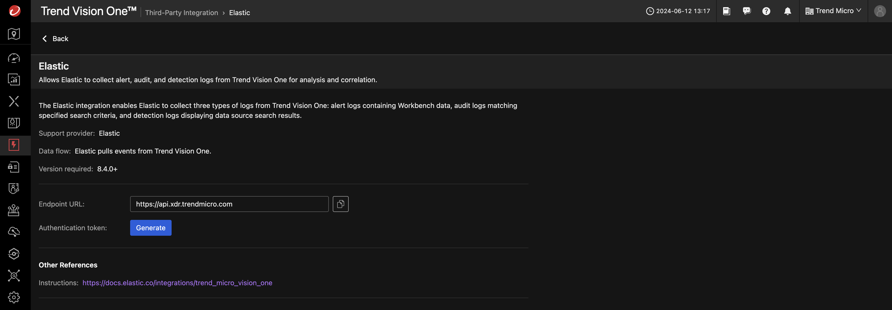
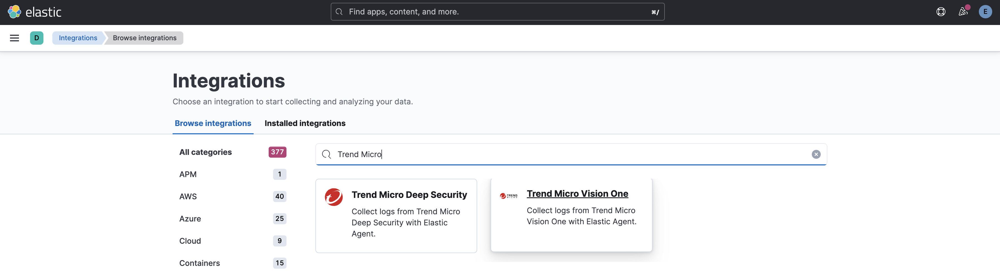
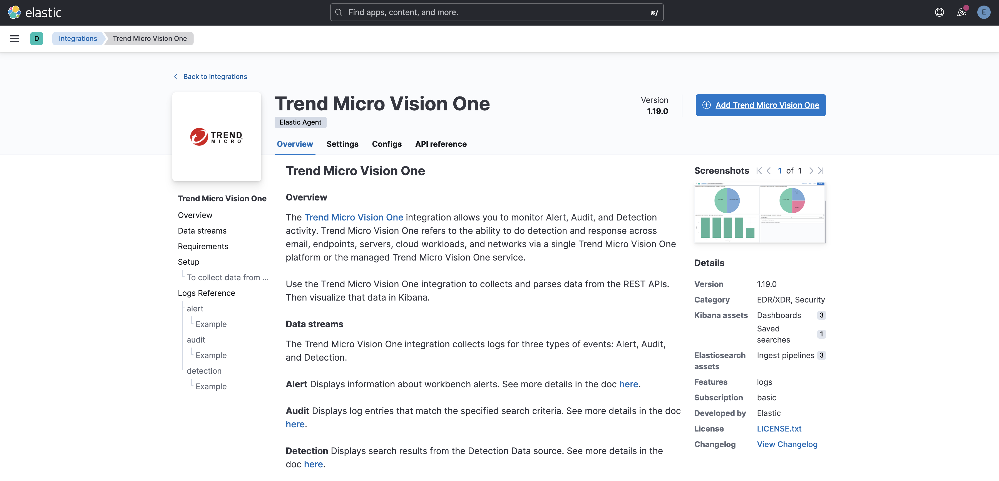
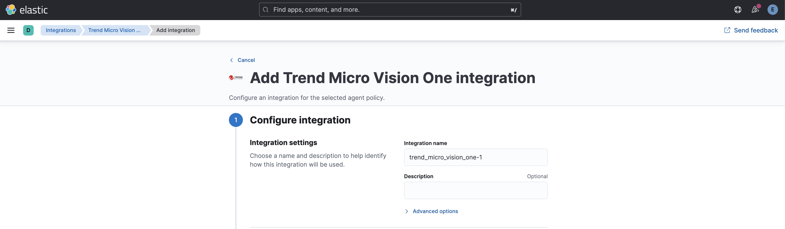

# Integrate Elastic Stack with Vision One

***DRAFT***

!!! warning "Challenge ahead!"

    This scenario is a bit challenging, but you should be able to get through it easily.

## Prerequisites

- Docker Engine with Compose enabled
- Completed Scenario [Elastic Setup](elastic-stack.md)

## Connect the Trend Vision One for Elastic App to Vision One

The App will pull data from Vision One. To allow this we need to head over to Vision One and create an API Key for your Elastic instance.

In Vision One head over to `Workflow and Automation -> Third-Party Ingegration` and filter for `Elastic` in the vendors section. This should filter on four available integration variants. Choose `Elastic` in this case.

Click on `[Generate]` and in the `Add API Key`-dialog on `[Add]`.

Save the generated API Key in a secure location.

Next, go back to your Kibana and navigate to `Management -> Integrations` and find `Trend Micro Vision One`.

Click on the Integration.

Install the integration by clicking on the blue button `[Add Trend Micro Vision One]`

Go through the settings and set URL und API Token. Leave everything to the defaults.

As URL type `https://api.xdr.trendmicro.com` for an US instance of Vision One. Adapt the URL if your instance is located in another region (see [FAQ](../../faq.md#know-how-to-check-the-region-and-data-center-location-details-in-trend-vision-one)).

Click on the button `[Save and continue]` in the bottom right.

To be continued...

## Links

- Integration: <https://docs.elastic.co/integrations/trend_micro_vision_one>
