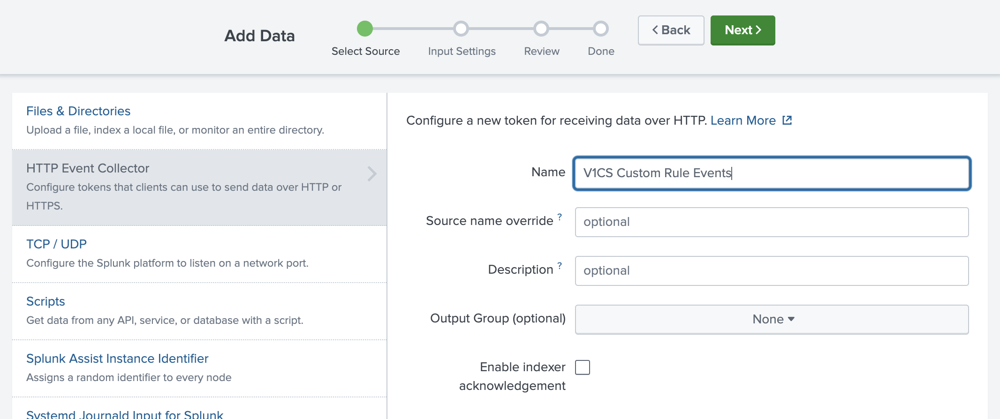
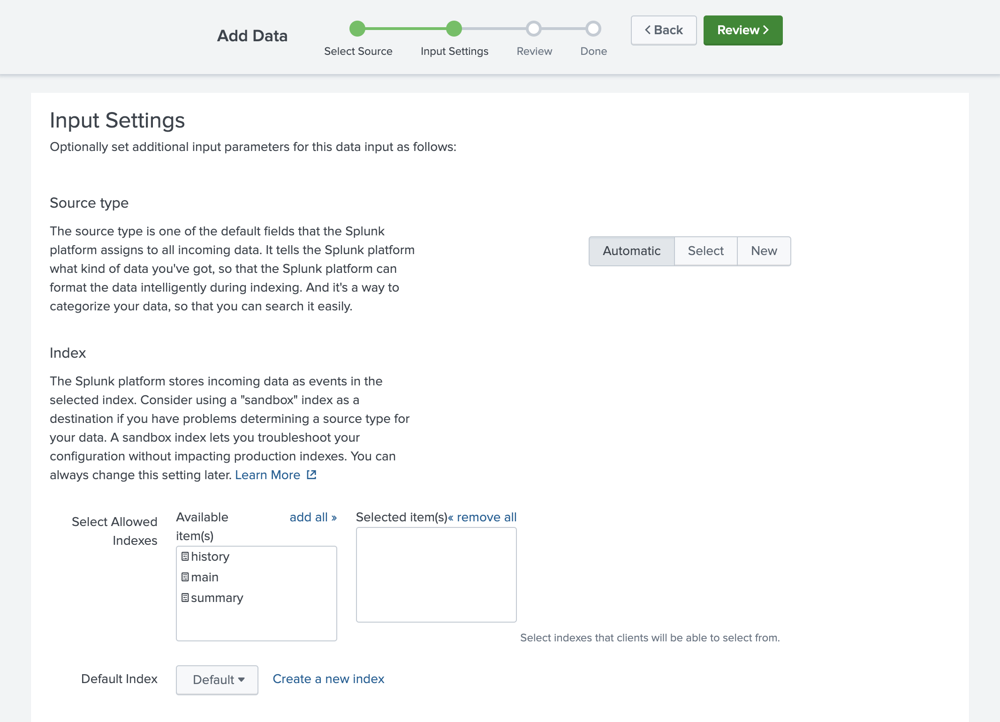
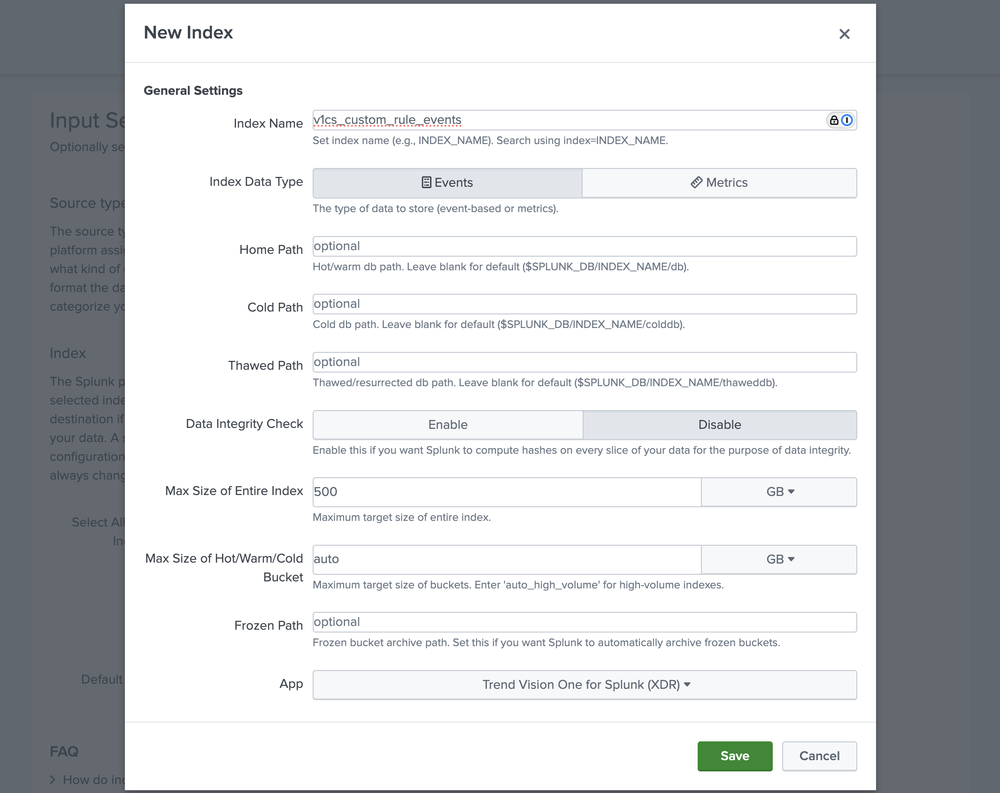
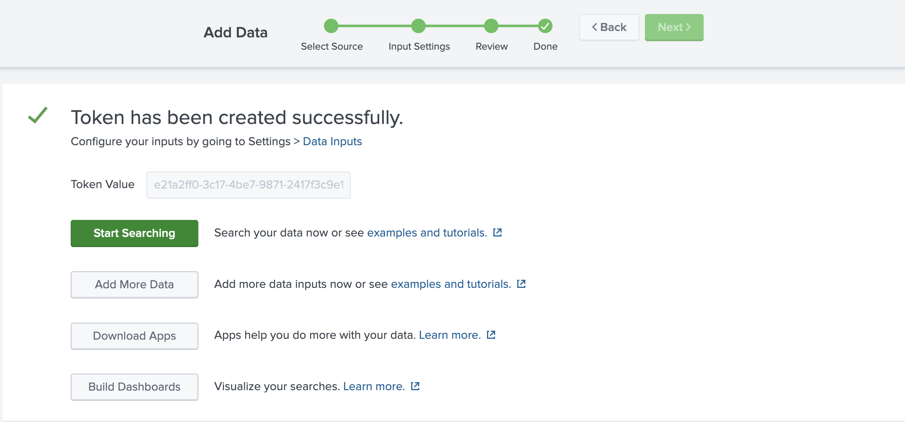
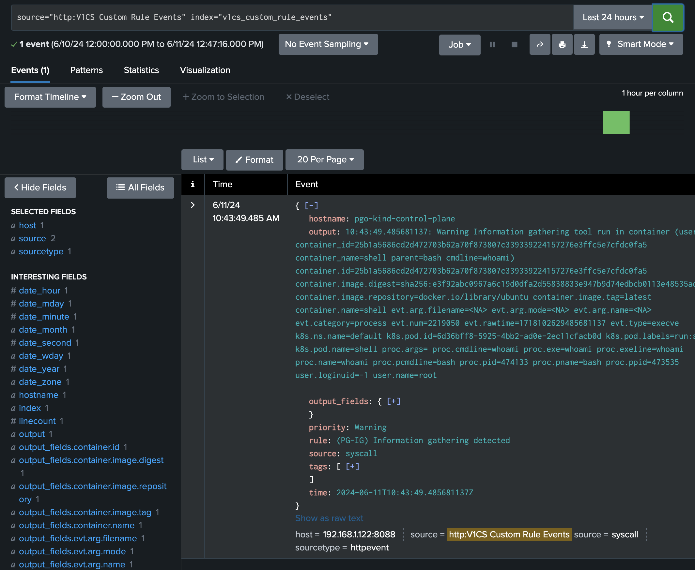

# Integrate V1CS Customer Runtime Security Rules with Splunk

***DRAFT***

!!! warning "Challenge ahead!"

    This scenario is a bit challenging, but you should be able to get through it easily.

## Prerequisites

- Docker Engine with Compose enabled
- Completed Scenario [Splunk Setup](splunk-setup.md)

## Configure HTTP Event Collector in Splunk

Beeing authenticated to Splunk navigate to `Settings -> Data -> Data inputs` and create a new `HTTP Event Collector` by clicking `[+ Add new]` on the right hand side.


Create a `V1CS Custom Rule Events`



Click `[Next]`, which you will bring to the `Input Settings`.



On the this page we will create a new indexer first. To do so, click on `Create a new index`.



Name it `v1cs_custom_rule_events`, and change App to `Splunk Analytics Workspace`. 


Leave all the rest as default and click `[Save]`.

Back at the Input Settings, move the newly created index to the right box by clicking on it.


Proceed with `[Review >]` in the upper right.

Proceed with `[Submit >]` in the upper right.



Finally, move back to `Settings -> Data -> Data inputs` and select `HTTP Event Collector` which now shows our just created collector. You now want to copy the `Token Value` and paste it to your notes.


Btw, you need to know the IP address of your docker host later.

## Integrate Custom Rules to V1CS

Custom Rules for Vision One Container Security do work with any kind of the provided Kubernetes clusters (EKS with EC2 or Fargate, or Kind).

Below, how to do this using the built in Kind cluster:

***Prerequisite: Vision One Container Security configured in Playground One configuration.***

```sh
pgo --init kind
pgo --apply kind
```

The above will create the cluster and deploy Container Security.

Next, run the following commands in your shell:

```sh
# Create and change to working directory
mkdir -p ${ONEPATH}/customrules
cd ${ONEPATH}/customrules

# Download helm release
tag=2.3.38
curl -LOs https://github.com/trendmicro/cloudone-container-security-helm/archive/refs/tags/${tag}.tar.gz
tar xfz ${tag}.tar.gz

# Navigate to the customrules directory
cd cloudone-container-security-helm-${tag}/config/customrules
```

Next, we're creating a sample custom rule. Do this by running the following command:

```sh
cat <<EOF >./playground_rules.yaml
# ################################################################################
# Information Gathering
# ################################################################################
- macro: container
  condition: (container.id != host)

# We create an event, if someone runs an information gathering tool within a container
- list: information_gathering_tools
  items:
    [
      whoami,
      nmap,
      racoon,
      ip,
    ]

- rule: (PG-IG) Information gathering detected
  desc: An information gathering tool is run in a Container
  condition: evt.type = execve and evt.dir=< and container.id != host and proc.name in (information_gathering_tools)
  output: "Information gathering tool run in container (user=%user.name %container.info parent=%proc.pname cmdline=%proc.cmdline)"
  priority: WARNING
EOF
```

This rule will trigger, when you run the command `whoami` inside of a container. Nothing serious, but it should show how it works.

After changing back to our working directory with

```sh
cd ${ONEPATH}/customrules
```

we create an additional overrides file which enables custom rules in Container Security. Run

```sh
# splunk_http_event_collector=http://<IP address of your docker host>:8088
splunk_http_event_collector=http://192.168.1.122:8088
# splunk_token_value=<Token Value from the previous step>
splunk_token_value=e21a2ff0-3c17-4be7-9871-2417f3c9e19f

cat <<EOF >./overrides-custom-rules.yaml
cloudOne:
  runtimeSecurity:
    enabled: true
    customRules:
      enabled: true
      output:
        json: true
        splunk:
          url: ${splunk_http_event_collector}/services/collector/raw
          headers:
          - "Authorization: Splunk ${splunk_token_value}"
EOF
```

Now, upgrade the helm deployment of Container Security in your cluster. Run:

```sh
helm get values --namespace trendmicro-system container-security | \
  helm upgrade container-security \
    --namespace trendmicro-system \
    --values - \
    --values overrides-custom-rules.yaml \
    cloudone-container-security-helm-2.3.38
```

The above basically reads out the current values of the Container Security deployment, adds our overrides to enable custom rules, and upgrades the deployment.

Example upgrade output:

```sh
Release "container-security" has been upgraded. Happy Helming!
NAME: container-security
LAST DEPLOYED: Tue Jun 11 12:37:39 2024
NAMESPACE: trendmicro-system
STATUS: deployed
REVISION: 13
TEST SUITE: None
```

## Testing it...

Now, let's test what we did. We're quickly creating a shell in our Kubernetes cluster here:

```sh
kubectl run -it --image=ubuntu shell --restart=Never --rm -- /bin/bash
```

It's just a simple Ubuntu shell what you should get, but it runs as a Pod on your cluster.

```sh
If you don't see a command prompt, try pressing enter.
root@shell:/# 
```

Now, run the command `whomi` which will tell you, that you're `root` :-).

```sh
root@shell:/# whoami
root
```

Now, back to Splunk...

Navigate to `Search & Reporting >`


As the `Search` query type:

```
source="http:V1CS Custom Rule Events" index="v1cs_custom_rule_events"
```


This should reveal our information gathering attempt...



Look for `proc.cmdline=`.

🎉 Success 🎉

## Some other Custom Rules You can Play with

Simply append the yamls below to your `/config/customrules/playground_rules.yaml`.

```yaml
# ################################################################################
# Container Escape
# ################################################################################
- macro: is_kind
  condition: container.image startswith "kindest/node:"

# Container Escape with nsenter
# Not 100% sure about the deltatime thing
# Runnig a nsenter -t 1 -m -u -i -n bash will result in four findings if no
# deltatime is defined. 
- rule: (PG-ESC) Detect Container Escape (nsenter)
  desc: Detect a container escape using nsenter
  condition: >
    evt.type = setns
    and container
    and container.privileged=true
    and container.image != ""
    and evt.deltatime > 8000
    and not is_kind
  output: >
    The command nsenter was used to run a process within the name spaces of another process from within a container
    (user=%user.name command=%proc.cmdline parent=%proc.pname pcmdline=%proc.pcmdline gparent=%proc.aname[2]
    container=%container.name image=%container.image)
  priority: ERROR
  tags: [escape]
```

*Exploit Container Escape with `nsenter`:*

Start a privileged container in Kubernetes:

```sh
kubectl run -it --image=alpine s --restart=Never --rm --overrides '{"spec":{"hostPID":true,"containers":[{"name":"shell","image":"alpine","stdin":true,"tty":true,"command":["/bin/sh"],"securityContext":{"privileged":true}}]}}'
```

From within the container run: `nsenter -t 1 -m -u -i -n sh`

```yaml
# ################################################################################
# Shell Usage in Container
# ################################################################################
- macro: spawned_process
  condition: (evt.type in (execve, execveat) and evt.dir=<)

- list: shell_binaries
  items: [ash, bash, csh, ksh, sh, tcsh, zsh, dash]

- macro: shell_procs
  condition: (proc.name in (shell_binaries))

# Detect attach/exec with terminal shell as root or user
- macro: is_user_shell
  condition: (proc.vpid!=1 and user.uid!=0)

- macro: is_root_shell
  condition: (proc.vpid!=1 and user.uid=0)

- rule: (PG-SHELL) Attach/Exec Pod with Terminal User shell in container
  desc: A shell was created inside an unprivileged container with an attached terminal.
  condition: >
    spawned_process and container
    and shell_procs and proc.tty != 0
    and is_user_shell
  output: >
    A shell was spawned in a container with an attached terminal (user=%user.name user_loginuid=%user.loginuid %container.info
    shell=%proc.name parent=%proc.pname cmdline=%proc.cmdline terminal=%proc.tty container_id=%container.id image=%container.image.repository)
  priority: WARNING
  tags: [container, shell, mitre_execution]
  enabled: true

- rule: (PG-SHELL) Attach/Exec Pod with Terminal Root shell in container
  desc: A shell was created inside a container which runs as root user with an attached terminal.
  condition: >
    spawned_process and container
    and shell_procs and proc.tty != 0
    and is_root_shell
  output: >
    A shell with root privileges was spawned in a container running as root with an attached terminal (user=%user.name
    user_loginuid=%user.loginuid %container.info shell=%proc.name parent=%proc.pname cmdline=%proc.cmdline terminal=%proc.tty
    container_id=%container.id image=%container.image.repository)
  priority: WARNING
  tags: [container, shell, mitre_execution]
  enabled: true
```

*Trigger:*

Find a Pod you want a shell in

```sh
kubectl get pods -A
```

and then try to open a shell with

```sh
kubectl exec -it -n <NAMESPACE> <POD> -- /bin/sh
```
