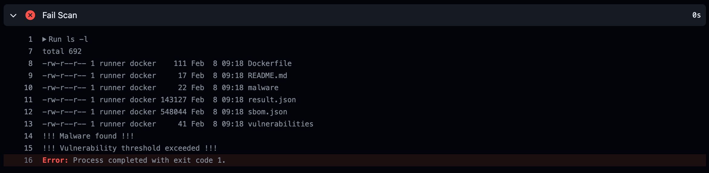
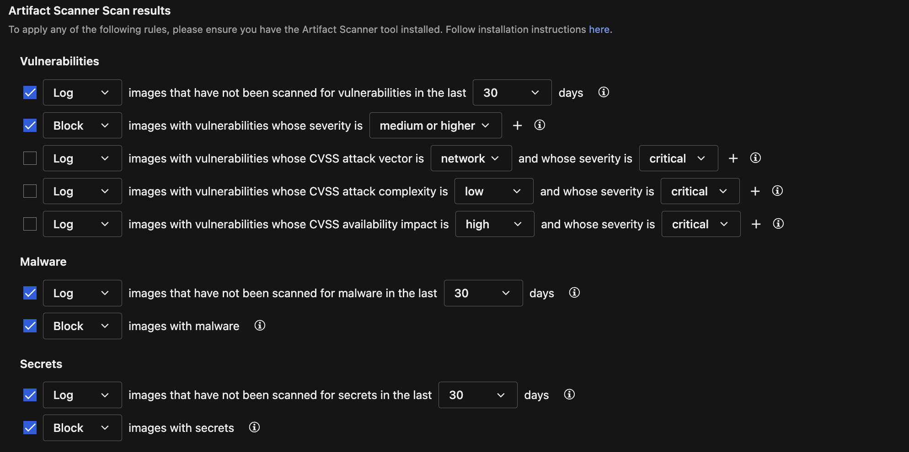

# Scenario: Container Image Vulnerability and Malware Scanning as GitHub Action

## Prerequisites

- Vision One Container Security Artifact Scanner API-Key with the following permissions:
    - Cloud Security Operations
        - Container Protection
            - Run artifact scan
- GitHub Account.
- Forked [playground-one-scenario-github-action](https://github.com/mawinkler/playground-one-scenario-github-action).
- Kubernetes Cluster (ideally) with Vision One Container Security deployed.

## About GitHub Actions

GitHub Actions is a continuous integration and continuous delivery (CI/CD) platform that allows you to automate your build, test, and deployment pipeline on GitHub.

GitHub Actions goes beyond just DevOps and lets you run workflows when other events happen in your repository. For example, you can run a workflow to automatically add the appropriate labels whenever someone creates a new issue in your repository.

You can configure a GitHub Actions workflow to be triggered when an event occurs in your repository, such as a pull request being opened, an issue being created or a push happened. Your workflow contains one or more jobs which can run in sequential order or in parallel. Each job will run inside its own virtual machine runner, or inside a container, and has one or more steps that either run a script that you define or run an action, which is a reusable extension that can simplify your workflow.

Workflows are defined as YAML files in the .github/workflows directory in a repository, and a repository can have multiple workflows, each of which can perform a different set of tasks.

In this scenario we're going to create a workflow to automatically build, push and scan a container image with Trend Micro Artifact Scanning. The scan will check the image for vulnerabilities and malware and may push it to the registry.

The logic implemented in this Action template is as follows:

- Prepare the Docker Buildx environment.
- Build the image and save it as a tar ball.
- Scan the built image for vulnerabilities and malware using Vision One Container Security.
- Upload Scan Result and SBOM Artifact if available. Artifacts allow you to share data between jobs in a workflow and store data once that workflow has completed, in this case saving the scan result and the container image SBOM as an artifact allow you to have proof on what happened on past scans.
- Optionally fail the workflow if malware and/or the vulnerability threshold was reached. Failing the workflow at this stage prevents the registry to get polluted with insecure images.
- Authenticate to the deployment registry.
- Rebuild the image from cache for the desired architectures.
- Push the image to the registry.
- Rescan the image in the registry to allow proper admission control integration.

## Fork the Scenario Repo

The first step is to fork the scenarios GitHub repo. For this go to [github.com](https://github.com/) and sign in or create a free account if you need to.

Next, you want to create a Fork of the scenarios repo. A fork is basically a copy of a repository. Forking a repository allows you to freely experiment with changes without affecting the original project.

To do this navigate to the repo [playground-one-scenario-github-action](https://github.com/mawinkler/playground-one-scenario-github-action) and click on the `Fork`-button in the upper right.

On the next screen you change the name to something shorter like `action`. Then press `[Create fork]` which will bring you back to your account.

## The Repo

The repo containes a very simple Dockerfile and a hidden directory `.github/workflows` with a `yaml`-file.

The Dockerfile specifies the image to build. As we can easily see, it is using the latest `nginx` as the base image and just adds (very obviously) an Eicar.

```Dockerfile
FROM nginx

RUN curl -fsSL http://eicar.eu/eicarcom2.zip -o /usr/share/nginx/html/eicarcom2.zip
```

### The Workflow

The `yaml`-file in `.github/workflows` is more interesting. Let's go through it.

```yaml
name: ci

# A push --tags on the repo triggers the workflow
on:
  push:
    tags: [ v* ]

env:
  REGISTRY: ghcr.io
  IMAGE_NAME: ${{ github.repository }}
  TMAS_API_KEY: ${{ secrets.TMAS_API_KEY }}

  REGION: us-east-1
  THRESHOLD: "critical"
  MALWARE_SCAN: true
  FAIL_ACTION: true

jobs:
  docker:
    runs-on: ubuntu-latest
    permissions:
      contents: read
      packages: write

    steps:
      # Prepare the Docker Buildx environment.
      - name: Checkout
        uses: actions/checkout@v4
      - name: Set up QEMU
        uses: docker/setup-qemu-action@v3
      - name: Set up Docker Buildx
        uses: docker/setup-buildx-action@v3

      - name: Extract metadata for the Docker image
        id: meta
        uses: docker/metadata-action@v5
        with:
          images: ${{ env.REGISTRY }}/${{ env.IMAGE_NAME }}
          
      # Build the image and save it as a tar ball.
      - name: Build and store
        uses: docker/build-push-action@v5
        with:
          context: .
          tags: ${{ steps.meta.outputs.tags }}
          outputs: type=docker,dest=/tmp/image.tar

      # Scan the build image for vulnerabilities and malware.
      - name: Scan
        env:
          SBOM: true # Saves SBOM to sbom.json
        run: |
          # Install tmas latest version
          curl -s -L https://gist.github.com/raphabot/abae09b46c29afc7c3b918b7b8ec2a5c/raw/ | bash

          tmas scan -V "$(if [ "$MALWARE_SCAN" = true ]; then echo "-M"; fi)" -r "$REGION" docker-archive:/tmp/image.tar "$(if [ "$SBOM" = true ]; then echo "--saveSBOM"; fi)" | tee result.json

          if [ "$SBOM" = true ]; then mv SBOM_* sbom.json; fi

          # Analyze result
          fail_vul=false
          fail_mal=false
          [ "${THRESHOLD}" = "any" ] && \
            [ $(jq '.vulnerability.totalVulnCount' result.json) -ne 0 ] && fail_vul=true

          [ "${THRESHOLD}" = "critical" ] && \
            [ $(jq '.vulnerability.criticalCount' result.json) -ne 0 ] && fail_vul=true

          [ "${THRESHOLD}" = "high" ] && \
            [ $(jq '.vulnerability.highCount + .vulnerability.criticalCount' result.json) -ne 0 ] && fail_vul=true

          [ "${THRESHOLD}" = "medium" ] && \
            [ $(jq '.vulnerability.mediumCount + .vulnerability.highCount + .vulnerability.criticalCount' result.json) -ne 0 ] && fail_vul=true

          [ "${THRESHOLD}" = "low" ] &&
            [ $(jq '.vulnerability.lowCount + .vulnerability.mediumCount + .vulnerability.highCount + .vulnerability.criticalCount' result.json) -ne 0 ] && fail_vul=true

          [ $(jq '.malware.scanResult' result.json) -ne 0 ] && fail_mal=true

          [ "$fail_vul" = true ] && echo !!! Vulnerability threshold exceeded !!! > vulnerabilities || true
          [ "$fail_mal" = true ] && echo !!! Malware found !!! > malware || true

      # Upload Scan Result and SBOM Artifact if available.
      - name: Upload Scan Result Artifact
        uses: actions/upload-artifact@v3
        with:
          name: scan-result
          path: result.json
          retention-days: 30

      - name: Upload SBOM Artifact
        uses: actions/upload-artifact@v3
        with:
          name: sbom
          path: sbom.json
          retention-days: 30

      # Fail the workflow if malware found or the vulnerability threshold reached.
      - name: Fail Action
        run: |
          if [ "$FAIL_ACTION" = true ]; then
            if [ -f "malware" ]; then cat malware; fi
            if [ -f "vulnerabilities" ]; then cat vulnerabilities; fi
            if [ -f "malware" ] || [ -f "vulnerabilities" ]; then exit 1; fi
          fi

      # Login to the registry.
      - name: Login to the Container registry
        uses: docker/login-action@v3
        with:
          registry: ${{ env.REGISTRY }}
          username: ${{ github.actor }}
          password: ${{ secrets.GITHUB_TOKEN }}

      # Rebuild the image and push to registry. This is fast since everything is cached.
      - name: Build and push
        id: build
        uses: docker/build-push-action@v5
        with:
          context: .
          push: true
          provenance: false
          tags: ${{ steps.meta.outputs.tags }}

      - name: Summarize the Docker digest and tags
        run: |
          echo 'Digest: ${{ steps.build.outputs.digest }}'
          echo 'Tags: ${{ steps.meta.outputs.tags }}'

      # Rescan in the registry to support admission control
      - name: Registry Scan
        run: |
          tmas scan -V "$(if [ "$MALWARE_SCAN" = true ]; then echo "-M"; fi)" -r "$REGION" -p linux/amd64 registry:${{ steps.meta.outputs.tags }} || true
```

### Secrets

The workflow requires a secret to be set. For that navigate to `Settings --> Security --> Secrets and variables --> Actions --> Secrets`.

Add the following secret:

- TMAS_API_KEY: `<Your TMAS API Key>`

### Template

Below, the workflow tamplate. Adapt it to your needs and save it as a `yaml`-file in the `.github/workflow` directory.

Adapt the environment variables in the `env:`-section as required.

Variable       | Purpose
-------------- | -------
`REGISTRY`     | The workflow uses the GitHub Packages by default.
`IMAGE_NAME`   | The image name is derived from the GitHub Repo name.
`TMAS_API_KEY` | The key is retrieved from the secrets.
`REGION`       | Vision One Region of choice (ap-southeast-2, eu-central-1, ap-south-1, ap-northeast-1, ap-southeast-1, us-east-1).
`THRESHOLD`    | Defines the fail condition of the action in relation to discovered vulnerabilities. A threshold of `critical` does allow any number of vulnerabilities up to the criticality `high`. 
`MALWARE_SCAN` | Enable or disable malware scanning.
`FAIL_ACTION`  | Enable or disable failing the action if the vulnerability threshold was reached and/or malware detected.

Allowed values for the `THRESHOLD` are:

- `any`: No vulnerabilities allowed.
- `critical`: Max severity of discovered vulnerabilities is `high`.
- `high`: Max severity of discovered vulnerabilities is `medium`.
- `medium`: Max severity of discovered vulnerabilities is `low`.
- `low`: Max severity of discovered vulnerabilities is `negligible`.

If the `THRESHOLD` is not set, vulnerabilities will not fail the pipeline.

The workflow will trigger on `git push --tags`.

### Actions

Navigate to `Actions` and enable Workflows for the forked repository.

## Test it

### Create a Tag

To trigger the action we simply create a tag.

Navigate to `Releases` on the right and then click on `[Draft a new release]`.

Next, click on `[Choose a tag]` and type `v0.1`. A new button called `[Create new tag]` should get visible. Click on it.

Leave the rest as it is and finally click on the green button `[Publish release]`. This will trigger the action workflow.

> ***CLI:*** `git tag v0.1 && git push --tags`

### Check the Action

Now, navigate to the tab `Actions` and review the actions output. Click on the workflow run.

You should now see three main sections:

1. `build-push.yaml`: Clicking on `docker` reveals the output of the steps from the workflow (and where it failed).
   
3. Annotations: Telling you in this case that the process completed with exit code 1.
4. Artifacts: These are the artifacts created by the action. There should be a `sbom` and `scan-result`.

### Let the workflow pass...

Now, we want the image to be published, even though that it has vulnerabilities and a malware inside. To achieve this in this scenario we simply change the environment variable `FAIL_ACTION`:

```yaml
env:
...
  FAIL_ACTION: false
```

Again, do this by directly editing the workflow file on GitHub and commit the changes to main. Then, repeat the steps to create a new tag as above, but choose a different tag (e.g. `v0.2`).

The action should now complete successfully and the container image is pushed to the registry.

### Configure Vision One Container Protection Policy

Next, ensure to have your Container Security policy set with the following properties:



### Try deployment

Assuming you have access to a Kubernetes cluster with Vision One Container Security deployed and a policy assigned with the setting from above, you can now run

```sh
kubectl run --image=ghcr.io/<GITHUB_USERNAME>/<GITHUB_REPO_NAME>:<IMAGE_TAG> action
```

This should result in the following error message since Container Security blocks the deploament:

```sh
Error from server: admission webhook "trendmicro-admission-controller.trendmicro-system.svc" denied the request: 
- malware violates rule with properties { count:0 } in container(s) "nginx" (block).
- vulnerabilities violates rule with properties { max-severity:high } in container(s) "nginx" (block).
```

🎉 Success 🎉
