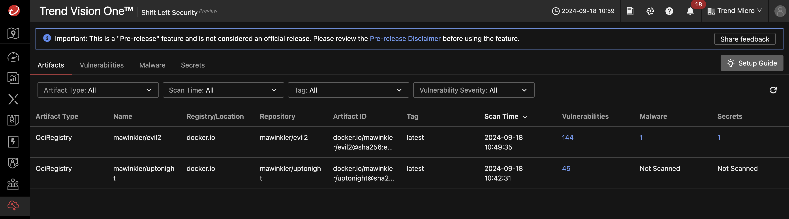
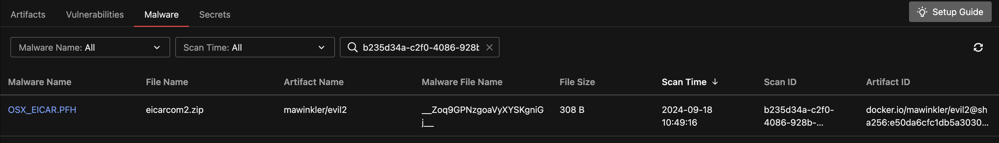
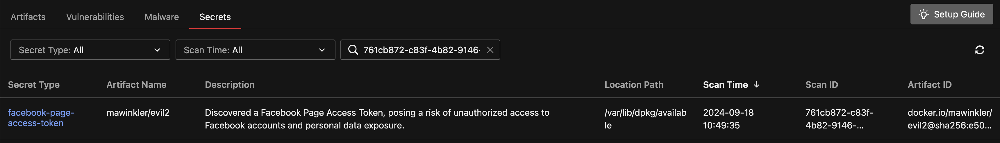
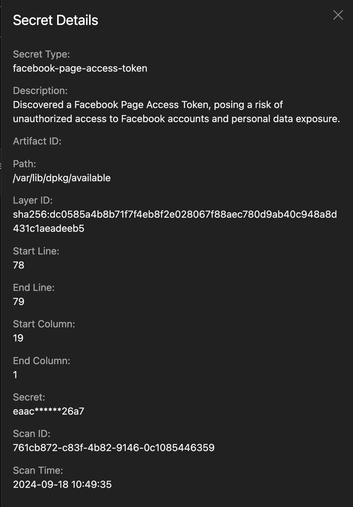
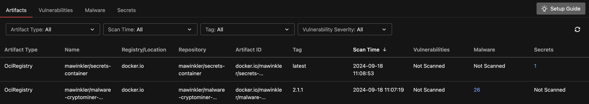
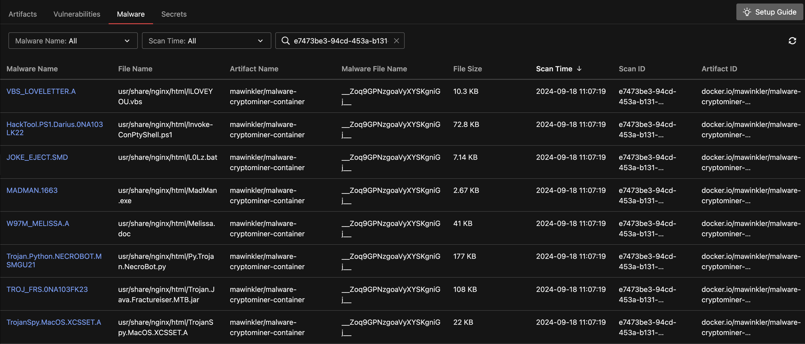
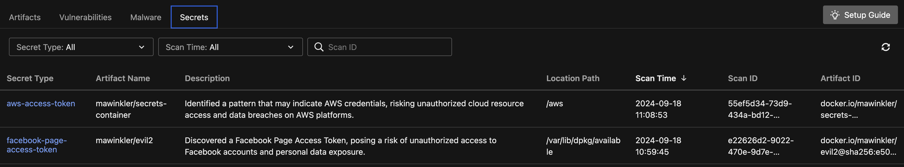
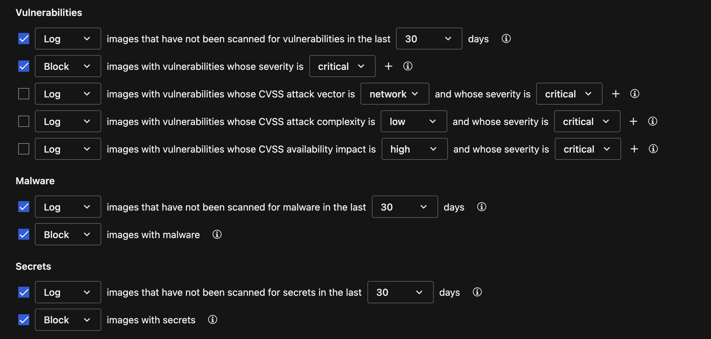

# Scenario: Shift Left Security - Preview

## Prerequisites

- Vision One Container Security Artifact Scanner API-Key with the following permissions:
    - Cloud Security Operations
        - Container Protection
            - Run artifact scan
- Playground One EKS EC2 Cluster
- Vision One Container Security

Ensure to have the latest `tmas` deployed:

```sh
tmcli-update
```

## Scan Images

First, set the Artifact Scanner API-Key as an environment variable:

```sh
export TMAS_API_KEY=<YOUR API-Key>
```

> ***Note:*** tmas defaults to the Vision One service region `us-east-1`. If your Vision One is serviced from any other region you need to add the `--region` flag to the scan request.
> 
> Valid regions: `[ap-southeast-2 eu-central-1 ap-south-1 ap-northeast-1 ap-southeast-1 us-east-1]`

The `tmas` tools supports three scan variants:

- malware, -M          Perform a malware scan on an image artifact
- secrets, -S          Perform a secrets scan on an artifact
- vulnerabilities, -V  Perform a vulnerability scan on an artifact

You can either choose an individual scan type or combine multiple via flags.

To easily scan an image for vulnerabililies, secrets, and malware run

```sh
# Service region us-east-1
tmas scan vulnerabilities registry:mawinkler/uptonight:1.5

# If you Vision One is located for example in another region add the `--region` parameter
... --region eu-central-1
```

Scanning an image for vulnerabilities and malware simultaneously is as easy as above

```sh
tmas scan -VMS registry:mawinkler/evil2:latest
```

At the time of writing, the second scan should find 144 vulnerabilities, one malware, and a secret:

```json
{
  "vulnerabilities": {
    "totalVulnCount": 144,
    "criticalCount": 0,
    "highCount": 5,
    "mediumCount": 71,
    "lowCount": 61,
    "negligibleCount": 7,
    "unknownCount": 0,
    "overriddenCount": 0,
    "findings": { 
...
  "malware": {
    "scanResult": 1,
    "findings": [
      {
        "layerDigest": "sha256:45c40a2cddec05be02a717d677b61b16d656246e0f6995e7c58a788db29b8aed",
        "layerDiffID": "sha256:d5fafe98396dfece28a75fc06ef876bf2e9014d62d908f8296a925bab92ab4b9",
        "fileName": "eicarcom2.zip",
        "fileSize": 308,
        "fileSHA256": "sha256:e1105070ba828007508566e28a2b8d4c65d192e9eaf3b7868382b7cae747b397",
        "foundMalwares": [
          {
            "fileName": "__Zoq9GPNzgoaVyXYSKgniGj__",
            "malwareName": "OSX_EICAR.PFH"
          }
        ]
      }
    ],
    "scanID": "b235d34a-c2f0-4086-928b-4fba0724d304",
    "scannerVersion": "1.0.0-89"
  },
  "secrets": {
    "totalFilesScanned": 3244,
    "unmitigatedFindingsCount": 1,
    "overriddenFindingsCount": 0,
    "findings": {
      "unmitigated": [
        {
          "ruleID": "facebook-page-access-token",
          "description": "Discovered a Facebook Page Access Token, posing a risk of unauthorized access to Facebook accounts and personal data exposure.",
          "secret": "eaacd63db236f47bdcc19e3bea7026a7",
          "location": {
            "layerID": "sha256:dc0585a4b8b71f7f4eb8f2e028067f88aec780d9ab40c948a8d431c1aeadeeb5",
            "path": "/var/lib/dpkg/available",
            "startLine": 78,
            "endLine": 79,
            "startColumn": 19,
            "endColumn": 1
          }
        }
      ]
    }
  }
}
```

## Shift Left Security

Let's review the findings in Vision One. Head over to `Cloud Security -> Shift Left Security`. The two scanned artifact should be listed:



We can now check on the malware and secrets tabs what has been discovered:





Let's get more information on the secret:



Another malware example might be this:

```sh
tmas scan malware registry:mawinkler/malware-cryptominer-container:2.1.1
```

Scanning for secrets is very similar:

```sh
tmas scan secrets registry:mawinkler/secrets-container:latest
```

The two scans result in some additional findings:







## Trying Deployments

Now, let's try to create a pod on our Kubernetes cluster. Check your Container Security policy since you really don't want containers with malware and/or secrets, or? 



When trying to deploy the images our admission controller should block you:

```sh
kubectl run --image mawinkler/secrets-container:latest secrets
```

```sh
Error from server: admission webhook "trendmicro-admission-controller.trendmicro-system.svc" denied the request: 
- secrets violates rule with properties { count:0 } in container(s) "secrets" (block).
- unscannedImage violates rule with properties { days:30 } in container(s) "secrets" (log).
- unscannedImageMalware violates rule with properties { days:30 } in container(s) "secrets" (log).
```

As we can see, the deployment is blocked, which is as expected. The two `unscannedImage` logs come up since we only scanned the image for secrets. If you want, rerun the scan with the `-VMS` parameter which instructs tmas to scan for vulnerabilities, malware, and secrets.

Trying to deploy the secrets image again will result in the following (expected) deny:

```sh
Error from server: admission webhook "trendmicro-admission-controller.trendmicro-system.svc" denied the request: 
- secrets violates rule with properties { count:0 } in container(s) "secrets" (block).
```

Very similar with the malware image:

```sh
kubectl run --image mawinkler/malware-cryptominer-container:2.1.1 malware
```

```sh
Error from server: admission webhook "trendmicro-admission-controller.trendmicro-system.svc" denied the request: 
- malware violates rule with properties { count:0 } in container(s) "malware" (block).
- unscannedImage violates rule with properties { days:30 } in container(s) "malware" (log).
- unscannedImageSecret violates rule with properties { days:30 } in container(s) "malware" (log).
```

🎉 Success 🎉
