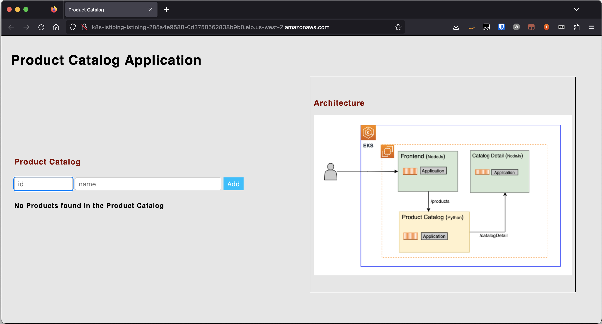

# Scenario: Playing with Istio Service Mesh

***Draft***

!!! warning "NOT FINISHED YET"

## Prerequisites

- Playground One Network

Verify, that you have `Deploy Istio` enabled in your configuration.

```sh
pgo --config
```

```sh
...
Section: Kubernetes Deployments
Please set/update your Integrations configuration
...
Deploy Istio? [true]:
...
```

Then, create the PGO EKS-EC2 cluster by running

```sh
pgo --apply eks-ec2
```

## Add-Ons

The Playground One provides a functional but basic Istio configuration only, yet. Since we want to get a little experience with it we deploy some of the most commonly used add-ons by running the commands below:

```sh
# Install Istio add-ons Kiali, Jaeger, Prmetheus, and Grafana
for ADDON in kiali jaeger prometheus grafana 
do 
   ADDON_URL="https://raw.githubusercontent.com/istio/istio/1.22.3/samples/addons/$ADDON.yaml" 
   kubectl apply -f $ADDON_URL
done
```

***Access Kiali***

```sh
kubectl port-forward svc/kiali 20001:20001 -n istio-system --address 0.0.0.0
```

Use your browser to navigate to <http://localhost:20001>. You can replace localhost with the IP of your PGO server, if you need to.

***Access Grafana***

```sh
kubectl port-forward svc/grafana 3000:3000 -n istio-system --address 0.0.0.0
```

Use your browser to navigate to <http://localhost:3000/dashboards>. You can replace localhost with the IP of your PGO server, if you need to.

### Get your Shovel

To play with Istio we're using an AWS sample application for now. To deploy it run:

```sh
# Setup Namespace for Istio Mesh
cd ${ONEPATH}/experimenting/istio/istio-on-eks/modules/01-getting-started

kubectl create namespace workshop
kubectl label namespace workshop istio-injection=enabled

# Deploy sample app
helm install mesh-basic . -n workshop
```

The application’s (user interface) URL can be retrieved using the following command:

```sh
ISTIO_INGRESS_URL=$(kubectl get svc istio-ingress -n istio-ingress -o jsonpath='{.status.loadBalancer.ingress[*].hostname}')
echo "http://$ISTIO_INGRESS_URL"
```

Accessing this URL in the browser will lead you to the Product Catalog application as shown here:



### Generating Traffic

Let’s generate some traffic for our application. Use the siege command line tool to generate traffic to the application’s (user interface) URL by running the following commands in a separate terminal session.

If you get a `command not found` you need to install `siege` first.

```sh
sudo apt update
sudo apt install siege -y
```

Now run

```sh
ISTIO_INGRESS_URL=$(kubectl get svc istio-ingress -n istio-ingress -o jsonpath='{.status.loadBalancer.ingress[*].hostname}')

# Generate load for 2 minute, with 5 concurrent threads and with a delay of 10s between successive requests
siege http://$ISTIO_INGRESS_URL -c 5 -d 10 -t 2M
```

## Cleanup

```sh
helm uninstall mesh-basic -n workshop
kubectl delete namespace workshop
```

