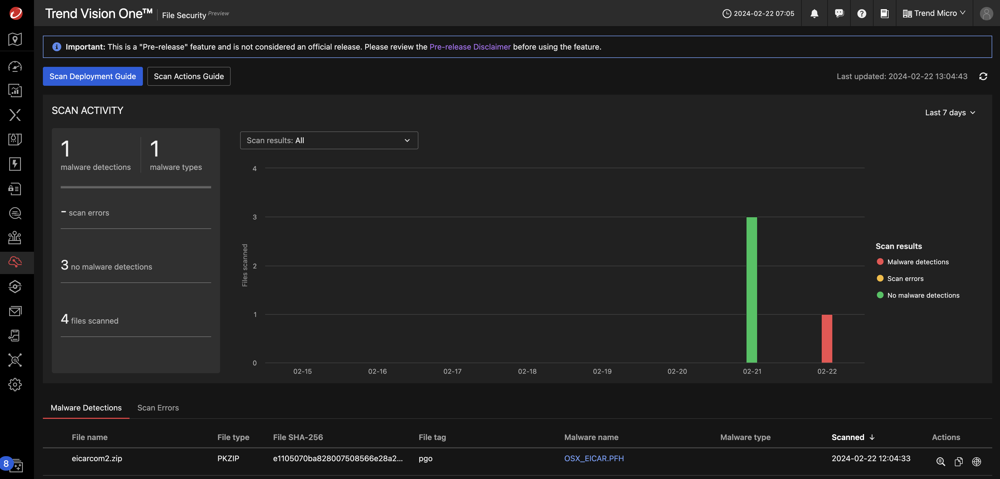

# Scenario: S3 Bucket Malware Scanning

## Prerequisites

- Vision One Cloud Security File Scanner API-Key with the following permissions:
    - Cloud Security Operations
        - File Security
            - Run file scan via SDK
- Know your Vision One region.

!!! warning "PGO S3 Scanning"

    This scenario uses Playground Ones own S3 Bucket Scanner which is ***not*** the official solution component of Vision One. It uses the File Security Python SDK within a Lambda Function. Scan results will show up on the Vision One console.

## Architecture

The scanner consists out of the following components:

- A Lambda function triggered by `s3:ObjectCreated` events. It uses the File Security Python SDK via gRPC.
- The function uses a custom layer containing the required dependencies including the SDK.
- An S3 Bucket with the permission to notify the Lambda.
- An IAM Role and Policy.
- The scanned files are tagged

> ***Note:*** Lambda will use Python 3.11

## The Function Code

Below are the relevant sections of the function code:

```py
import json
import os
import time
import urllib.parse
from datetime import datetime

import amaas.grpc
import boto3

v1_region = os.getenv("V1_REGION")
v1_api_key = os.getenv("V1_API_KEY")

s3 = boto3.resource("s3")
s3_client = boto3.client("s3")


FSS_TAG_PREFIX = "fss-"


def lambda_handler(event, context):

    # create v1fs connection handle
    # handle = amaas.grpc.init(v1_amaas_server, v1_api_key, True)
    # or use v1 regions
    handle = amaas.grpc.init_by_region(v1_region, v1_api_key, True)

    for record in event["Records"]:

        bucket = record["s3"]["bucket"]["name"]
        key = urllib.parse.unquote_plus(record["s3"]["object"]["key"], encoding="utf-8")

        pml = True
        feedback = True
        verbose = True
        digest = True

        try:
            s3object = s3.Object(bucket, key)
            # Load file into a buffer
            buffer = s3object.get().get("Body").read()

            print(f"executing scan on {key}.")

            s = time.perf_counter()

            # Scan the file
            scan_resp = amaas.grpc.scan_buffer(
                handle,
                buffer,
                key,
                tags=["pgo"],
                pml=pml,
                feedback=feedback,
                verbose=verbose,
                digest=digest,
            )

            response = json.loads(scan_resp)

            scanning_result = response.get("result")
            findings = scanning_result.get("atse").get("malwareCount")
            scan_result = "malicious" if findings else "no issues found"
            scan_date = datetime.strftime(
                datetime.fromisoformat(response.get("timestamp").get("end")), "%m/%d/%Y %H:%M:%S"
            )
            malware_name = scanning_result.get("atse").get("malware")[0].get("name") if findings else "n/a"

            tags = [
                f"{FSS_TAG_PREFIX}scanned=true",
                f"{FSS_TAG_PREFIX}scan-date={scan_date}",
                f"{FSS_TAG_PREFIX}scan-result={scan_result}",
                f"{FSS_TAG_PREFIX}scan-detail-code={malware_name}",
            ]

            elapsed = time.perf_counter() - s

            existing_tags = s3_client.get_object_tagging(Bucket=bucket, Key=key)

            # Merge existing tags with new ones
            merged_tags = existing_tags.get("TagSet") + tags

            # Remove duplicates (if needed)
            merged_tags = list(set(merged_tags))

            # Convert to TagSet format
            key_value_dict = [{"Key": item.split("=")[0], "Value": item.split("=")[1]} for item in merged_tags]

            # Put tags on object
            s3_client.put_object_tagging(Bucket=bucket, Key=key, Tagging={"TagSet": key_value_dict})

            print(f"scan executed in {elapsed:0.2f} seconds.")
            print(f"scan result -> {str(scan_result)}")
            print(f"tags -> {str(merged_tags)}")

        except Exception as e:
            print(e)
            print("error scan object {} from bucket {}.".format(key, bucket))

    amaas.grpc.quit(handle)
```

## Deployment

Assuming you have set your Vision One API Key and Vision One region with the help of the config tool simply run

```sh
pgo --apply s3scanner
```

The following outputs are created:

```sh
Outputs:

aws_lambda_function_name = "pgo-id-bucket-scanner-2kn1vopd"
aws_lambda_layer_arn = "arn:aws:lambda:eu-central-1:634503960501:layer:pgo-id-filesecurity-layer-2kn1vopd:1"
aws_s3_bucket_name = "pgo-id-scanning-bucket-2kn1vopd"
```

Feel free to review the Lambda function in the AWS console.

## Run Scans

Either head over to the S3 bucket via the console to upload files or use the AWS cli.

Download the `eicarcom2.zip` and upload it to the scanning bucket.

> ***Warning:*** Do not download malicious files on computers with a running anti malware engine!

```sh
# Set your bucket name from the outputs
SCANNING_BUCKET=pgo-id-scanning-bucket-2kn1vopd

wget https://secure.eicar.org/eicarcom2.zip
aws s3 cp eicarcom2.zip s3://${SCANNING_BUCKET}/eicarcom2.zip
```

## Example Tags

Malware | Key | Value
------- | --- | -----
Eicar | fss-scan-detail-code | OSX_EICAR.PFH
|| fss-scan-date | 11/14/2024 10:57:18
|| fss-scan-result | malicious
|| fss-scanned | true
|||
Qjwmonkey | fss-scan-detail-code | PUA.Win32.Qjwmonkey.GZ
|| fss-scan-date | 11/14/2024 10:57:17
|| fss-scan-result | malicious
|| fss-scanned | true
|||
Clean file | fss-scan-detail-code | n/a
|| fss-scan-date | 11/14/2024 11:04:53
|| fss-scan-result | no issues found
|| fss-scanned | true

The tested Clean file was a 1.8GB mkv which was scanned in 8.23 secs.

## Check on Vision One

When heading over to your Vision One console to `Cloud Security Operations --> File Security` you should see scan results with potentially detected malware.



🎉 Success 🎉
