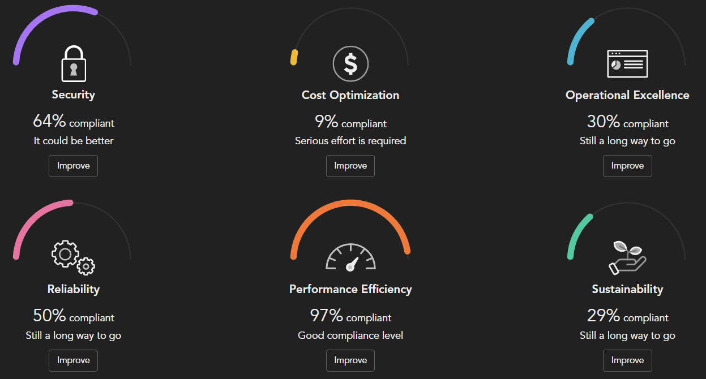

# Scenario: Compliance by Category with Cloud One Conformity

## Prerequisites

- Cloud One API-Key with the following permissions:
    - Conformity
        - Full-Access

The provided Python scripts will use the RESTful APIs to query the check results. The reporting of the compliance status may be limited by the number of days back in and a minimum level of criticality. 

## Playing through the Workflow

The scenario uses the python script `category_compliance_c1.py` located in the `cspm` subdirectory.

### Prepare

- Set environment variable `C1CSPM_SCANNER_KEY` with the API key.
- Get your `ACCOUNT_ID`:

  ```sh
  curl -s --location "https://conformity.${REGION}.cloudone.trendmicro.com/api/accounts" \
      --header "Content-Type: application/vnd.api+json" \
      --header "Authorization: ApiKey ${C1CSPM_SCANNER_KEY}" | \
      jq -r '.data[] | .id + ": " + .attributes.name'
  ```
- Adapt the constants in the Python script in between `# HERE` and `# /HERE` to your requirements.
- Lines 68ff. 
  ```py
  # HERE
  REGION = "trend-us-1"  # Examples: de-1 or us-1
  ACCOUNT_ID = "e37fe1b7-2b14-4b2c-96a4-db1bb2be8c8b"
  RISK_LEVEL_FAIL = "LOW"
  CREATED_LESS_THAN_DAYS = 90
  # /HERE
  ```

## Calculate the Compliance by Category

```sh
# Get the Compliance by Categories
$ ./category_compliance_c1.py --compliance
```

The script will produce an output like this.

```sh
2024-11-22 15:13:57 DEBUG (MainThread) [retrieve_bot_results] Retrieved 129 findings.
2024-11-22 15:13:59 DEBUG (MainThread) [retrieve_bot_results] Retrieved 329 findings.
...
2024-11-22 15:14:04 DEBUG (MainThread) [retrieve_bot_results] Retrieved 1097 findings.
2024-11-22 15:14:06 DEBUG (MainThread) [retrieve_bot_results] Retrieved 1133 findings.
2024-11-22 15:14:07 INFO (MainThread) [main] Category: Security - {'success': 682, 'failure': 375, 'compliance': 65}
2024-11-22 15:14:07 INFO (MainThread) [main] Category: Cost-optimisation - {'success': 2, 'failure': 19, 'compliance': 10}
2024-11-22 15:14:07 INFO (MainThread) [main] Category: Reliability - {'success': 2, 'failure': 2, 'compliance': 50}
2024-11-22 15:14:07 INFO (MainThread) [main] Category: Performance-efficiency - {'success': 69, 'failure': 2, 'compliance': 97}
2024-11-22 15:14:07 INFO (MainThread) [main] Category: Operational-excellence - {'success': 13, 'failure': 29, 'compliance': 31}
2024-11-22 15:14:07 INFO (MainThread) [main] Category: Sustainability - {'success': 39, 'failure': 93, 'compliance': 30}
```

We can clearly see, that the cloud account is 65% compliant from the security perspective, as an example. Similar the other categories.

The calculated results match closely with the Conformity view.



What we could also be interested in is, how we did in the last 30 days? Did we introduce new findings with a criticality of HIGH or worse?

For this, we change two variables in the python script:

```py
RISK_LEVEL_FAIL = "HIGH"
CREATED_LESS_THAN_DAYS = 30
```

```sh
# Get the Compliance by Categories
$ ./category_compliance_c1.py --compliance
```

The script will produce an output like this.

```sh
2024-11-22 15:29:30 DEBUG (MainThread) [retrieve_bot_results] Retrieved 157 findings.
2024-11-22 15:29:32 DEBUG (MainThread) [retrieve_bot_results] Retrieved 193 findings.
2024-11-22 15:29:33 INFO (MainThread) [main] Category: Security - {'success': 144, 'failure': 47, 'compliance': 75}
2024-11-22 15:29:33 INFO (MainThread) [main] Category: Cost-optimisation - {'success': 1, 'failure': 0, 'compliance': 100}
2024-11-22 15:29:33 INFO (MainThread) [main] Category: Reliability - {'success': 0, 'failure': 0, 'compliance': 0}
2024-11-22 15:29:33 INFO (MainThread) [main] Category: Performance-efficiency - {'success': 0, 'failure': 0, 'compliance': 0}
2024-11-22 15:29:33 INFO (MainThread) [main] Category: Operational-excellence - {'success': 3, 'failure': 0, 'compliance': 100}
2024-11-22 15:29:33 INFO (MainThread) [main] Category: Sustainability - {'success': 0, 'failure': 34, 'compliance': 0}
```

Apparently we have introduced 47 new security misconfigurations that we should check.

🎉 Success 🎉
