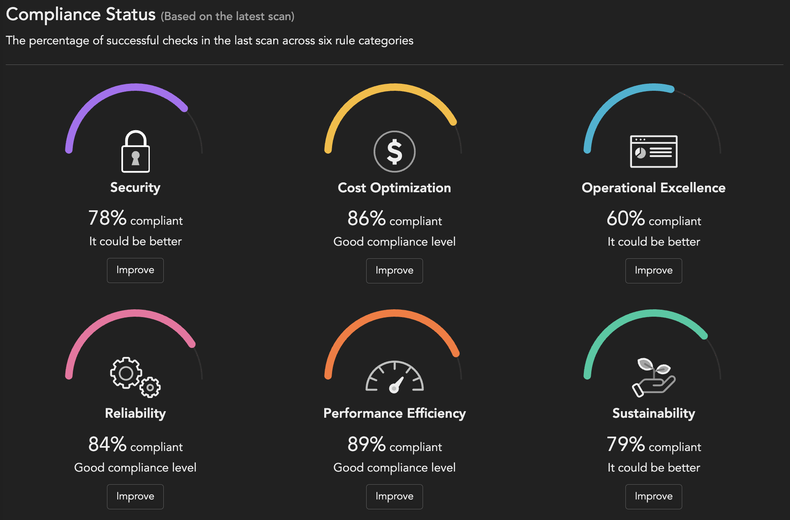

# Scenario: Compliance by Category with Vision One Posture Management

## Prerequisites

- Vision One API-Key with the following permissions:
    - Attack Surface Risk Management
        - Cloud Posture
            - View
            - Configure settings

The provided Python script will use the RESTful APIs to query the check results. The reporting of the compliance status may be limited by the number of days back in and a minimum level of criticality. 

## Playing through the Workflow

The scenario uses the python script `category_compliance_v1.py` located in the `cspm` subdirectory.

## Prepare

- Set environment variable `V1CSPM_SCANNER_KEY` with the API key.
- Get your `ACCOUNT_ID`:

  ```sh
  curl -s --location "https://api.xdr.trendmicro.com/beta/cloudPosture/accounts" \
    --header 'Content-Type: application/json;charset=utf-8' \
    --header "Authorization: Bearer ${V1CSPM_SCANNER_KEY}" | \
    jq -r '.items[] | .id + ": " + .name'
  ```
- Adapt the constants in the Python script in between `# HERE` and `# /HERE` to your requirements.
- Lines 68ff. 
  ```py
  # HERE
  REGION = ""  # Examples: eu-central-1 or "" for us-east-1
  ACCOUNT_ID = "e37fe1b7-2b14-4b2c-96a4-db1bb2be8c8b"
  RISK_LEVEL_FAIL = "LOW"
  CREATED_LESS_THAN_DAYS = 90
  # /HERE
  ```

## Calculate the Compliance by Category

```sh
# Get the Compliance by Categories
$ ./category_compliance_v1.py --compliance
```

The script will produce an output like this.

```sh
2024-11-22 13:34:01 DEBUG (MainThread) [retrieve_bot_results] Retrieved 200 findings.
2024-11-22 13:34:04 DEBUG (MainThread) [retrieve_bot_results] Retrieved 329 findings.
...
2024-11-22 13:34:47 DEBUG (MainThread) [retrieve_bot_results] Retrieved 5233 findings.
2024-11-22 13:34:48 DEBUG (MainThread) [retrieve_bot_results] Retrieved 5234 findings.
2024-11-22 13:34:48 INFO (MainThread) [main] Category: Security - {'success': 3602, 'failure': 997, 'compliance': 78}
2024-11-22 13:34:48 INFO (MainThread) [main] Category: Cost-optimisation - {'success': 1504, 'failure': 238, 'compliance': 86}
2024-11-22 13:34:48 INFO (MainThread) [main] Category: Reliability - {'success': 1589, 'failure': 297, 'compliance': 84}
2024-11-22 13:34:48 INFO (MainThread) [main] Category: Performance-efficiency - {'success': 1919, 'failure': 229, 'compliance': 89}
2024-11-22 13:34:48 INFO (MainThread) [main] Category: Operational-excellence - {'success': 475, 'failure': 315, 'compliance': 60}
2024-11-22 13:34:48 INFO (MainThread) [main] Category: Sustainability - {'success': 1652, 'failure': 436, 'compliance': 79}
```

We can clearly see, that the cloud account is 78% compliant from the security perspective, as an example. Similar the other categories.

The calculated results match with the posture management view.



What we might also be interested in is how have we performed over the last 30 days? Have we introduced any new findings with a criticality of HIGH or worse?

For this, we change two variables in the python script:

```py
RISK_LEVEL_FAIL = "HIGH"
CREATED_LESS_THAN_DAYS = 30
```

```sh
# Get the Compliance by Categories
$ ./category_compliance_v1.py --compliance
```

The script will produce an output like this.

```sh
2024-11-22 13:41:20 DEBUG (MainThread) [retrieve_bot_results] Retrieved 23 findings.
2024-11-22 13:41:21 DEBUG (MainThread) [retrieve_bot_results] Retrieved 34 findings.
2024-11-22 13:41:22 DEBUG (MainThread) [retrieve_bot_results] Retrieved 35 findings.
2024-11-22 13:41:22 INFO (MainThread) [main] Category: Security - {'success': 32, 'failure': 3, 'compliance': 91}
2024-11-22 13:41:22 INFO (MainThread) [main] Category: Cost-optimisation - {'success': 0, 'failure': 0, 'compliance': 0}
2024-11-22 13:41:22 INFO (MainThread) [main] Category: Reliability - {'success': 1, 'failure': 0, 'compliance': 100}
2024-11-22 13:41:22 INFO (MainThread) [main] Category: Performance-efficiency - {'success': 0, 'failure': 0, 'compliance': 0}
2024-11-22 13:41:22 INFO (MainThread) [main] Category: Operational-excellence - {'success': 1, 'failure': 0, 'compliance': 100}
2024-11-22 13:41:22 INFO (MainThread) [main] Category: Sustainability - {'success': 1, 'failure': 0, 'compliance': 100}
```

Not too bad, but apparently we have introduced 3 new security misconfigurations that we should check.

🎉 Success 🎉
