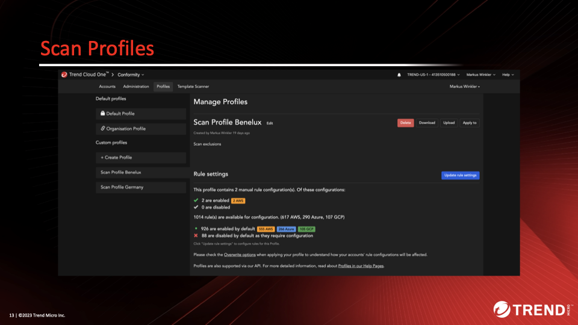
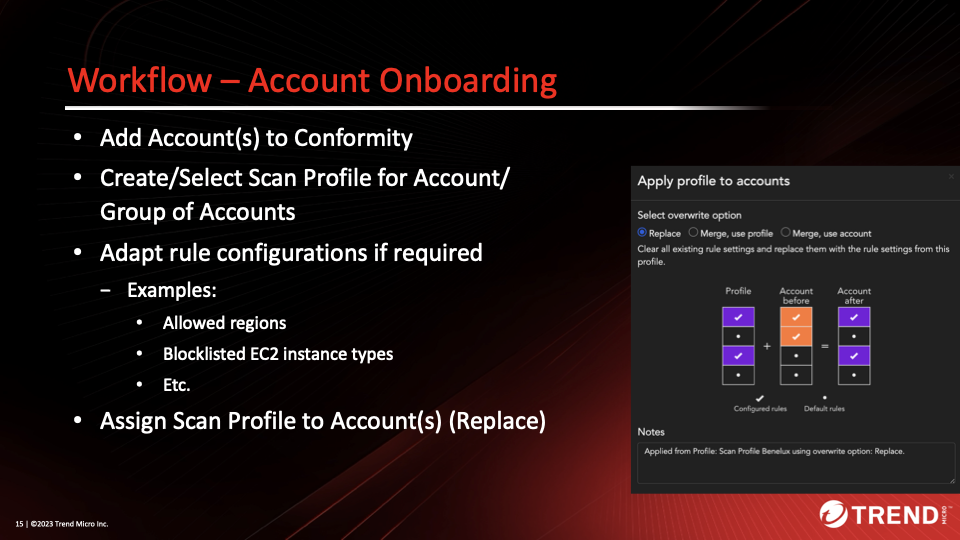

# Scenario: Terraform IaC Scanning in Pipelines with Exception Handling

## Prerequisites

- Vision One API-Key with the following permissions:
    - Attack Surface Risk Management
        - Cloud Posture
            - View
            - Configure settings

The provided Python scripts implement the required functionality for Terraform Template Scanning, Exception approval workflows and temporary suppression of findings in Conformity Account Profile. It mainly focuses on the logic to support these kind of scenarios and cannot be used 1-to-1 in real life pipelines without modifications. The implementation assumes that an external workflow engine such as ServiceNow is used for approval workflows, which include an expiration set on the specific exception.

Conformity offers two different variants to “allow” non-compliance:

- Exceptions in rule configuration based on Tags or Resource ID (AWS ARN)
- Suppressions on specific findings

The required functionality as part of the workflow requirements is available via Conformity's REST API in combination with ServiceNow for workflow management.

Logical architecture:


The idea is to create one or more *Scan Profiles* with are used by the template scanner. The *Scan Profile* gets Exceptions assigned so that a template scan result can pass before deployment.



In the above screenshot we have two Scan Profiles with different settings.

Scan Profile contains

- Rule Settings and
- approved Exceptions

Suppressions are set in Account to (temporarily) suppress but report Findings. When Suppression(s) expire, Exceptions in Scan Profile are to be adapted/removed.

The onboarding workflow:



The next graph shows the complete workflow implemented in this scenario:


Things to be aware of:

- Resource IDs (e.g. ARNs) are often unknown at Terraform Plan stage
- Name-Tags might not be granular enough in regards Suppressions
- Tags on resources may be set incorrectly, possibly intentionally
  - Resolution idea (partly implemented):
    - Trigger Template Scan
    - Findings trigger Exemption Workflow
    - Approved Exceptions get a unique ID assigned which is bound to the Resource and Rule ID
    - Allowed non-compliant resources are tagged in the Terraform Template with this unique ID
    - Allows validation before deployment (does the tag match to the resource and Rule ID?)

## Playing through the Workflow

The scenarios offer two different terraform configurations that you can play with for convenience. Effectively it is not limitted to these, the Python script can scan any configuration, even the Playground One configurations of `awsone`.

There are two variants implemented which differ in their approach to identity AWS resources to build:

- `scanner_v1_name.py`: Simply uses name tags on the resources.
- `scanner_v1_uuid.py`: Automatically creates an unique `uuid`-tag for the resources which need to be assigned manually to the resource before deployment to be compliant.

The scripts are located in the `cspm`-directory and assume, that all exeption are granted and expire after seven days.

### Prepare

- Set environment variable `V1CSPM_SCANNER_KEY` with the API key of the
  Cloud Posture Template Scanner.
- Adapt the constants in the Python script in between `# HERE` and `# /HERE` to your requirements.
- Lines 106ff. 
  ```py
  # HERE
  REGION = ""  # Examples: eu. sg., leave blank for us
  SCAN_PROFILE_ID = "TQNDl13ix"
  ACCOUNT_ID = "e37fe1b7-2b14-4b2c-96a4-db1bb2be8c8b"
  SCAN_PROFILE_NAME = "Playground One Template Scanner"
  REPORT_TITLE = "Workflow Tests"
  RISK_LEVEL_FAIL = "MEDIUM"
  # /HERE
  ```

- Get your `ACCOUNT_ID`:

  ```sh
  curl -s --location "https://api.xdr.trendmicro.com/beta/cloudPosture/accounts" \
    --header 'Content-Type: application/json;charset=utf-8' \
    --header "Authorization: Bearer ${V1CSPM_SCANNER_KEY}" | \
    jq -r '.items[] | .id + ": " + .name'
  ```
- Get the `SCAN_PROFILE_ID` and `SCAN_PROFILE_NAME`:

  ```sh
  curl -s --location "https://api.xdr.trendmicro.com/beta/cloudPosture/profiles" \
    --header 'Content-Type: application/json;charset=utf-8' \
    --header "Authorization: Bearer ${V1CSPM_SCANNER_KEY}" | \
    jq -r '.items[] | .id + ": " + .name'
  ```

### Using Name-Tags

First, we're going the easy route using name tags.

Here's the quick run-through:

```sh
# Run template scan
$ ./scanner_v1_name.py --scan 2-network
```

This produces the following output:

```sh
2024-11-13 13:15:25 INFO (MainThread) [scan_template] Starting Template Scan...
2024-11-13 13:15:38 INFO (MainThread) [scan_template] Template Scan done.
2024-11-13 13:15:38 INFO (MainThread) [scan_failures] Finding of rule EC2-001 with Risk Level MEDIUM, Rule Title: Security Group Port Range for Resource: module.ec2.aws_security_group.sg["public"]
2024-11-13 13:15:38 INFO (MainThread) [scan_failures] Finding of rule EC2-033 with Risk Level MEDIUM, Rule Title: Unrestricted Security Group Egress for Resource: module.ec2.aws_security_group.sg["private"]
2024-11-13 13:15:38 INFO (MainThread) [scan_failures] Finding of rule EC2-033 with Risk Level MEDIUM, Rule Title: Unrestricted Security Group Egress for Resource: module.ec2.aws_security_group.sg["public"]
```

For now, let's assume the user did run through an approval workflow for the above findings and is therefore allowed to create exceptions. For this, we run:

```sh
# Run approval workflows in engine, here implementing the approved workflow
$ ./scanner_v1_name.py --exclude 2-network
```

```sh
2024-11-13 13:16:33 INFO (MainThread) [scan_template] Starting Template Scan...
2024-11-13 13:16:37 INFO (MainThread) [scan_template] Template Scan done.
2024-11-13 13:16:37 INFO (MainThread) [scan_failures] Setting Exception for rule EC2-001 with Risk Level MEDIUM, Rule Title: Security Group Port Range for Resource: module.ec2.aws_security_group.sg["public"]
2024-11-13 13:16:44 INFO (MainThread) [set_exception] Exception for EC2-001 in Profile TQNDl13ix set
2024-11-13 13:16:44 INFO (MainThread) [scan_failures] Setting Exception for rule EC2-033 with Risk Level MEDIUM, Rule Title: Unrestricted Security Group Egress for Resource: module.ec2.aws_security_group.sg["private"]
2024-11-13 13:16:49 INFO (MainThread) [set_exception] Exception for EC2-033 in Profile TQNDl13ix set
2024-11-13 13:16:49 INFO (MainThread) [scan_failures] Setting Exception for rule EC2-033 with Risk Level MEDIUM, Rule Title: Unrestricted Security Group Egress for Resource: module.ec2.aws_security_group.sg["public"]
2024-11-13 13:16:52 INFO (MainThread) [set_exception] Exception for EC2-033 in Profile TQNDl13ix set
```

The exceptions are based on the name-tags of the resource. You can find the exption tags generated within the `exceptions.json`-file.

```json
{
  "EC2-001": {
    "scan_profile_id": "TQNDl13ix",
    "tags": [
      "Name::pgo-public-sg"
    ]
  },
  "EC2-033": {
    "scan_profile_id": "TQNDl13ix",
    "tags": [
      "Name::pgo-private-sg",
      "Name::pgo-public-sg"
    ]
  }
}
```

A subsequent template scan should now pass without findings and the template is prepared for deployment.

```sh
# Run template scan again to verify that the scan result is clean
$ ./scanner_v1_name.py --scan 2-network
```

```sh
2024-11-13 13:18:39 INFO (MainThread) [scan_template] Starting Template Scan...
2024-11-13 13:18:44 INFO (MainThread) [scan_template] Template Scan done.
```

Now, lets apply the configuration and trigger a bot run:

```sh
# Apply configuration
$ ./scanner_v1_name.py --apply 2-network

# Trigger bot run
$ ./scanner_v1_name.py --bot
```

Even if the scan was clean, the bot will still identify violations since the bot uses the account and not the scanning template. To temporarily suppress the findings run:

```sh
# Suppress findings
$ ./scanner_v1_name.py --suppress
```

The above suppressed the findings for a week. Running the script with the `--expire` flag will check all the suppressions and if a suppression is expired, it will remove the exception from the scan profile, simulating an expired exception.

> ***Note:*** For demoing purposes, the script fast forwards the time by 8 days to immedeately expire the exceptions. This is defined by the constant `TIMESHIFT_DAYS` in the script.

```sh
# Suppressions are active for 1 week
$ ./scanner_v1_name.py --expire
```

To do a cleanup and remove the suppressions and exceptions run:

```sh
# Cleanup
$ ./scanner_v1_name.py --destroy 2-network
$ ./scanner_v1_name.py --reset
$ ./scanner_v1_name.py --expire
```

### Using UUID-Tags (more secure)

```sh
# Run template scan
$ ./scanner_v1_uuid.py --scan 2-network
```

This produces the following output:

```sh
2024-11-13 12:50:01 INFO (MainThread) [scan_template] Starting Template Scan...
2024-11-13 12:50:13 INFO (MainThread) [scan_template] Template Scan done.
2024-11-13 12:50:13 INFO (MainThread) [scan_failures] Finding of rule EC2-001 with Risk Level MEDIUM, Rule Title: Security Group Port Range for Resource: module.ec2.aws_security_group.sg["public"]
2024-11-13 12:50:13 INFO (MainThread) [scan_failures] Finding of rule EC2-033 with Risk Level MEDIUM, Rule Title: Unrestricted Security Group Egress for Resource: module.ec2.aws_security_group.sg["private"]
2024-11-13 12:50:13 INFO (MainThread) [scan_failures] Finding of rule EC2-033 with Risk Level MEDIUM, Rule Title: Unrestricted Security Group Egress for Resource: module.ec2.aws_security_group.sg["public"]
```

For now, let's assume the user did run through an approval workflow for the above findings and is therefore allowed to create exceptions. For this, we run:

```sh
# Run approval workflows in engine, here implementing the approved workflow
$ ./scanner_v1_uuid.py --exclude 2-network
```

```sh
2024-11-13 12:52:38 INFO (MainThread) [scan_template] Starting Template Scan...
2024-11-13 12:52:43 INFO (MainThread) [scan_template] Template Scan done.
2024-11-13 12:52:43 INFO (MainThread) [scan_failures] Setting Exception for rule EC2-001 with Risk Level MEDIUM, Rule Title: Security Group Port Range for Resource: module.ec2.aws_security_group.sg["public"]
2024-11-13 12:52:45 INFO (MainThread) [set_exception] Creating new Exception tag for module.ec2.aws_security_group.sg["public"] in Profile TQNDl13ix
2024-11-13 12:52:49 INFO (MainThread) [set_exception] Exception for EC2-001 in Profile TQNDl13ix set
2024-11-13 12:52:49 INFO (MainThread) [scan_failures] Setting Exception for rule EC2-033 with Risk Level MEDIUM, Rule Title: Unrestricted Security Group Egress for Resource: module.ec2.aws_security_group.sg["private"]
2024-11-13 12:52:50 INFO (MainThread) [set_exception] Creating new Exception tag for module.ec2.aws_security_group.sg["private"] in Profile TQNDl13ix
2024-11-13 12:52:53 INFO (MainThread) [set_exception] Exception for EC2-033 in Profile TQNDl13ix set
2024-11-13 12:52:53 INFO (MainThread) [scan_failures] Setting Exception for rule EC2-033 with Risk Level MEDIUM, Rule Title: Unrestricted Security Group Egress for Resource: module.ec2.aws_security_group.sg["public"]
2024-11-13 12:52:54 INFO (MainThread) [set_exception] Creating new Exception tag for module.ec2.aws_security_group.sg["public"] in Profile TQNDl13ix
2024-11-13 12:52:56 INFO (MainThread) [set_exception] Exception for EC2-033 in Profile TQNDl13ix set
```

For each exception the script genarates a unique tag which needs to be assigned to the resource definition within the Terraform configuration. You can find the exption tags generated within the `exceptions.json`-file.

```json
{
  "EC2-001": {
    "scan_profile_id": "TQNDl13ix",
    "tags": [
      "3ea0ed93-bdcf-456d-adc5-7080ea923bf4::module.ec2.aws_security_group.sg[\"public\"]_EC2-001"
    ]
  },
  "EC2-033": {
    "scan_profile_id": "TQNDl13ix",
    "tags": [
      "2c277201-31d8-42ac-85e2-bda5dd1ef329::module.ec2.aws_security_group.sg[\"private\"]_EC2-033",
      "7f404fd7-4f7b-4ac6-bfcc-512eed878dd0::module.ec2.aws_security_group.sg[\"public\"]_EC2-033"
    ]
  }
}
```

The generated exception-tags have the following schema: `<UUID>::<RESOURCE>_<RULE ID>`.

Copy the exception-tag for the resource in the tags section of the resource. Don't forget to replace the `::` with `" = "` as shown in the example below.

```terraform
locals {
  security_groups = {
    public = {
      name        = "${var.environment}-public-sg"
      description = "Security group for Public Access"
      tags = {
        "3ea0ed93-bdcf-456d-adc5-7080ea923bf4" = "module.ec2.aws_security_group.sg[\"public\"]_EC2-001"
        "7f404fd7-4f7b-4ac6-bfcc-512eed878dd0" = "module.ec2.aws_security_group.sg[\"public\"]_EC2-033"
      }
      ingress = {
...
    private = {
      name        = "${var.environment}-private-sg"
      description = "Security group for Private Access"
      tags = {
        "2c277201-31d8-42ac-85e2-bda5dd1ef329" = "module.ec2.aws_security_group.sg[\"private\"]_EC2-033"
      }
      ingress = {
...
```

This allows to validate, that the unique tag key is assigned to the designated resource and violating rule only.

A subsequent template scan should now pass without findings and the template is prepared for deployment.

```sh
# Run template scan again to verify that the scan result is clean
$ ./scanner_v1_uuid.py --scan 2-network
```

The scan results are now clean:

```sh
2024-11-13 12:59:39 INFO (MainThread) [scan_template] Starting Template Scan...
2024-11-13 12:59:43 INFO (MainThread) [scan_template] Template Scan done.
```

Now, lets apply the configuration and trigger a bot run:

```sh
# Apply configuration
$ ./scanner_v1_uuid.py --apply 2-network

# Trigger bot run
$ ./scanner_v1_uuid.py --bot
```

Even if the scan was clean, the bot will still identify violations since the bot uses the account and not the scanning template. To temporarily suppress the findings run:

```sh
# Suppress findings
$ ./scanner_v1_uuid.py --suppress
```

The above suppressed the findings for a week. Running the script with the `--expire` flag will check all the suppressions and if a suppression is expired, it will remove the exception from the scan profile, simulating an expired exception.

> ***Note:*** For demoing purposes, the script fast forwards the time by 8 days to immedeately expire the exceptions. This is defined by the constant `TIMESHIFT_DAYS` in the script.

```sh
# Suppressions are active for 1 week
$ ./scanner_v1_uuid.py --expire
```

To do a cleanup and remove the suppressions and exceptions run:

```sh
# Cleanup
$ ./scanner_v1_uuid.py --destroy 2-network
$ ./scanner_v1_uuid.py --reset
$ ./scanner_v1_uuid.py --expire
```

🎉 Success 🎉
