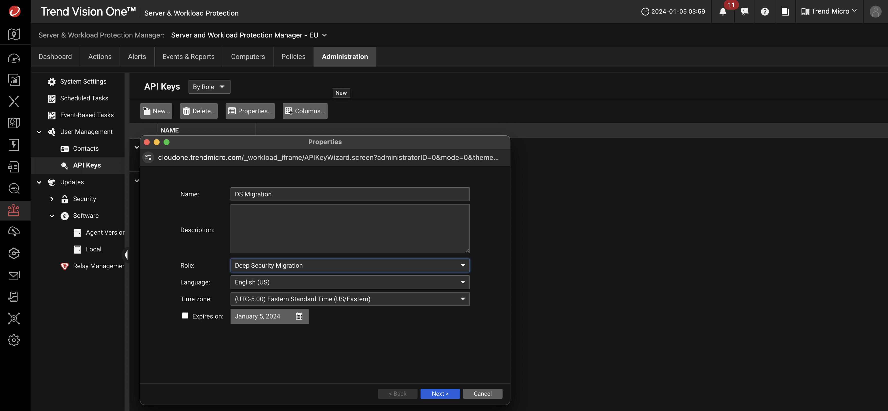
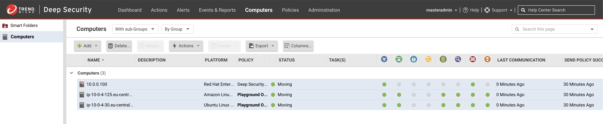
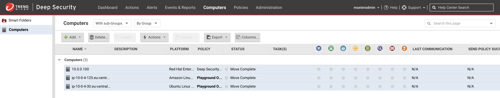
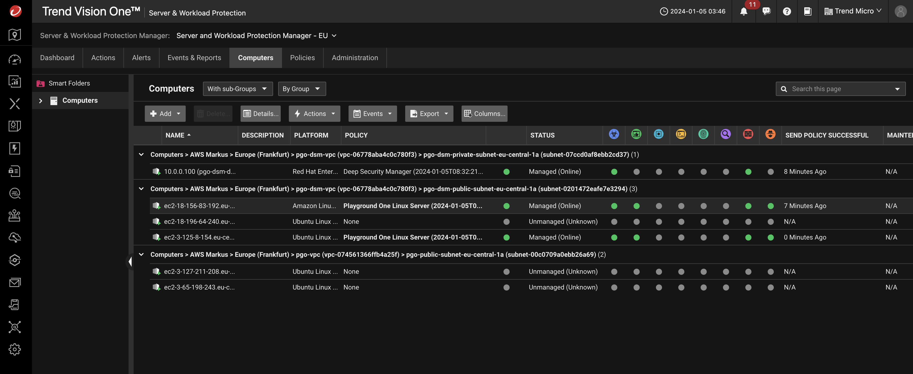
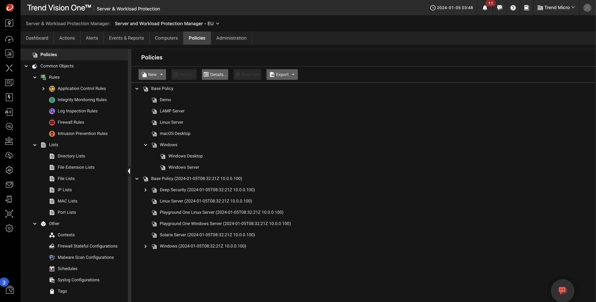

# Scenario: Migrate Deep Security to Vision One

***DRAFT***

## Why Migrate to the Cloud

- Power of the Cloud
  - Get the latest features continuously
  - Infinitely scalable architecture
  - Remove physical infrastructure costs & maintenance
- Data Privacy, Security & Compliance
  - Compliance certified: PCI-DSS, ISO, SOC
  - Multiple Regional Data Centers
  - Data privacy
  - Reduce time spent on audits
- Simplified Operations & Monitoring
  - 24 x 7 x 365 always available
  - Physically secure cloud environment
  - Monitored by Trend Micro staff

### Benefits

- Workload detection and protection techniques including IDS/IPS, antimalware, firewall, application control, integrity monitoring, log inspection & web reputation
- Continuous updates to services, updated by Trend Micro – leading to better security outcomes
- Compliance certifications for PCI-DSS, ISO 27001, ISO 27014, ISO 27017, SOC
- Managed compute, storage and network infrastructure – eliminates operational overhead of managing a solution
- 24 x 7 x 365 operation and monitoring of the security service
- Provided via a highly scalable, high availability, physically secure cloud environment
- Disaster recovery and business continuity planning supported by compliance frameworks
- Vulnerability, penetration testing, and updating/patching of the service provided by Trend Micro
- Annual compliance audits on the service
- Access to other Cloud Security services from a common platform

## Prerequisites

- Playground One Deep Security
- Playground One Deep Security Workload

The Playground One can provide a simulates on-premise Deep Security deployment. For simulation purposes it creates a dedicated VPC with the most commonly used architecture, private and public subnets accross two availability zones. 

Deep Security itself is located within the private subnet and uses a RDS Postgres as the database. The Deep Security Workload configuration creates two linux and one windows server with a deployed and activated Deep Security Agent. Some essential configurations in Deep Security are executed via REST. These are (amongst others):

- Creation of a Windows and Linux Policy with valid configurations for the security modules
- Activation of agent initiated activation
- Scheduling a recommendation scan for all created instances

For this scenarion you need to ensure to have the Deep Security and Deep Security Workload configurations up and running:

```sh
pgo --apply dsm
pgo --apply dsw
```

## Current Situation

- Deep Security is securing (simulated) on-premise instances.
- Since you want to move to the Vision One platform you to migrate Deep Security protected computers to Vision One Server & Workload Protection.

## Migration Workflow

Vision One

1. Log in to Trend Vision One, and go to `Endpoint Security Operations --> Server & Workload Protection`.
2. Navigate to `Administration > User Management > API keys`.
3. Create a new API key with the predefined role “Deep Security Migration” and save the key for later use.



Deep Security

4. Go to DSM and use the feature Migrate to Workload Security. `Support --> Migrate to Workload Security`.
5. When using this feature, it will need the API key and region. Specify them based on the result of the previous steps.
6. In the tab `Configurations` select the Common Objects you want to migrate:
   1. Directory Exclusions (Windows). To migrate this select is and press `[Migrate Selected]`.
   2. Same for the other Common Objects.
7. In the same tab click on the drop down `Migrate Policy (includes references Common Objects)` and press `[Migrate Selected]`.
8. In the tab `Cloud Accounts` select the cloud accounts to migrate.
9. In the tab `Agents` click on `Migrate using Computers page`.
10. Select the agents to migrate in the Computers page. Right click on a selected Computer and go to `Actions --> Migrate to Workload Security`.
11. In the `Cloud One Workload Security Agent Reactivation Configurations` adapt the settings when needed and check that `Security Policy --> Assign migrated policy` is activated.
12. Press the button `[Migrate]`
13. Review the Migration Summary.



Turns to



If the migration is successful, the DSM UI’s status will show “Migrated” or “Move Complete”. 

Vision One

In Trend Vision One Server & Workload Protection, you will also see the new migrated objects appear.



The migrated policy tree shows the migrated policies including it's dependencies:



## Result and Benefits

🎉 Success 🎉
