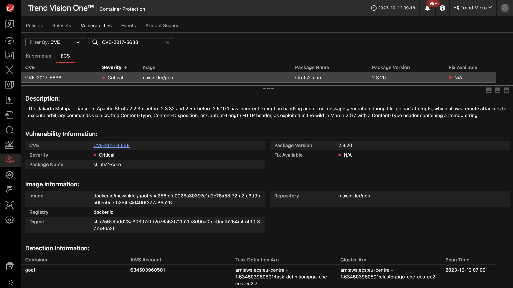
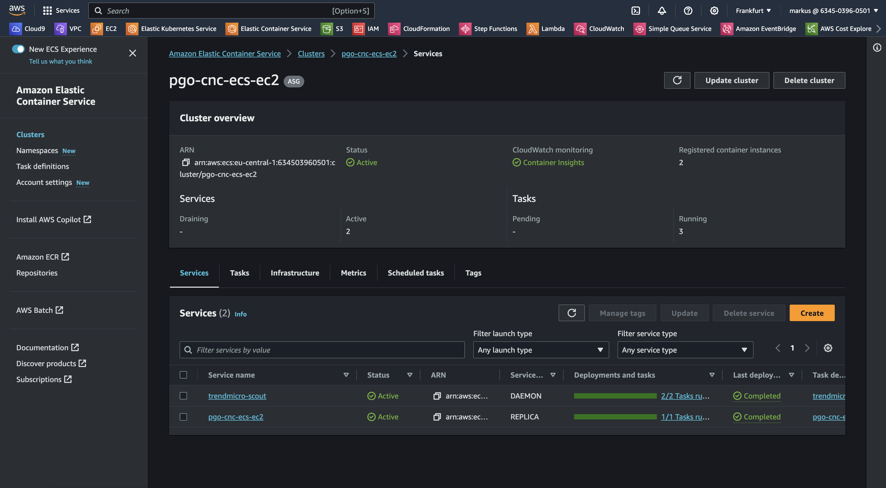
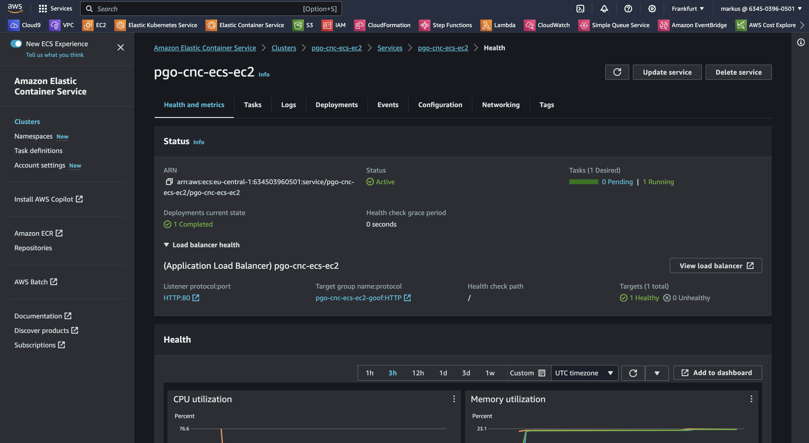
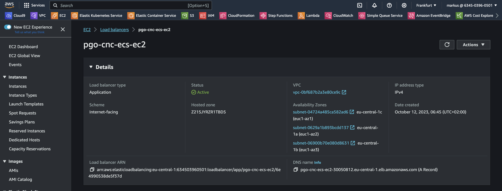

# Scenario: Runtime Vulnerability Scanning

## Prerequisites

- Vision One connected to your AWS Account
- Playground One ECS Cluster

Ensure to have the ECS Cluster up and running:

```sh
# EC2
pgo --apply ecs-ec2

# Fargate
pgo --apply ecs-fg
```

Ensure to have Runtime Scanning enabled on the Vision One Console for this cluster.

## Disclaimer

> ***Note:*** It is highly recommended to have the `awsone.access_ip` set to a single IP or at least a small CIDR before deploying the ECS cluster. This will prevent anonymous users playing with your environmnent. Remember: we're using vulnerable apps.

## Overview

This scenario showcases the vulnerability detection functionalities of Vision One Container Security at runtime in ECS clusters. The deployment of this scenario is based on a container image with plenty of different vulnerabilities.

By the end of the scenario, you will understand and learn the following:

- Reviewing vulnerability findings and searching for a specific vulnerability
- Proof the finding by exploitation

## The story

Every now and then new critical vulnerabilities are disclosed. A famous one with huge impact was the  vulnerability CVE-2017-5638. 

On March 6th 2017, a new remote code execution (RCE) vulnerability in Apache Struts 2 was made public. This vulnerability allows a remote attacker to inject operating system commands into a web application through the “Content-Type” header. Written in Java, Apache Struts 2 is the popular open source web application framework. This is yet another incident that adds up to a long list of vulnerabilities in this framework.

You want to search and validate for this specific vulnerability in your production environment.

## Goals

The goal of this scenario is to identify the vulnerable deployment and proof that it is vulnerable.

### Hints

✨ Didn't find the vulnerable deployment?

Head over to Container Security --> Runtime vulnerability and search for CVE-2017-5638. 🙌

## Solution & Walkthrough

Head over to Container Security --> Container Protection --> Vulnerabilities --> ECS and search for the vulnerability `CVE-2017-5638`.

Identify the vulnerable deployment/container on the ECS cluster(s)



Next step is to find out the load balancer address of the vulnerable service. The finding tells us (amongst others) the following:

- AWS Account ID: `634503960501`
- AWS Region of the cluster: `eu-central-1`
- Cluster name: `pgo-cnc-ecs-ec2`

With this, head over to your AWS console and access the ECS service in the region from above.



Click on the service name `pgo-cnc-ecs-ec2` since this provides the vulnerable container `goof`.



On the right, click on `[View Load Balancer]`



This gives you the DNS name.

```sh
pgo-cnc-ecs-ec2-30050812.eu-central-1.elb.amazonaws.com
```

Now, verify the vulnerability by running:

```sh
cd ${ONEPATH}/exploits/struts/
./struts-exploit.sh pgo-cnc-ecs-ec2-30050812.eu-central-1.elb.amazonaws.com
```

```ascii
[*] CVE: 2017-5638 - Apache Struts2 S2-045
[*] cmd: cat /etc/passwd

b'root:x:0:0:root:/root:/bin/bash\ndaemon:x:1:1:daemon:/usr/sbin:/usr/sbin/nologin\nbin:x:2:2:bin:/bin:/usr/sbin/nologin\nsys:x:3:3:sys:/dev:/usr/sbin/nologin\nsync:x:4:65534:sync:/bin:/bin/sync\ngames:x:5:60:games:/usr/games:/usr/sbin/nologin\nman:x:6:12:man:/var/cache/man:/usr/sbin/nologin\nlp:x:7:7:lp:/var/spool/lpd:/usr/sbin/nologin\nmail:x:8:8:mail:/var/mail:/usr/sbin/nologin\nnews:x:9:9:news:/var/spool/news:/usr/sbin/nologin\nuucp:x:10:10:uucp:/var/spool/uucp:/usr/sbin/nologin\nproxy:x:13:13:proxy:/bin:/usr/sbin/nologin\nwww-data:x:33:33:www-data:/var/www:/usr/sbin/nologin\nbackup:x:34:34:backup:/var/backups:/usr/sbin/nologin\nlist:x:38:38:Mailing List Manager:/var/list:/usr/sbin/nologin\nirc:x:39:39:ircd:/run/ircd:/usr/sbin/nologin\ngnats:x:41:41:Gnats Bug-Reporting System (admin):/var/lib/gnats:/usr/sbin/nologin\nnobody:x:65534:65534:nobody:/nonexistent:/usr/sbin/nologin\n_apt:x:100:65534::/nonexistent:/usr/sbin/nologin\n'
```

You proofed that the application server of your little goof application is vulnerable to CVE-2017-5638.

🎉 Success 🎉
