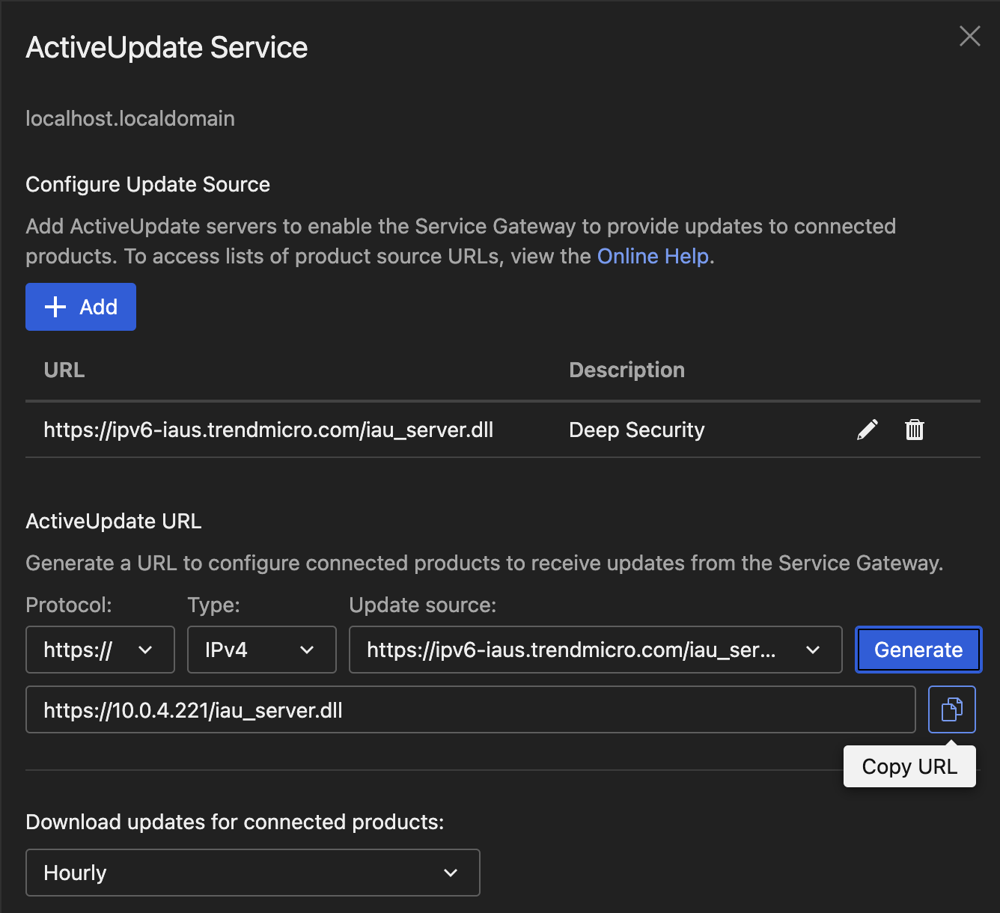
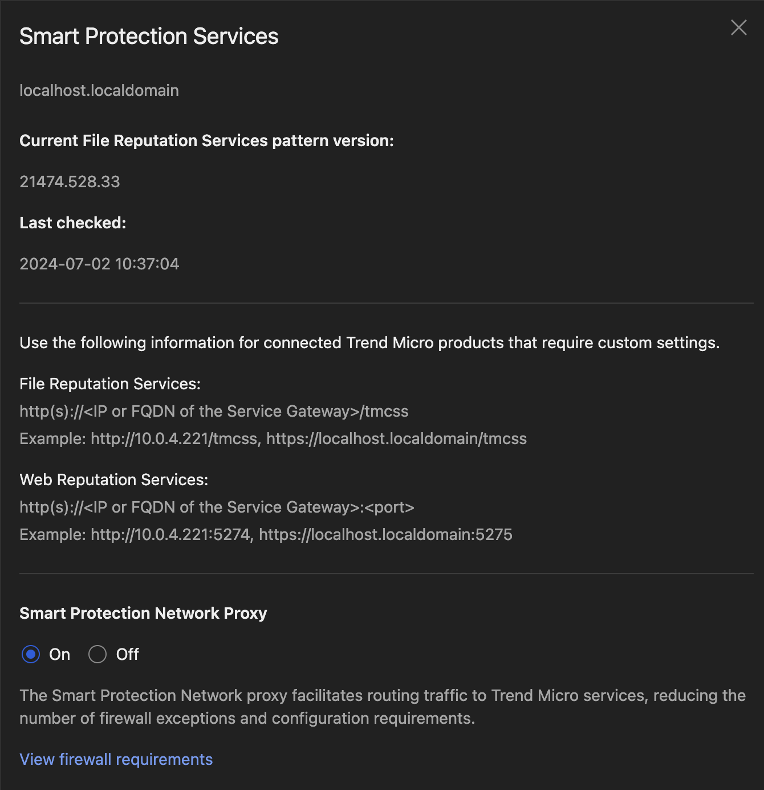
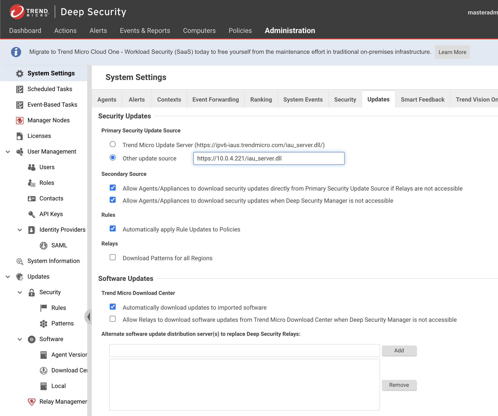
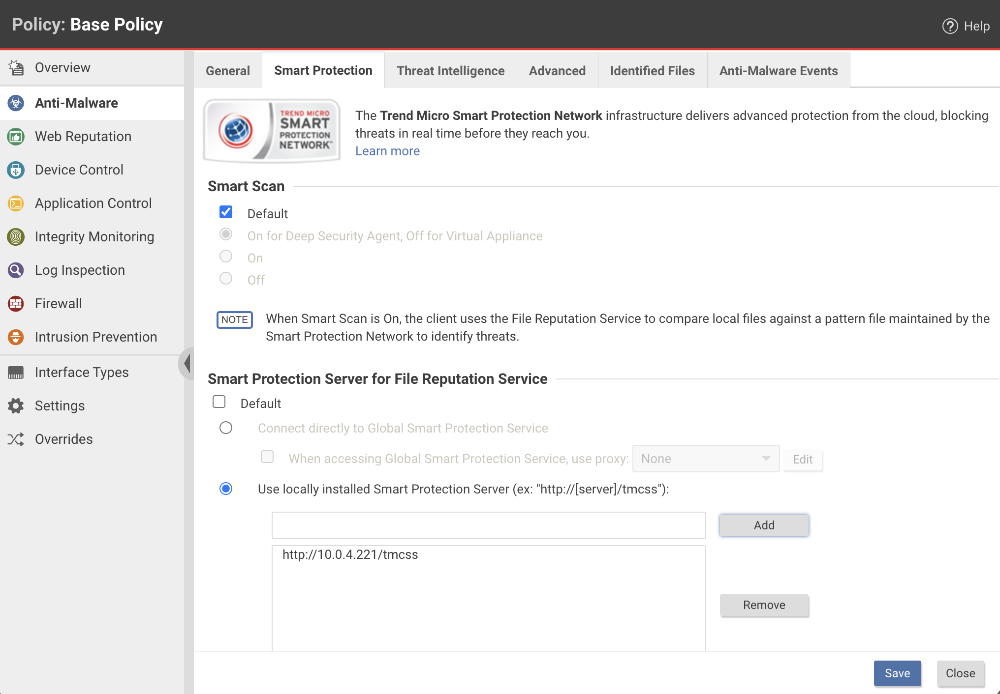
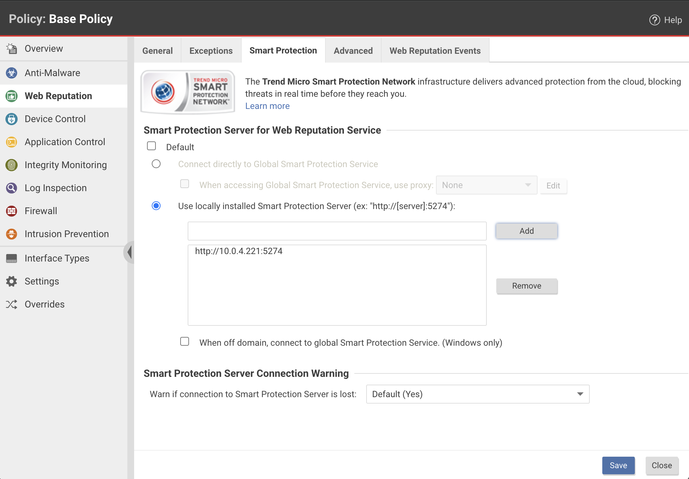
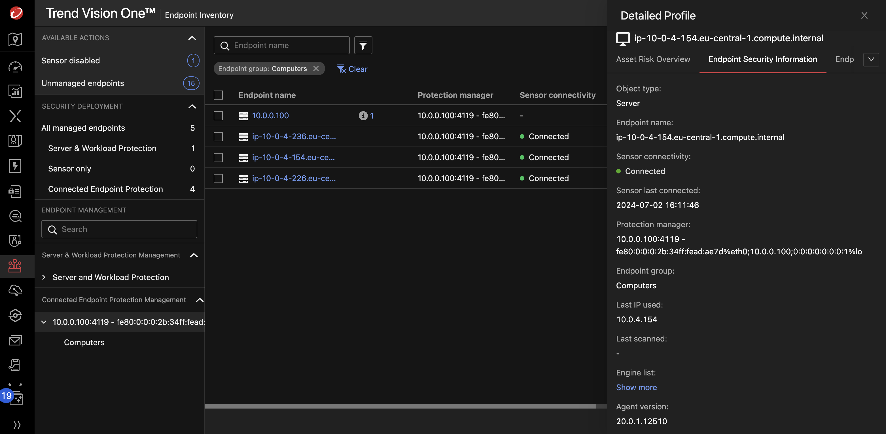

# Scenario: Integrate Deep Security with Vision One and Service Gateway

## Prerequisites

- Playground One Deep Security
- Playground One Deep Security Workload
- Activated Marketplace AMI for Trend Service Gateway BYOL

The Playground One can provide a simulated on-premise Deep Security deployment. For simulation purposes it creates a dedicated VPC with the most commonly used architecture, private and public subnets accross two availability zones. 

Deep Security itself is located within the private subnet and uses a RDS Postgres as the database. The Deep Security Workload configuration creates two linux and one windows server with a deployed and activated Deep Security Agent. Some essential configurations in Deep Security are executed via REST. These are (amongst others):

- Creation of a Windows and Linux Policy with valid configurations for the security modules
- Activation of agent initiated activation
- Scheduling a recommendation scan for all created instances

You need to have activated the Trend Service Gateway BYOL AMI in Marketplace once. To do this, on the AWS Console choose the service EC2 and navigate to `Images --> AMI Catalog`. Select the tab `AWS Marketplace AMIs` and seach for `Trend Micro Service Gateway`.


There should only be one AMI shown for your current region. Click on `[Select]` and `[Subscribe on instance launch]`. 


Now, check your Playground One configuration.

Verify, that you have `AWS SG - create Service Gateway` enabled in your configuration.

```sh
pgo --config
```

```sh
...
AWS SG - create Service Gateway [true]:
...
```

For this scenarion you need to ensure to have the Deep Security and Deep Security Workload configurations up and running:

```sh
pgo --apply dsm
pgo --apply dsw
```

The Service Gateway gets a dedicated AWS Security Group assigned which allows SSH from your configured access IP(s) only. All other ports are only accessible from within the public and private subnets.

## Current Situation

- Deep Security secures instances in an on-premise environment simulated for this scenario, to which you want to add the XDR capabilities provided by Vision One.
- You start by integrating Deep Security into the platform and connect it to a service gateway for Smart Protection Network and Active Update capabilities.

## Integration Workflow

**Vision One**

1. `Vision One Product Instances --> Add Existing Product`.
2. Choose `Trend Micro Deep Security` --> `Click to generate the enrollment token`.


3. Copy the enrollment token and save the token.
4. Click `[Save]`.
5. Click `[Connect and Transfer]`.


**Deep Security**

6. Login to DSM Console as administrator.
7. On the Deep Security software console, go to `Administration > System Settings > Trend Vision One`
8. Under `Registration`, click `Registration enrollment token`.


9. In the dialog that appears, paste the enrollment token and click  `[Register]`.
10. After successful registration, your Deep Security software automatically enables Forward security events to Trend Vision One and changes the Enrollment status to "Registered".


This tab shows the Endpoint Sensor deployment script as well.

**Vision One**

11. Go to `Product Instance` App and verify the DSM On Premise being conncted.
12. Optionally install Endpoint Sensor to the instances.


## Integrate with the Service Gateway

### Get the Vision One API Key

In Vision One head over to `Workflow and Automation -> Service Gateway Management` and click on `[Download Virtual Appliance]`.


In a real environment, you would now download the virtual machine and deploy it to the virtualization infrastructure. In this scenario, you do not need to download the virtual appliance as we will be using an AWS Marketplace AMI. Simply copy the registration token shown at the bottom right and save it in a safe place.


### Activate the Service Gateway

Back to your console/shell run the following command (adapt the parameters to your environment):

```sh
pgo --output network
```

```sh
...
sg_va_ssh = "ssh -i /home/markus/projects/opensource/playground/playground-one/pgo-key-pair-oaxuizlr.pem -o StrictHostKeyChecking=no admin@18.194.239.58"
...
mad_admin_password = XrJ*5VPDZGmhhL70
```

The interesting value here is `sg_va_ssh`. Run the given command to connect to the Service Gateway.

```sh
ssh -i /home/markus/projects/opensource/playground/playground-one/pgo-key-pair-oaxuizlr.pem -o StrictHostKeyChecking=no admin@18.194.239.58
```


```sh
enable

register <your API Token from the first step>
```

It can take some time for the Service Gateway to show up in the console.

### Add Services to the Service Gateway

Click on your newly created Service Gateway and press the button `[Manage Services]`.

Download the *Smart Protection Services* and *ActiveUpdate Service* by pressing the blue circular buttons. Wait until download has finished.


Back to the services click on the gear in the line of *ActiveUpdate Service*. Configure an Update Source by pressing `[+ Add]`.

As the URL use `https://ipv6-iaus.trendmicro.com/iau_server.dll` and `Deep Security` as the Description.

Then, using the newly configured Update source to generate the ActiveUpdate URL by pressing `[Generate]`.



Press `[Save]`.

Now choose the *Smart Protection Services* gear.



The examples show the URLs for *File* and *Web Reputation Services* which we're now going to configure in Deep Security.

### Configure Deep Security

In Deep Security navigate to `Administration -> Updates` and paste the `iau_server.dll` URL from above into the field `Other update source`.



Lastly, head over to Policies and open the Base Policy. 

Open the `Anti-Malware -> Smart Protection` tab

Change the Smart Protection Server to use a locally installed Smart Protection Server. Add the URL from the previous chapter. 



Analogous for `Web Reputation`.



## Install Endpoint Sensor on Instances

First, lets get the `ssh` commands to access our servers by running

```sh
pgo --output dsw
```

```sh
 __                 __   __   __             __      __        ___ 
|__) |     /\  \ / / _` |__) /  \ |  | |\ | |  \    /  \ |\ | |__  
|    |___ /~~\  |  \__> |  \ \__/ \__/ | \| |__/    \__/ | \| |___ 
                                                                   
...
ssh_instance_linux1 = "ssh -i /home/markus/projects/opensource/playground/playground-one/pgo-id-dsm-key-pair.pem -o StrictHostKeyChecking=no ec2-user@3.79.102.108"
ssh_instance_linux2 = "ssh -i /home/markus/projects/opensource/playground/playground-one/pgo-id-dsm-key-pair.pem -o StrictHostKeyChecking=no ubuntu@18.195.62.150"
ssh_instance_windows1 = "ssh -i /home/markus/projects/opensource/playground/playground-one/pgo-id-dsm-key-pair.pem -o StrictHostKeyChecking=no admin@18.153.208.157"
...
```

To connect to a linux instance via the provided `ssh` command copy and paste the commnd in your shell

```sh
ssh -i /home/markus/projects/opensource/playground/playground-one/pgo-id-dsm-key-pair.pem -o StrictHostKeyChecking=no ec2-user@3.79.102.108
```

On the Deep Security software console, go to `Administration > System Settings > Trend Vision One`


This tab shows the Endpoint Sensor deployment script for the supported platform types. First, select `Linux (64-bit)` and copy the script. In the shell on the connected server run `sudo su` to get `root` and simply paste the script.

```sh
Last login: Tue Jul  2 12:57:12 2024 from p57aa067b.dip0.t-ipconnect.de
   ,     #_
   ~\_  ####_        Amazon Linux 2
  ~~  \_#####\
  ~~     \###|       AL2 End of Life is 2025-06-30.
  ~~       \#/ ___
   ~~       V~' '->
    ~~~         /    A newer version of Amazon Linux is available!
      ~~._.   _/
         _/ _/       Amazon Linux 2023, GA and supported until 2028-03-15.
       _/m/'           https://aws.amazon.com/linux/amazon-linux-2023/

[ec2-user@ip-10-0-4-236 ~]$ sudo su
[root@ip-10-0-4-236 ec2-user]# <PASTE>
```

Similar for Windows. Connect to the instance and paste the windows deployment script to the console.  Ignore the error at the top. The agent will install just fine.

```sh
ssh -i /home/markus/projects/opensource/playground/playground-one/pgo-id-dsm-key-pair.pem -o StrictHostKeyChecking=no admin@18.153.208.157
```

```powershell
Windows PowerShell
Copyright (C) Microsoft Corporation. All rights reserved.

Install the latest PowerShell for new features and improvements! https://aka.ms/PSWindows

PS C:\Users\admin> <PASTE>
```

When, as the final step, you head back to `Vision One -> Endpoint Security -> Endpoint Inventory` you will see the Deep Security instance integrated with Vision One and the available computers.



## Result and Benefits

You now have integrated your on-prem Deep Security instance to Vision One and enabled the XDR functionality. Your Deep Security is additionally integrated with the Service Gateway to streamline the network communication.

🎉 Success 🎉
