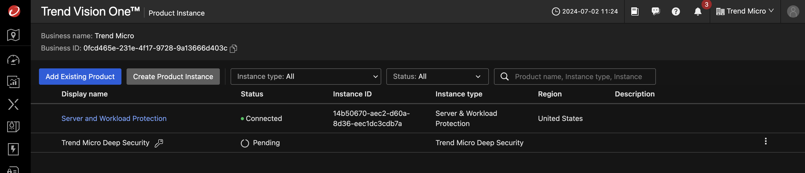
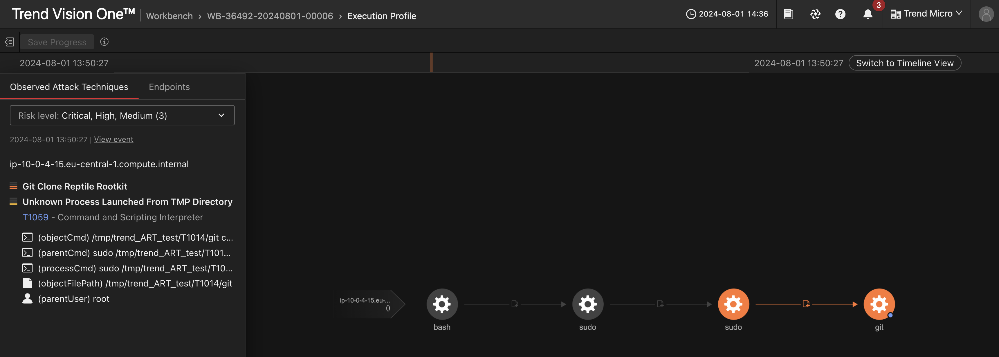

# Scenario: Integrate Deep Security with Vision One and Demo Benefits

This scenario is very similar to [Integrate Deep Security with Vision One](ds-integrate.md) but here we're running some attacks before and after the integration. This should highlight the benefits of the integration, even without doing a full migration.

## Prerequisites

- Playground One Deep Security
- Playground One Deep Security Workload

The Playground One can provide a simulated on-premise Deep Security deployment. For simulation purposes it creates a dedicated VPC with the most commonly used architecture, private and public subnets accross two availability zones. 

Deep Security itself is located within the private subnet and uses a RDS Postgres as the database. The Deep Security Workload configuration creates two linux and one windows server with a deployed and activated Deep Security Agent. Some essential configurations in Deep Security are executed via REST. These are (amongst others):

- Creation of a Windows and Linux Policy with valid configurations for the security modules
- Activation of agent initiated activation
- Scheduling a recommendation scan for all created instances

Before starting the deployment of Deep Security, download the Atomic Launcher (latest Windows and Linux) from [here](https://trendmicro.atlassian.net/wiki/spaces/GRTL/pages/322570154/Atomic+Launcher) and store them in the  `${ONEPATH}/awsone/9-deep-security/files` directory.

Your `${ONEPATH}/awsone/9-deep-security/files`-directory should look like this:

```sh
total 95132
-rw-rw-r-- 1 markus markus 17912014 Aug  1 12:43 atomic_launcher_linux_1.0.0.1009.zip
-rw-rw-r-- 1 markus markus 79491173 Aug  1 12:43 atomic_launcher_windows_2.zip
-rw-rw-r-- 1 markus markus        0 Nov 13  2023 see_documentation
```

The Atomic Launcher is stored within the downloads folder of each of the instances connected to Deep Security.

Verify, that you have `Enable Deep Security` enabled in your configuration and have set ***a valid Deep Security License***.

```sh
pgo --config
```

```sh
...
Section: Deep Security (on-prem)
Please set/update your Deep Security configuration
Enable Deep Security? [true]: 
Deep Security License [AP-FHMD-FU...]: 
Deep Security Username [masteradmin]: 
Deep Security Password [trendmicro]: 
...
```

Now, deploy Deep Security and Deep Security Workload configurations by running:

```sh
pgo --apply dsm
pgo --apply dsw
```

## Current Situation

- Deep Security secures instances in an on-premise environment simulated for this scenario, to which you want to add the XDR capabilities provided by Vision One.
- You run some atomic tests before integrating Deep Security with Vision One.
- You then integrate Deep Security into the platform
- And rerun the same tests as before.
- Finally, you will compare the results.

## Test Round #1

Check the output of the `dsm`-configuration.

```sh
pgo --output dsm
```

```sh
bastion_private_ip = "10.0.4.13"
bastion_public_ip = "3.120.148.35"
ds_apikey = "44EE16E8-7226-F0A1-948B-4851B6112D8A:1xyiBUaocwS1WxJwVhdb1ElPjaG5ps38HusJhJmiHOI="
dsm_url = "https://3.120.148.35:4119"
ec2_profile = "pgo-id-dsm-ec2-profile"
key_name = "pgo-id-dsm-key-pair"
private_key_path = "/home/markus/projects/opensource/playground/playground-one/pgo-id-dsm-key-pair.pem"
public_key = "ssh-rsa AAAAB3NzaC1yc2EAAAADAQABAAACAQDTi0yXH3Xw5J3NWykzs7RgabJl/qVyEzYo5CzkIQmlCI3dIDgAJt8EaUK7ZAl4oqhOrFRbnXSUqojHC+CzUhUTliH0Azvn+unWmYBC+LZ4HOHSNk0AsziTHFYVBLF9l8cg10ARXIweJHMXw0FCwvqI5kEQVqw0Cq6RWvncj/2Vocfp79UBswcG9FsipQYAmuTlMoKVCsm482M0x7RqTpo3N1/UZuuj/YuGplC3x3FdKNMVlFAqi5sUYlMAA9D0UVxGKr6eOdS2JrBIIhB6hk9vkLTYqICbbOKbGqflL55D2STKz5zRHAMnAP5Bn9BFfaEoKAhfj+6JCBTxzAEEQIcpswRMXgC9J129PvyTtmkio1VW/Z1n1w3n5Q1vf8zO/EpHwH0SfdBoWVxoI88mJxhl1nX184jH90tWHFPNXdk46x9zuTO91he/YG0oCQpIHn8IbqIU6Iyl1lgQV2s4lTR2rXnR9QNzrpHp4YRQCiLzeB2omJJU/iJgzV8I7FQVgggPRpJZXyZgb+tqUiZteqPr+xQiogn9Jd2rt85GeHRlPba5HB6jxMj2T36Pc3c0S/jCoy5pTD3shO+4NtjpnjM1v+npYIftbmk7oEHUSXs7LQ5wPWJ1PQ00MQuqadz4ydYtb4kLWvb2EpuYNETMNfN5yoj3RjgNdBJZ62kDOhuG5Q=="
public_security_group_id = "sg-09aae61a66989cc6d"
public_subnets = [
  "subnet-04a6ed0e09612c0ea",
  "subnet-0c934a9f5917c301a",
]
s3_bucket = "playground-awsone-4bh9mlgz"
ssh_instance_dsm = "ssh -i /home/markus/projects/opensource/playground/playground-one/pgo-id-dsm-key-pair.pem -o StrictHostKeyChecking=no -o ProxyCommand='ssh -i /home/markus/projects/opensource/playground/playground-one/pgo-id-dsm-key-pair.pem -o StrictHostKeyChecking=no -o UserKnownHostsFile=/dev/null -W %h:%p ubuntu@3.120.148.35' ec2-user@10.0.0.100"
vpc_id = "vpc-0725e481ee5a3250a"
```

Connect to Deep Security using the `dsm_url` using your browser. You have configured the credentials during the configuration workflow, defaults are `masteradmin / trendmicro`.

Verify, that some computers are protected by Deep Security and the agents are up and running.

### Connect to one of the Computers

Here, we`re connecting to one of the Linux machines, but you can also play with the Windows Server if you prefer the *mouse* ;-)

Run

```sh
pgo --output dsw
```

```sh
ds_apikey = "44EE16E8-7226-F0..."
dsm_url = "https://3.120.148.35:4119"
linux_policy_id = 11
public_instance_ip_linux1 = "18.199.99.82"
public_instance_ip_linux2 = "3.68.82.58"
public_instance_ip_windows1 = "35.159.94.8"
public_instance_password_windows1 = <sensitive>
ssh_instance_linux1 = "ssh -i /home/markus/projects/opensource/playground/playground-one/pgo-id-dsm-key-pair.pem -o StrictHostKeyChecking=no ec2-user@18.199.99.82"
ssh_instance_linux2 = "ssh -i /home/markus/projects/opensource/playground/playground-one/pgo-id-dsm-key-pair.pem -o StrictHostKeyChecking=no ubuntu@3.68.82.58"
ssh_instance_windows1 = "ssh -i /home/markus/projects/opensource/playground/playground-one/pgo-id-dsm-key-pair.pem -o StrictHostKeyChecking=no admin@35.159.94.8"
windows_policy_id = 10
public_instance_password_windows1 = EtppixPh#>xi)UPa
```

Copy and paste the command of `ssh_instance_linux2` and run it. This will give you a prompt on that machine which is protected by Deep Security.

```sh
ubuntu@ip-10-0-4-15:~$ cd download/
ubuntu@ip-10-0-4-15:~/download$ unzip atomic_launcher_linux_1.0.0.1009.zip
```

### Run Tests

```sh
ubuntu@ip-10-0-4-15:~/download$ sudo ./Atomic_Launcher_Linux.sh
```

In this example we're running the following quick tests:

```txt
- 1 - Pre Defined Tests for OAT
  - 1 - T1003.008 - Linux Credential Access
  - 2 - T1018     - Remote System Discovery - arp nix
- 2 - Pre Defined Tests for OAT & Workbench
  - 1 - T1014     - Defense Evasion Reptile Rootkit
```

You can experiment with the other tests as well, of course.

Likely, Deep Security does not detect any of these tests.

## Integration Workflow

Now, let's integrate Deep Security with Vision One.

**Vision One**

1. `Vision One Product Instances --> Add Existing Product`.
2. Choose `Trend Micro Deep Security` --> `Click to generate the enrollment token`.


3. Copy the enrollment token and save the token.
4. Click `[Save]`.
5. Click `[Connect and Transfer]`.



**Deep Security**

6. Login to DSM Console as administrator.
7. On the Deep Security software console, go to `Administration > System Settings > Trend Vision One`
8. Under `Registration`, click `Registration enrollment token`.


9.  In the dialog that appears, paste the enrollment token and click  `[Register]`.
10. After successful registration, your Deep Security software automatically enables Forward security events to Trend Vision One and changes the Enrollment status to "Registered".


**Vision One**

11. Go to `Product Instance` App and verify the DSM On Premise being conncted.


## Install Endpoint Sensor on Instances

First, lets get the `ssh` commands to access our servers by running

```sh
pgo --output dsw
```

```sh
 __                 __   __   __             __      __        ___ 
|__) |     /\  \ / / _` |__) /  \ |  | |\ | |  \    /  \ |\ | |__  
|    |___ /~~\  |  \__> |  \ \__/ \__/ | \| |__/    \__/ | \| |___ 
                                                                   
...
ssh_instance_linux1 = "ssh -i /home/markus/projects/opensource/playground/playground-one/pgo-id-dsm-key-pair.pem -o StrictHostKeyChecking=no ec2-user@3.79.102.108"
ssh_instance_linux2 = "ssh -i /home/markus/projects/opensource/playground/playground-one/pgo-id-dsm-key-pair.pem -o StrictHostKeyChecking=no ubuntu@18.195.62.150"
ssh_instance_windows1 = "ssh -i /home/markus/projects/opensource/playground/playground-one/pgo-id-dsm-key-pair.pem -o StrictHostKeyChecking=no admin@18.153.208.157"
...
```

To connect to a linux instance via the provided `ssh` command copy and paste the commnd in your shell

```sh
ssh -i /home/markus/projects/opensource/playground/playground-one/pgo-id-dsm-key-pair.pem -o StrictHostKeyChecking=no ec2-user@3.79.102.108
```

On the Deep Security software console, go to `Administration > System Settings > Trend Vision One`


This tab shows the Endpoint Sensor deployment script for the supported platform types. First, select `Linux (64-bit)` and copy the script. In the shell on the connected server run `sudo su` to get `root` and simply paste the script.

```sh
Last login: Tue Jul  2 12:57:12 2024 from p57aa067b.dip0.t-ipconnect.de
   ,     #_
   ~\_  ####_        Amazon Linux 2
  ~~  \_#####\
  ~~     \###|       AL2 End of Life is 2025-06-30.
  ~~       \#/ ___
   ~~       V~' '->
    ~~~         /    A newer version of Amazon Linux is available!
      ~~._.   _/
         _/ _/       Amazon Linux 2023, GA and supported until 2028-03-15.
       _/m/'           https://aws.amazon.com/linux/amazon-linux-2023/

[ec2-user@ip-10-0-4-236 ~]$ sudo su
[root@ip-10-0-4-236 ec2-user]# <PASTE>
```

Similar for Windows. Connect to the instance and paste the windows deployment script to the console.  Ignore the error at the top. The agent will install just fine.

```sh
ssh -i /home/markus/projects/opensource/playground/playground-one/pgo-id-dsm-key-pair.pem -o StrictHostKeyChecking=no admin@18.153.208.157
```

```powershell
Windows PowerShell
Copyright (C) Microsoft Corporation. All rights reserved.

Install the latest PowerShell for new features and improvements! https://aka.ms/PSWindows

PS C:\Users\admin> <PASTE>
```

When, as the final step, you head back to `Vision One -> Endpoint Security -> Endpoint Inventory` you will see the Deep Security instance integrated with Vision One and the available computers.


## Test Round #2

Here, we're simply rerunning the same tests as before.

```sh
ubuntu@ip-10-0-4-15:~/download$ sudo ./Atomic_Launcher_Linux.sh
```

In this example we're running the following quick tests:

```txt
- 1 - Pre Defined Tests for OAT
  - 1 - T1003.008 - Linux Credential Access
  - 2 - T1018     - Remote System Discovery - arp nix
- 2 - Pre Defined Tests for OAT & Workbench
  - 1 - T1014     - Defense Evasion Reptile Rootkit
```

There should be plenty of OATs available for inspection.


A Workbench will show up as well.


You could now easily choose to isolate the Computer via Endpoint Sensor and the Computer gets detached from network besides Endpoint Sensor communication.

Execution Path:



After doing some analysis you can reconnect the computer via `Workflow and Automation -> Response Management` and selecting `Restore Connection` after clicking on the three vertical dots.


Optionally, download an Eicar to the linux machine. This will lead to a detection in Deep Security as well as in Vision One.


## Result and Benefits

You now have integrated your on-prem Deep Security instance to Vision One and enabled the XDR functionality. Additionally, you have proven some of the benefits when integration Deep Security with Vision One. Eventually think about migrating?

🎉 Success 🎉
