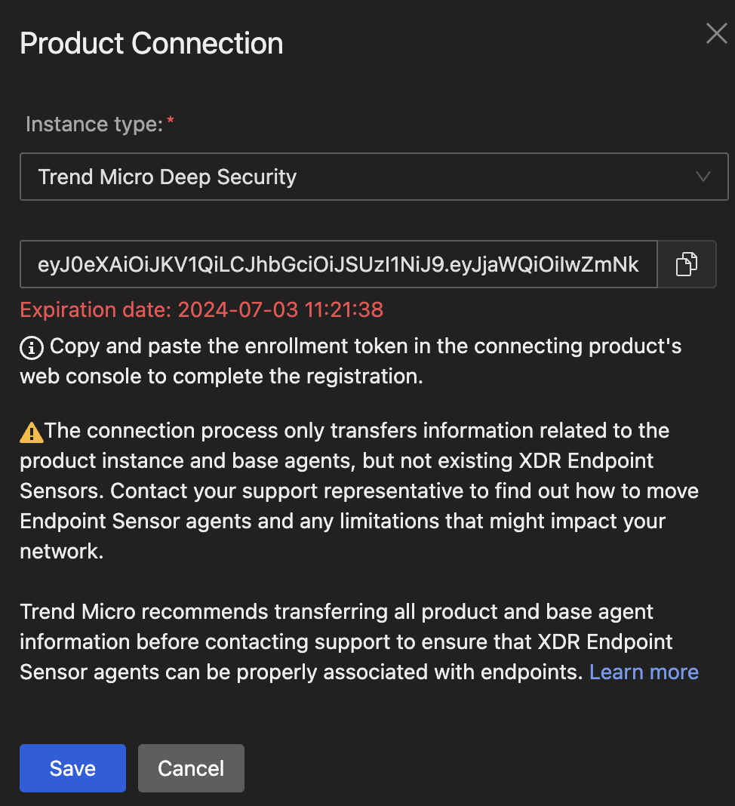
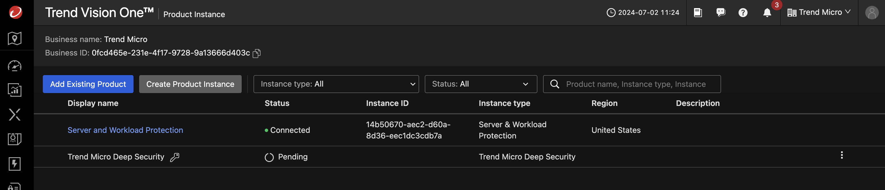
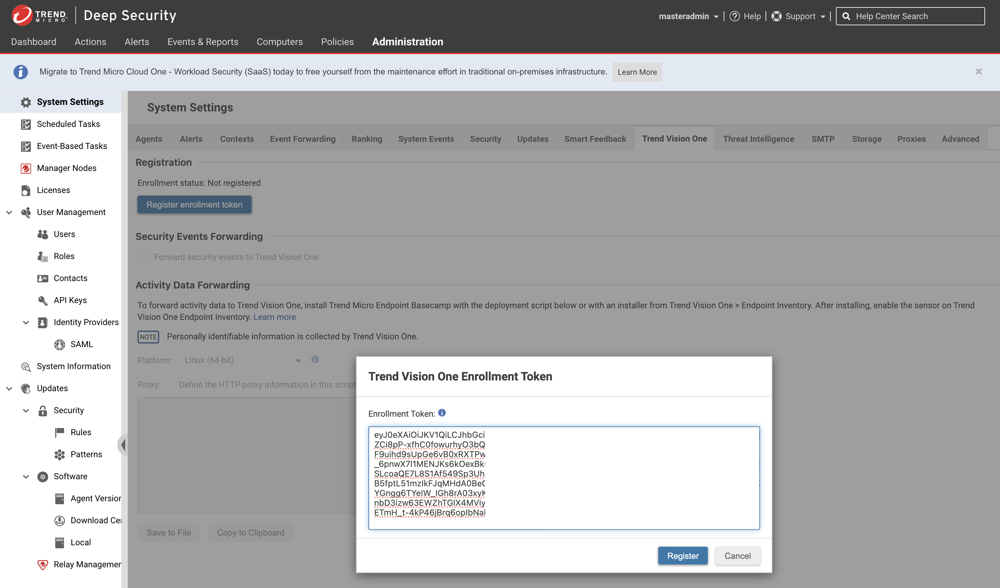
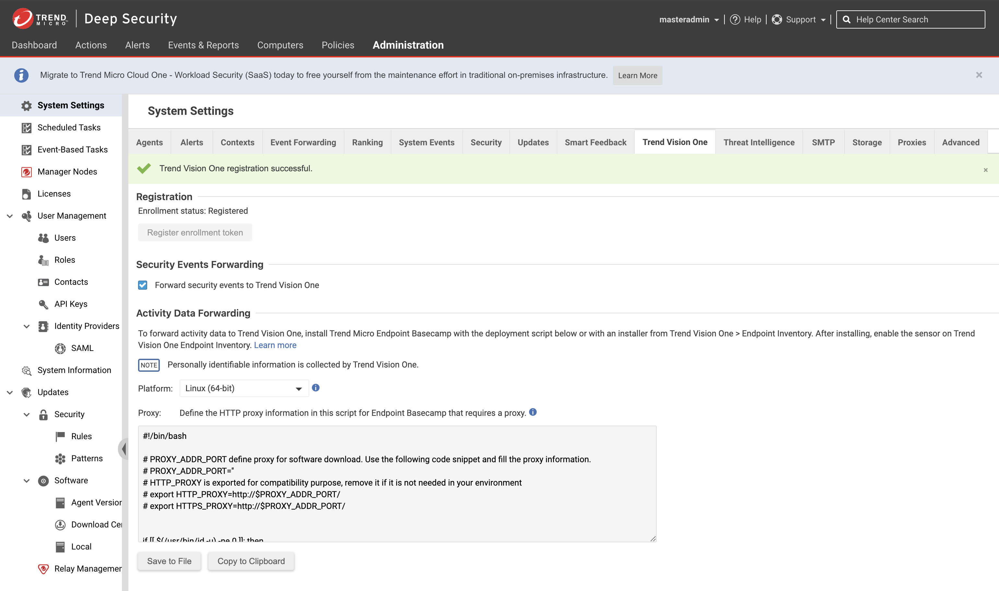
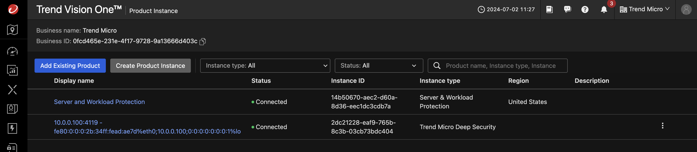

# Scenario: Integrate Deep Security with Vision One

## Prerequisites

- Playground One Deep Security
- Playground One Deep Security Workload

The Playground One can provide a simulates on-premise Deep Security deployment. For simulation purposes it creates a dedicated VPC with the most commonly used architecture, private and public subnets accross two availability zones. 

Deep Security itself is located within the private subnet and uses a RDS Postgres as the database. The Deep Security Workload configuration creates two linux and one windows server with a deployed and activated Deep Security Agent. Some essential configurations in Deep Security are executed via REST. These are (amongst others):

- Creation of a Windows and Linux Policy with valid configurations for the security modules
- Activation of agent initiated activation
- Scheduling a recommendation scan for all created instances

For this scenarion you need to ensure to have the Deep Security and Deep Security Workload configurations up and running:

```sh
pgo --apply dsm
pgo --apply dsw
```

## Current Situation

- Deep Security is securing (simulated) on-premise instances.
- Since you want to move to the Vision One platform you start with integrating Deep Security with the platform.

## Integration Workflow

**Vision One**

1. `Vision One Product Instances --> Add Existing Product`.
2. Choose `Trend Micro Deep Security` --> `Click to generate the enrollment token`.



3. Copy the enrollment token and save the token.
4. Click `[Save]`.
5. CLick `[Connect and Transfer]`.



**Deep Security**

6. Login to DSM Console as administrator.
7. On the Deep Security software console, go to `Administration > System Settings > Trend Vision One`
8. Under `Registration`, click `Registration enrollment token`.



9.  In the dialog that appears, paste the enrollment token and click  `[Register]`.
10. After successful registration, your Deep Security software automatically enables Forward security events to Trend Vision One and changes the Enrollment status to "Registered".



**Vision One**

11. Go to `Product Instance` App and verify the DSM On Premise being conncted.
12. Optionally install Endpoint Sensor to the instances.



## Result and Benefits

You now have control of the (simulated) on-premise environment via Vision One.

🎉 Success 🎉
