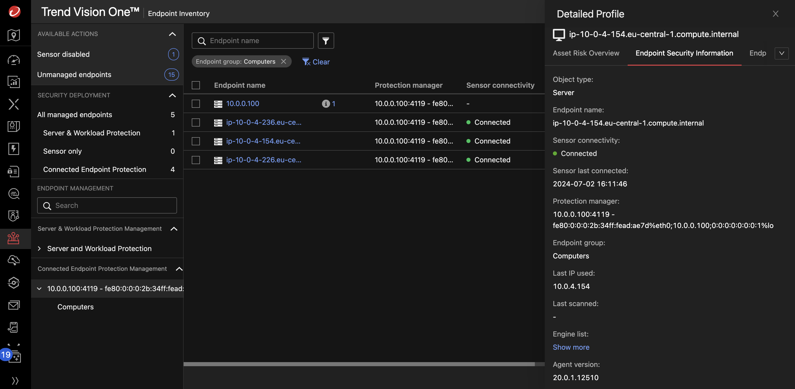

# Scenario: Integrate Deep Security with Vision One

## Prerequisites

- Playground One Deep Security
- Playground One Deep Security Workload

The Playground One can provide a simulated on-premise Deep Security deployment. For simulation purposes it creates a dedicated VPC with the most commonly used architecture, private and public subnets accross two availability zones. 

Deep Security itself is located within the private subnet and uses a RDS Postgres as the database. The Deep Security Workload configuration creates two linux and one windows server with a deployed and activated Deep Security Agent. Some essential configurations in Deep Security are executed via REST. These are (amongst others):

- Creation of a Windows and Linux Policy with valid configurations for the security modules
- Activation of agent initiated activation
- Scheduling a recommendation scan for all created instances

For this scenarion you need to ensure to have the Deep Security and Deep Security Workload configurations up and running:

```sh
pgo --apply dsm
pgo --apply dsw
```

## Current Situation

- Deep Security secures instances in an on-premise environment simulated for this scenario, to which you want to add the XDR capabilities provided by Vision One.
- You start by integrating Deep Security into the platform.

## Integration Workflow

**Vision One**

1. `Vision One Product Instances --> Add Existing Product`.
2. Choose `Trend Micro Deep Security` --> `Click to generate the enrollment token`.


3. Copy the enrollment token and save the token.
4. Click `[Save]`.
5. Click `[Connect and Transfer]`.


**Deep Security**

6. Login to DSM Console as administrator.
7. On the Deep Security software console, go to `Administration > System Settings > Trend Vision One`
8. Under `Registration`, click `Registration enrollment token`.


9.  In the dialog that appears, paste the enrollment token and click  `[Register]`.
10. After successful registration, your Deep Security software automatically enables Forward security events to Trend Vision One and changes the Enrollment status to "Registered".


**Vision One**

11. Go to `Product Instance` App and verify the DSM On Premise being conncted.


## Install Endpoint Sensor on Instances

First, lets get the `ssh` commands to access our servers by running

```sh
pgo --output dsw
```

```sh
 __                 __   __   __             __      __        ___ 
|__) |     /\  \ / / _` |__) /  \ |  | |\ | |  \    /  \ |\ | |__  
|    |___ /~~\  |  \__> |  \ \__/ \__/ | \| |__/    \__/ | \| |___ 
                                                                   
...
ssh_instance_linux1 = "ssh -i /home/markus/projects/opensource/playground/playground-one/pgo-id-dsm-key-pair.pem -o StrictHostKeyChecking=no ec2-user@3.79.102.108"
ssh_instance_linux2 = "ssh -i /home/markus/projects/opensource/playground/playground-one/pgo-id-dsm-key-pair.pem -o StrictHostKeyChecking=no ubuntu@18.195.62.150"
ssh_instance_windows1 = "ssh -i /home/markus/projects/opensource/playground/playground-one/pgo-id-dsm-key-pair.pem -o StrictHostKeyChecking=no admin@18.153.208.157"
...
```

To connect to a linux instance via the provided `ssh` command copy and paste the commnd in your shell

```sh
ssh -i /home/markus/projects/opensource/playground/playground-one/pgo-id-dsm-key-pair.pem -o StrictHostKeyChecking=no ec2-user@3.79.102.108
```

On the Deep Security software console, go to `Administration > System Settings > Trend Vision One`


This tab shows the Endpoint Sensor deployment script for the supported platform types. First, select `Linux (64-bit)` and copy the script. In the shell on the connected server run `sudo su` to get `root` and simply paste the script.

```sh
Last login: Tue Jul  2 12:57:12 2024 from p57aa067b.dip0.t-ipconnect.de
   ,     #_
   ~\_  ####_        Amazon Linux 2
  ~~  \_#####\
  ~~     \###|       AL2 End of Life is 2025-06-30.
  ~~       \#/ ___
   ~~       V~' '->
    ~~~         /    A newer version of Amazon Linux is available!
      ~~._.   _/
         _/ _/       Amazon Linux 2023, GA and supported until 2028-03-15.
       _/m/'           https://aws.amazon.com/linux/amazon-linux-2023/

[ec2-user@ip-10-0-4-236 ~]$ sudo su
[root@ip-10-0-4-236 ec2-user]# <PASTE>
```

Similar for Windows. Connect to the instance and paste the windows deployment script to the console.  Ignore the error at the top. The agent will install just fine.

```sh
ssh -i /home/markus/projects/opensource/playground/playground-one/pgo-id-dsm-key-pair.pem -o StrictHostKeyChecking=no admin@18.153.208.157
```

```powershell
Windows PowerShell
Copyright (C) Microsoft Corporation. All rights reserved.

Install the latest PowerShell for new features and improvements! https://aka.ms/PSWindows

PS C:\Users\admin> <PASTE>
```

When, as the final step, you head back to `Vision One -> Endpoint Security -> Endpoint Inventory` you will see the Deep Security instance integrated with Vision One and the available computers.



## Result and Benefits

You now have integrated your on-prem Deep Security instance to Vision One and enabled the XDR functionality.

🎉 Success 🎉
