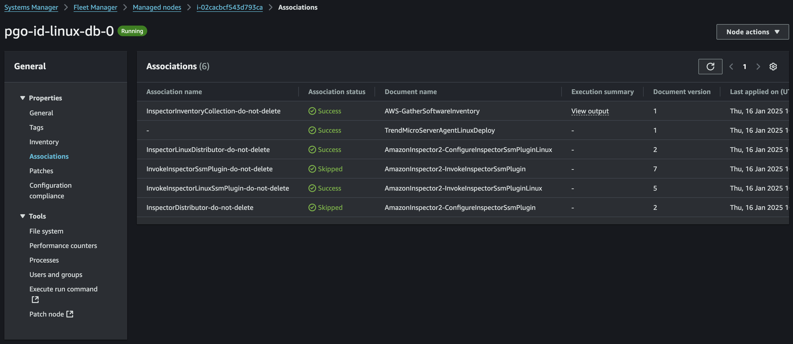
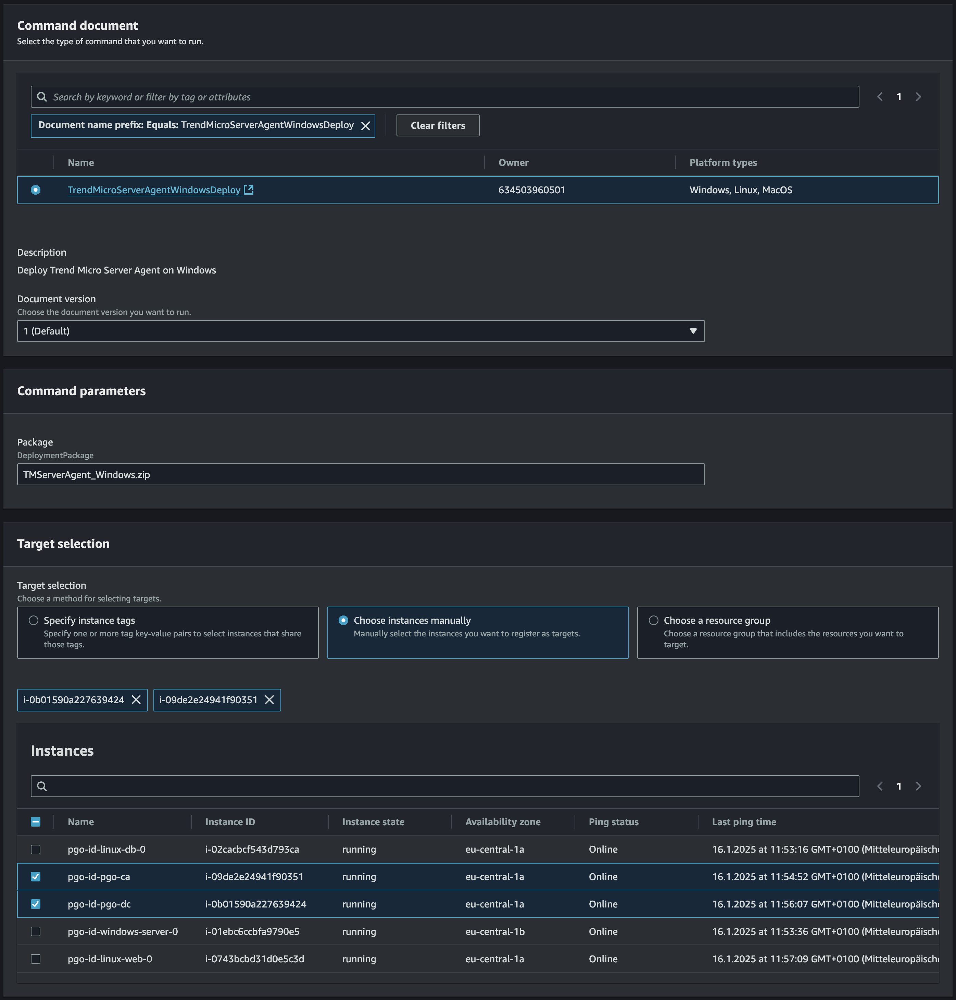

# Scenario: Endpoint Agent Deployment with AWS Systems Manager

## Prerequisites

- Vision One Endpoint Agents for Linux and Windows (SWP and Endpoint Sensor)
- (Optional): Playground One Active Directory

The Playground One integrates with Vision One Endpoint Security and can either automatically deploy Vision One Endpoint Agents or just prepares the deployment of the Agents via AWS Systems Manager.

You must first download *your* Endpoint Agent installers from *your* Vision One instance! The downloaded files are named something similar like

`TMServerAgent_Windows_auto_64_Server_and_Workload_Protection_Manager....zip`

and/or

`TMServerAgent_Linux_auto_64_Server_and_Workload_Protection_Manager....tar`.

Similar for the Endpoint Sensors.

Rename them to `TMServerAgent_Linux.tar`, `TMServerAgent_Windows.zip`,  `TMSensorAgent_Linux.tar`, and `TMSensorAgent_Windows.zip` respectively and copy the file(s) to `${ONEPATH}/awsone/0-files`.

Now, check your Playground One configuration.

```sh
pgo --config
```

Section: AWS

```sh
...
# This is optional, but for this scenario we'll set it to true as we'll
# be deploying agents to the DC and CA manually using SSM later.
AWS AD - create PGO Active Directory [true]: 
...
```

Section: Vision One

```sh
Enable Endpoint Security Automatic Deployment? [True]: 
Endpoint Security Agent Type (TMServerAgent|TMSensorAgent) [TMServerAgent]: 
...
```

```sh
pgo --apply network
```

The above does create the Playground One VPC including an Active Directory and Certification Authority. It will take approximately 15 minutes to be fully functional.

## Agent Deployment by AWS Systems Manager

AWS Systems Manager helps you manage and operate nodes at scale on AWS, on-premises, and in hybrid and multicloud environments.

The Systems Manager offers various tools to manage nodes whereby we're going to use the Fleet Manager, Inventory and Documents in this scenario.

The Fleet Manager is to manage and troubleshoot nodes, including Amazon EC2 instances, edge devices, and on-premises servers and virtual machines.

If you head over to `Systems Manager --> Fleet Manager` you should ideally already see two machines with the Windows platform listed here. The name suffix of our machines should be `-pgo-dc` and `-pgo-ca`. Selecting one of the machines let's you inspect a lot of machine properties but also gives you access to the file system, the registry, and much more.

Amongst the Properties there are Associations, which lists the associated System Manager Documents. An AWS Systems Manager (SSM) document is a JSON or YAML configuration file used by AWS Systems Manager to define the actions that Systems Manager can perform on your managed instances or AWS resources. These documents are also referred to as SSM documents and are a key component of automating and managing operational tasks in AWS.

The Playground One configuration `instances` does automatically create four SSM Documents which can be used to deploy the Vision One Endpoint Security Agents on Windows or Linux systems.

As an example, let's have a look at one of them:

```ps
schemaVersion: "2.2"
description: Deploy Trend Micro Sensor Agent on Windows
parameters:
  Package:
    type: "String"
    description: "DeploymentPackage"
    default: "TMSensorAgent_Windows.zip"
mainSteps:
- action: "aws:runPowerShellScript"
  name: "InstallSensorAgent"
  inputs:
    workingDirectory: C:\Windows\Temp
    runCommand:
      - Write-Host "Copying package from S3"
      - Read-S3Object -BucketName ${var.s3_bucket} -Key download/{{Package}} -File {{Package}}
      - Write-Host "Extracting package"
      - Expand-Archive -LiteralPath {{Package}} -DestinationPath . -Force
      - Write-Host "Running installer"
      - Start-Process -FilePath EndpointBasecamp.exe -NoNewWindow
```

The interesting part is the `runCommand` which instructs the SSM to do three things:

1. Download the agent package `TMSensorAgent_Windows.zip` from a given S3 bucket.
2. Extract the archive
3. Run `EndpointBasecamp.exe` to deploy the agent on the machine

To actually `run` a document on one or more endpoints one does need to associate it with the endpoints. We'll do this later but first let's deploy some additional EC2 instances.

```sh
pgo --apply instances
```

By default, Playground One creates two different Linux and one Windows Server instance.

## Verify

Now, check back at the Fleet Manager


When filtering on your environment name (here `pgo-id`) you should see the above five nodes. Select one of the nodes and check it's Associations.



We can easily see that a Document `TrendMicroServerAgentLinuxDeploy` is associated with this instance and that it did run successfully. That means, we magically deployed the Server Agent on that machine.

Validate this with your Server and Workload Protection instance in Vision One.

## Manual Association

The Domain Controller and the Certification Authority are not equiped with our Vision One Agent, yet. Let's change this using the SSM :-)

Go to `Systems Manager --> Documents --> Owned by me`.

There you will find four documents:

- `TrendMicroSensorAgentLinuxDeploy`
- `TrendMicroSensorAgentWindowsDeploy`
- `TrendMicroServerAgentLinuxDeploy`
- `TrendMicroServerAgentWindowsDeploy`

Choose `TrendMicroServerAgentWindowsDeploy` and inspect what this Document will do by selecting the tab `Content`. You know the code from above, do you?

Now click the button `[Run command]`.

Within the Target selection manually choose the instances you want to deploy the agent to:



Here we choose the CA and the DC.

Alternatively you could filter by tags. The following would work as well (environment name here `pgo-id`):

Tag key | Tag value
------- | ---------
Type | pgo-id-windows-server

Hit the button `[Run]` at the bottom of the page.


The Document is now executed on the two selected machines. If everything works correctly, the agents will register to your SWP.

Hit the refresh button after a couple of minutes. The same process is much faster with Linux machines ;-)


Selecting an instance will bring you to the console output of the command.


> ***Note:*** It can be that the agent deployment on the `windows-server` instance didn't succeed automatically. This is likely due to a timing issue with the user data of the instance. I will check this at some point in time...

🎉 Success 🎉

## Tear Down

```sh
pgo --destroy instances --destroy network
```
