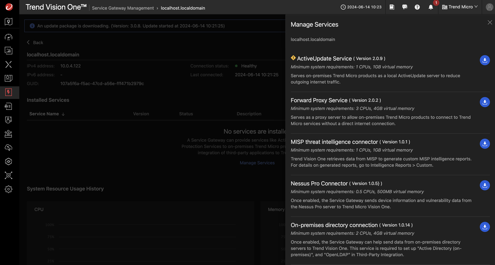

# Scenario: Populate the Active Directory

## Prerequisites

- Playground One Active Directory
- Activated Marketplace AMI for Trend Service Gateway BYOL

You need to have activated the Trend Service Gateway BYOL AMI in Marketplace once. To do this, on the AWS Console choose the service EC2 and navigate to `Images --> AMI Catalog`. Select the tab `AWS Marketplace AMIs` and seach for `Trend Micro Service Gateway`.


There should only be one AMI shown for your current region. Click on `[Select]` and `[Subscribe on instance launch]`. 


Now, check your Playground One configuration.

Verify, that you have `AWS AD - create PGO Active Directory` and `AWS SG - create Service Gateway` enabled in your configuration.

```sh
pgo --config
```

```sh
...
AWS AD - create PGO Active Directory [true]: 
AWS MAD - create Managed Active Directory [false]:
AWS SG - create Service Gateway [true]:
...
```

```sh
# With SG and PGO AD enabled
pgo --apply network
```

The Service Gateway gets a dedicated AWS Security Group assigned which allows SSH from your configured access IP(s) only. All other ports are only accessible from within the public and private subnets.

## Review the Active Directory

After applying the network the Active Directory will build itself automatically. It consists out of two machines both based on Windows Server 2022:

- Windows Domain Controller 
- Windows Certification Authority

After instantiation of the virtual machines the domain is created and the servers are rebooted as required in Windows 😜.

This process takes a couple of minutes.

The output of `pgo --output network` lists some relevant info for this scenario:

```sh
...
ad_ca_ip = "3.71.6.173"
ad_dc_ip = "18.196.75.194"
ad_dc_pip = "10.0.4.107"
ad_domain_admin = "Administrator"
ad_domain_name = "pgo-id.local"
...
sg_va_ip = "18.192.25.254"
sg_va_ssh = "ssh -i /home/markus/projects/opensource/playground/playground-one/pgo-id-key-pair-sd1ly786.pem -o StrictHostKeyChecking=no admin@18.192.25.254"
...
ad_admin_password = TrendMicro.1
```

- `ad_ca_ip`: Public IP address of your Certification Authority
- `ad_dc_ip` and `ad_dc_pip`: Public and private IP address of your Domain Controller
- `ad_domain_name`: Name of your Domain
- `ad_domain_admin` and `ad_admin_password`: Name and password for the Domain Admin
- `sg_va_ssh`: ssh command to connect to the Service Gateway

Use your Remote Desktop app to connect to the Domain Controller.


## Connect the Service Gateway to Vision One

### Get the Vision One API Key

In Vision One head over to `Workflow and Automation -> Service Gateway Management` and click on `[Download Virtual Appliance]`.


In this scenario, you do not need to download the virtual appliance as we will be using an AWS Marketplace AMI. Simply copy the registration token shown at the bottom right and save it in a safe place.


### Activate the Service Gateway

Back to your console/shell run the following command (adapt the parameters to your environment):

```sh
pgo --output network
```

```sh
...
sg_va_ssh = "ssh -i /home/markus/projects/opensource/playground/playground-one/pgo-key-pair-oaxuizlr.pem -o StrictHostKeyChecking=no admin@18.194.239.58"
...
mad_admin_password = XrJ*5VPDZGmhhL70
```

The interesting value here is `sg_va_ssh`. Run the given command to connect to the Service Gateway.

```sh
ssh -i /home/markus/projects/opensource/playground/playground-one/pgo-key-pair-oaxuizlr.pem -o StrictHostKeyChecking=no admin@18.194.239.58
```


```sh
enable

register <your API Token from the first step>
```

It can take some time for the Service Gateway to show up in the console.

### Connect the PGO Active Directory

In Vision One head over to `Workflow and Automation -> Service Gateway Management` again. There should now be a Service Gateway listed. Select it, click on `Manage Services` just in the center, and download the `On-premise directory connection` to the gateway.




In the Connection Settings choose the following parameters:

- Server Type: Microsoft Active Directory
- Server address: One of the private IPs out of `ad_dc_pip`
- Encryption: `SSL`
- Port: `636`
- Base Distinguished Name: `Specific`, value: `DC=<your environment name>, DC=local`
- Permission scope: `Read & write`
- User Name: `Administrator@<your environment name>.local`
- Password: `ad_admin_password`

Example with environment name `pgo-id`:


This should connect the Active Directory to Vision One via the Service Gateway.

Using the PGO Active Directory allows you to utilize the Security Event Forwarding. For this functionality you need to download the current installation package on the Domain Controller and walk through the installation procedure. If you want to use this functionality here, follow the instructions in the chapter [here](../../automation/service-gateway/v1-integrate-active-directory.md#install-security-event-forwarding) and return completing the chapter.

## Populate the Active Directory

Let's populate our Active Directory with users, groups, GPOs and some computers.

Do this by running

```sh
pgo --apply scenarios-identity
```

Check back at your Domain Controller and look out for newly added entities.

After the next synchronization with Vision One you will see some Identities and Assets listed in `Identity Security -> Identity Posture`.
