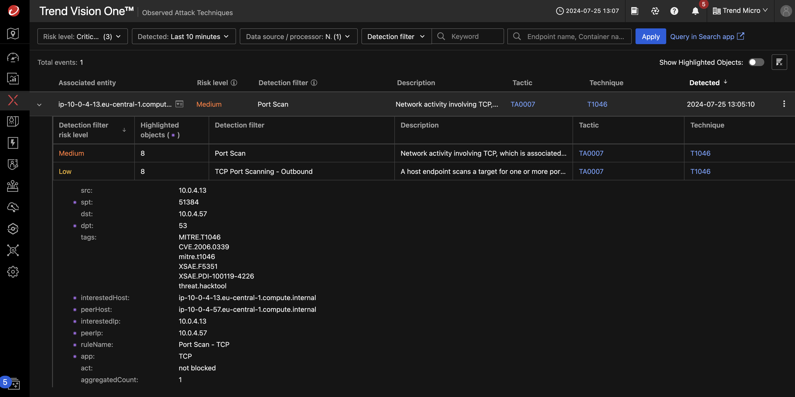

# Scenario: Deploying Deep Discovery Inspector on AWS

!!! warning "NOT FINISHED YET"

## Traffic Mirror on AWS

In an on-premises environment, you would connect the data port of a Deep Discovery Inspector to a single mirror port to capture all traffic on that switch.

In AWS, you can achieve similar functionality to a switch mirror port by using Traffic Mirroring on Elastic Network Interfaces (ENIs). This feature allows you to capture and inspect network traffic by mirroring it to another interface running monitoring software, such as our Inspector. However, unlike physical switches, in AWS you must explicitly configure traffic mirroring for each ENI you want to monitor.

## Prerequisites

- Playground One Network
- Activated Marketplace AMI for Trend Deep Discovery Inspector BYOL
- A valid license key for Deep Discovery Inspector

You need to have activated the Trend Deep Discovery Inspector BYOL AMI in Marketplace once. To do this, on the AWS Console choose the service EC2 and navigate to `Images --> AMI Catalog`. Select the tab `AWS Marketplace AMIs` and seach for `Trend Micro Virtual Network Sensor`.

There should only be one AMI shown for your current region. Click on `[Select]` and `[Subscribe on instance launch]`. 

Now, check your Playground One configuration.

Verify, that you have `DDI - create Deep Discovery Inspector` enabled in your configuration.

```sh
pgo --config
```

```sh
...
DDI - create Deep Discovery Inspector? [true]: 
...
```

Ensure to have the Playground One Network up and running:

```sh
# Network configuration
pgo --apply network

# Instances configuration
pgo --apply instances
```

You will get some output generated, the DDI relevant section is shown below:

```sh
...
Outputs:
...
ddi_ami = "ami-0089a63d4c91694fc"
ddi_va_ip = "3.122.148.231"
ddi_va_pip_dataport = "10.0.4.45"
ddi_va_pip_managementport = "10.0.4.230"
ddi_va_traffic_mirror_filter_id = "tmf-0729a55b05120aedb"
ddi_va_traffic_mirror_target_id = "tmt-032ac48714893a91f"
...
```

Use `ddi_va_id` to connect from the Vision One console.

!!! info "Initial Authentication"

    The first time you authenticate to the DDI console, you will be asked for an administrator account. Use `admin/admin` for this.

## Test It

***VERIFY***

Connect to the `linux_web` instance

```sh
pgo -o instances
 __                 __   __   __             __      __        ___ 
|__) |     /\  \ / / _` |__) /  \ |  | |\ | |  \    /  \ |\ | |__  
|    |___ /~~\  |  \__> |  \ \__/ \__/ | \| |__/    \__/ | \| |___ 
                                                                   
Using PDO User Access Key ID: ...S7CH
Configuration instances in directory /home/markus/projects/opensource/playground/playground-one/awsone/3-instances
instance_ip_linux_db = "18.194.28.64"
instance_ip_linux_web = "18.185.107.182"
instance_username_linux_server = "ubuntu"
s3_bucket = "pgo-id-bucket-vkdhir40"
ssh_instance_linux_db = "ssh -i /home/markus/projects/opensource/playground/playground-one/pgo-id-key-pair-51f2emm2.pem -o StrictHostKeyChecking=no ubuntu@18.194.28.64"
ssh_instance_linux_web = "ssh -i /home/markus/projects/opensource/playground/playground-one/pgo-id-key-pair-51f2emm2.pem -o StrictHostKeyChecking=no ubuntu@18.185.107.182"
```

```sh
ssh -i /home/markus/projects/opensource/playground/playground-one/pgo-id-key-pair-51f2emm2.pem -o StrictHostKeyChecking=no ubuntu@18.185.107.182
```

Now install `nmap` to trigger a simple detection with our Virtual Network Sensor.

```sh
sudo apt update
sudo apt install -y nmap
```

Scan the subnet

```sh
nmap 10.0.4.0/24
```

```sh
Starting Nmap 7.80 ( https://nmap.org ) at 2024-07-25 11:15 UTC
Nmap scan report for ip-10-0-4-13.eu-central-1.compute.internal (10.0.4.13)
Host is up (0.000074s latency).
Not shown: 998 closed ports
PORT   STATE SERVICE
22/tcp open  ssh
80/tcp open  http

Nmap scan report for ip-10-0-4-57.eu-central-1.compute.internal (10.0.4.57)
Host is up (0.00040s latency).
Not shown: 986 filtered ports
PORT     STATE  SERVICE
20/tcp   closed ftp-data
21/tcp   closed ftp
22/tcp   open   ssh
25/tcp   closed smtp
53/tcp   closed domain
80/tcp   closed http
110/tcp  closed pop3
113/tcp  closed ident
143/tcp  closed imap
443/tcp  closed https
993/tcp  closed imaps
1521/tcp closed oracle
3306/tcp closed mysql
5560/tcp closed isqlplus

Nmap done: 256 IP addresses (2 hosts up) scanned in 7.67 seconds
```

```sh
nmap -T4 -A -v 10.0.4.0/24
```

```sh
Starting Nmap 7.80 ( https://nmap.org ) at 2024-07-30 14:52 UTC
Nmap scan report for 10.0.4.91
Host is up (0.00026s latency).
Not shown: 986 filtered ports
PORT     STATE  SERVICE  VERSION
20/tcp   closed ftp-data
21/tcp   closed ftp
22/tcp   open   ssh      OpenSSH 8.2p1 Ubuntu 4ubuntu0.7 (Ubuntu Linux; protocol 2.0)
25/tcp   closed smtp
53/tcp   closed domain
80/tcp   closed http
110/tcp  closed pop3
113/tcp  closed ident
143/tcp  closed imap
443/tcp  closed https
993/tcp  closed imaps
1521/tcp closed oracle
3306/tcp closed mysql
5560/tcp closed isqlplus
Service Info: OS: Linux; CPE: cpe:/o:linux:linux_kernel

Nmap scan report for linuxweb (10.0.4.145)
Host is up (0.000093s latency).
Not shown: 998 closed ports
PORT   STATE SERVICE VERSION
22/tcp open  ssh     OpenSSH 8.2p1 Ubuntu 4ubuntu0.7 (Ubuntu Linux; protocol 2.0)
80/tcp open  http    nginx 1.18.0 (Ubuntu)
|_http-server-header: nginx/1.18.0 (Ubuntu)
|_http-title: Welcome to nginx!
Service Info: OS: Linux; CPE: cpe:/o:linux:linux_kernel

Nmap scan report for 10.0.4.192
Host is up (0.00081s latency).
Not shown: 995 filtered ports
PORT     STATE SERVICE       VERSION
80/tcp   open  http          Microsoft IIS httpd 10.0
| http-methods: 
|_  Potentially risky methods: TRACE
|_http-server-header: Microsoft-IIS/10.0
|_http-title: IIS Windows Server
135/tcp  open  msrpc         Microsoft Windows RPC
139/tcp  open  netbios-ssn   Microsoft Windows netbios-ssn
445/tcp  open  microsoft-ds?
3389/tcp open  ms-wbt-server Microsoft Terminal Services
| rdp-ntlm-info: 
|   Target_Name: ADFS
|   NetBIOS_Domain_Name: ADFS
|   NetBIOS_Computer_Name: PGO-CA
|   DNS_Domain_Name: pgo-id.local
|   DNS_Computer_Name: PGO-CA.pgo-id.local
|   Product_Version: 10.0.20348
|_  System_Time: 2024-07-30T14:53:04+00:00
| ssl-cert: Subject: commonName=PGO-CA.pgo-id.local
| Not valid before: 2024-07-29T11:08:41
|_Not valid after:  2025-01-28T11:08:41
|_ssl-date: 2024-07-30T14:53:44+00:00; 0s from scanner time.
Service Info: OS: Windows; CPE: cpe:/o:microsoft:windows

Host script results:
|_nbstat: NetBIOS name: PGO-CA, NetBIOS user: <unknown>, NetBIOS MAC: 02:5b:ce:db:4e:69 (unknown)
| smb2-security-mode: 
|   2.02: 
|_    Message signing enabled but not required
| smb2-time: 
|   date: 2024-07-30T14:53:04
|_  start_date: N/A

Service detection performed. Please report any incorrect results at https://nmap.org/submit/ .
Nmap done: 512 IP addresses (3 hosts up) scanned in 64.22 seconds
```

Head over to XDR Threat Investigation -> Observed Attack Techniques.

Set the Risk Level to include `Medium` and Datasource to `Network -> Network Sensor`. The following detection should pop up:



🎉 Success 🎉
