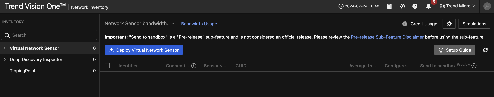
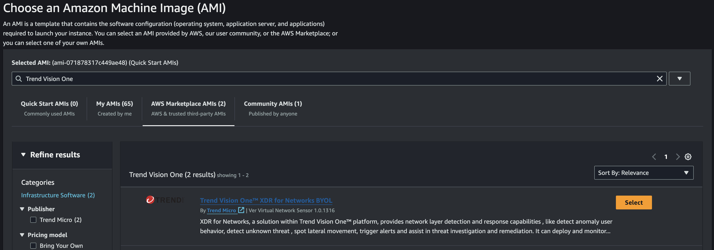

# Scenario: Deploying Virtual Network Sensor on AWS Manually

***Draft***

!!! warning "NOT FINISHED YET"

    Solve dependency with instances. Create Traffic Mirror Session in instances when VNS is enabled. 
    
## Prerequisites

- AWS Cloud Account integrated with Vision One

Ensure to have the Playground One Network and Linux Instances up and running:

```sh
# Network configuration
pgo --apply network

# Instances configuration
pgo --apply instances
```

## Links

- <https://docs.trendmicro.com/en-us/documentation/article/trend-vision-one-virtual-network-sensor-aws>
- <https://docs.trendmicro.com/en-us/documentation/article/trend-vision-one-network-sensor-traffic-mirror>
- <https://docs.trendmicro.com/en-us/documentation/article/trend-vision-one-launching-ami-instance>
- <https://docs.trendmicro.com/en-us/documentation/article/trend-vision-one-aws-security-groups-network-sensor>

## DDI v.s. TP v.s Virtual Network Sensor

Link: <https://trendmicro.atlassian.net/wiki/spaces/VO/pages/356499659/DDI+v.s.+TP+v.s+Virtual+Network+Sensor>

## Security Group

1. On the AWS Management Console, go to the EC2 dashboard.
2. In the top navigation bar, select the Region where you plan to deploy your instance.
3. Go to Network & Security → Security Groups.
4. To create the data port rules, click Create security group.
5. Configure the Basic details.
   1. Specify a unique name. Trend Micro recommends using easy to identify rule name such as VirtualNetworkSensor_DataPort
   3. Type a description of the ruleset.
   4. Select the VPC to save the security group.
6. Configure the Inbound rules.
   1. Click Add rule.
   2. Configure the new rule.
      1. Type: Select All traffic.
      2. Source: Trend Micro recommends setting the source to custom and setting the IP to 0.0.0.0/0 to allow the Virtual Network Sensor to scan all traffic. Allowing all traffic to the data port provides the Virtual Network Sensor with maximum visibility into your security environment.

    
7. Make sure Outbound rules is set to the default to accept all traffic.

    
8. Assign tags to your rule.
9. Click Create security group. The security group is created and opens the details page for the newly created security group.
10. Go to Network & Security → Security Groups.
11. To create the management port rules, click Create security group.
12. Configure the Basic details.
    1.  Specify a unique name. Trend Micro recommends using easy to identify rule name such as VirtualNetworkSensor_ManagementPort
    2.  Type a description of the ruleset.
    3.  Select the VPC to save the security group.
13. Configure the Inbound rules.
    1.  Click Add rule to create a new rule.
    2.  Configure the following rules.

        Type | Protocol | Port Range | Source Type | Source | Purpose
        ---- | -------- | ---------- | ----------- | ------ | -------
        SSH | TCP | 22 | Recommended: Custom | Specify an IP address in CIDR notation or select a security group which is allowed to access the Virtual Network Sensor. | For accessing the Virtual Network Sensor CLISH console<br>***Here we're setting our Access IP which we configured in PGO***
        HTTP | TCP | 80 | Recommended: Custom | Specify an IP address in CIDR notation or select a security group which is allowed to access the Virtual Network Sensor. | Debug log export<br>***Here we're setting our Access IP which we configured in PGO***
        Custom UDP | UDP | 4789 | Recommended: Custom | Specify the IP address in CIDR notation of your mirror source or NLB. | For VXLAN traffic required by the AWS traffic mirror
        Custom TCP | TCP | 14789 | Recommended: Custom | Specify the IP address in CIDR notation of your NLB. | For answering NLB health check

    
14. Make sure Outbound rules is set to the default to accept all traffic.

    
15. Assign tags to your rule.
16. Click Create security group.

The security group is created and opens the details page for the newly created security group.
Your environment should now be ready to launch the Virtual Network Sensor instance.

## Launching a Virtual Network Sensor AMI instance

1. On the Trend Vision One console, go to Network Security → Network Inventory → Virtual Network Sensor.
2. Click Deploy Virtual Network Sensor. The Virtual Network Sensor Deployment panel appears.

    
3. Select Amazon Web Services for the platform.
4. Set the Admin password and confirm the password.

    
5. Click Download Token to download the token file.
6. In a new tab in the same browser session, sign in to the AWS Management Console.
7. Locate the EC2 service and click the link to access the EC2 dashboard.
8. In the top navigation bar, select the Region for your instance.
9.  Click Launch instance, then select Launch instance. The Launch an instance screen appears.
10. In the Names and tags section, provide a name or add tags to the instance.
11. In the Application and OS Images (Amazon Machine Image) section, find and select the Virtual Network Sensor AMI.
    1.  In the Application and OS Images (Amazon Machine Image) section, click Browse more AMIs.
    2.  In the Choose an Amazon Machine Image (AMI) screen, select AWS Marketplace AMIs under the search bar.
    3.  Search for Trend Vision One.
    4.  Find Trend Vision One™ XDR for Networks (BYOL) and click Select.

        
    5.  Review the details and click Continue.

        
12. In the Instance Type section, select an instance that meets the specifications for your deployment. Here we use the smallest variant `t3.large`.

    
13. In the Key pair (login) section, select Proceed without a key pair.

    
14. In the Network settings section, click Edit and configure the settings.
    1.  Configure the network deployment settings.
        1.  Select the VPC to use for the instance.
        2.  Select a Subnet to use for the Virtual Network Sensor data port.
        3.  Set the Auto-assign Public IP to Disable.
            Important: Do not select No preference for the subnet.
    2.  Under Firewall (security groups), select Select existing security group.
    3.  Do not select any Common security groups.
    4.  Expand the Advanced network configuration section.
            Important: To comply with the AWS environment, the Virtual Network Sensor uses Port 1 (eth1) for the management port, and Port 0 (eth0) for the data port. For the following steps, Port 0 is Network interface 1, and Port 1 is Network interface 2.
    5.  Configure Network interface 1 for the data port.

        
        1.  Description: Provide a description for the interface. Adding a clear description such as `Virtual Network Sensor Data Port` makes it easier to locate when configuring your AWS network settings after deployment.
        2.  Subnet: The subnet you selected previously for the data port.
        3.  Security groups: Select the security group for the data port.
        4.  Primary IP: Specify an IP address available on the subnet, or leave blank to have AWS automatically assign the IP address.
    6.  Click Add network interface.
    7.  Configure Network interface 2 for the maintenance port.

        
        1.  Description: Provide a description for the interface. Adding a clear description such as `Virtual Network Sensor Management Port` makes it easier to locate when configuring your AWS network settings after deployment.
        2.  Subnet: Select the subnet for the maintenance port.
        3.  Security groups: Select the security group for the maintenance port.
        4.  Primary IP: Specify an IP address available on the subnet, or leave blank to have AWS automatically assign the IP address.
15. Use the Configure storage settings to specify the size of the root volume for your instance. Set the root volume size according to your throughput. Here we use 50GB, the smallest.

    
16. Expand the Advanced details section.
17. Locate User data - optional and click Choose file.
18. Select the token file you downloaded from Network Inventory.

    
19. Review the settings in the Summary panel and click Launch instance
    Once you launch the instance, the Virtual Network Sensor begins installation. Installation may take a few minutes to complete. You can view the status of the instance in the EC2 console by going to Instances → Instances.
    The Virtual Network Appliance is ready to connect and configure when the Instance state is Running and the Status check shows 2/2 checks passed.

## Configuring the Virtual Network Sensor as a traffic mirror target

1.  Sign in to the AWS Management Console.
2.  Find the Interface ID for the mirror source and the Virtual Network Sensor data port.
    Note:
    If you are deploying a Virtual Network Sensor behind a network load balancer, the network load balancer you created is the mirror source. You do not need to locate the Interface ID for the network load balancer.
    1.  Access the EC2 dashboard.
    2.  Go to Instances → Instances.
    3.  Locate the instance you want to use as the mirror source and click the instance ID.
    4.  Go to Networking.
    5.  On the Network Interfaces list, copy the Interface ID for the network interface you want to use as the mirror source.
    6.  Go to Instances → Instances.
    7.  Locate the Virtual Network Sensor instance you created and click the Instance ID.
    8.  Go to Networking.
    9.  On the Network Interfaces list, copy the Interface ID for the Virtual Network Sensor data port (eth0).

        Tip:
        If you provided a description when setting up the instance, you can use the description instead of the Interface ID to locate the network interface.
3. Access the VPC dashboard.
4. In the top navigation bar, select the Region the VPC your instance is deployed to is located.
5. Go to Traffic Mirroring → Mirror filters.
6. Click Create traffic mirror filter.
7. Configure the Filter settings.
   1. Name tag: Specify a unique name for the filter.
   2. Use a name that is descriptive and easy to find, such as VirtualNetworkSensor-TrafficMirrorFilter.
   3. Description: Specify a description for the filter.
   4. Use a description that clearly explains the purpose of the filter, such as Virtual Network Sensor Traffic Mirror Filter.
   5. Network services: Select amazon-dns.

    
8. In the Inbound rules section, click Add rule.
9. Configure the new rule.
    
    Trend Micro recommends using a permissible rule set as detailed below. Adding additional rules to limit traffic might interfere with the visibility of the Virtual Network Sensor into your environment.

    Inbound rules for Data Port traffic mirror filter

    Option | Setting | Description
    ------ | ------- | -----------
    Number | 100 | The rule priority. Lower rule numbers have priority and are applied first.
    Rule action | accept | What action to take for a rule match
    Protocol | All protocols | The protocol to apply the rule
    Source CIDR block | 0.0.0.0/0 | The source IP address range in CIDR format to apply the rule
    Destination CIDR block | 0.0.0.0/0 | The destination IP address range in CIDR format to apply the rule
    Description | Mirror all inbound traffic. | A description of what the rule does

    
10. In the Outbound rules section, click Add rule.
11. Configure the new rule.

    Trend Micro recommends using a permissible rule set as detailed below. Adding additional rules to limit traffic might interfere with the visibility of the Virtual Network Sensor into your environment.

    Outbound rules for Data Port traffic mirror filter

    Option | Setting | Description
    ------ | ------- | -----------
    Number | 100 | The rule priority. Lower rule numbers have priority and are applied first.
    Rule action | accept | What action to take for a rule match
    Protocol | All protocols | The protocol to apply the rule
    Source CIDR block | 0.0.0.0/0 | The source IP address range in CIDR format to apply the rule
    Destination CIDR block | 0.0.0.0/0 | The destination IP address range in CIDR format to apply the rule
    Description | Mirror all outbound traffic. | A description of what the rule does

    
12. Click Create. Creating the mirror filter takes a moment to complete. Once finished, click Close.
13. Go to Traffic Mirroring → Mirror targets.
14. Click Create traffic mirror target.
15. Configure Target settings.
    1.  Name tag: Specify a unique name for the target settings. Use a name that is descriptive and easy to find, such as VirtualNetworkSensor-TrafficMirrorTarget.
    2.  Description: Specify a description for the target. Use a description that clearly explains the purpose of the filter, such as Virtual Network Sensor Traffic Mirror Target.

    
16. Configure Choose target.
    1.  For normal deployments, use the following configurations:
        1.  For Target type, select Network Interface.
        2.  For Target specify the data port Interface ID or search by the network interface description.
    2.  For deploying behind a Network Load Balancer, use the following configurations:
        1.  For Target type, select Network Load Balancer.
        2.  For Target specify the network load balancer you created.

    
17. Click Create. Creating the mirror target takes a moment to complete. Once finished, click Close.
18. Go to Traffic Mirroring → Mirror session.
19. Click Create traffic mirror session.
20. Configure Session settings.
    1.  Name tag: Specify a unique name for the mirror session. Use a name that is descriptive and easy to find, such as `VirtualNetworkSensor-TrafficMirrorSession`.
    2.  Description: Specify a description for the mirror session. Use a description that clearly explains the purpose of the session, such as Virtual Network Sensor Traffic Mirror Session.
    3.  Mirror source: Specify the mirror source Interface ID.
    4.  Mirror target: Specify the name of the mirror target you created.

    
21. Configure Additional settings. For best results, Trend Micro recommends using the following settings. You can adjust these settings to best fit the needs of your security environment.

    Additional settings for traffic mirror session

    Option | Setting | Description
    ------ | ------- | -----------
    Session number | 1 | The session priority<br>The session number determines the order traffic mirror sessions are evaluated in the following situations:<br>When an interface is used by multiple sessions<br>When an interface is used by different traffic mirror targets and traffic mirror filters<br>Traffic is only mirrored one time, so use the recommended setting to ensure the highest priority.
    VNI | Leave blank | The unique VXLAN network identifier<br>Leave blank to allow AWS to assign a random number.<br>If you prefer to designate the VXLAN manually, see https://tools.ietf.org/html/rfc7348.
    Packet length | Leave blank | The number of bytes in each packet to mirror<br>Leave blank to allow mirroring of the entire packet.<br>Specifying a number limits the packet length to the specified number of bytes. For example, setting to 100 only transfers the first 100 bytes of a packet after the VXLAN header.
    Filter | Select the traffic mirror filter you created | The traffic mirror filter to use for the mirror session

    
22. Click Create. Creating the mirror session takes a moment to complete. Once finished, the Virtual Network Sensor starts monitoring the mirrored traffic.

## Register

```sh
markus@devng:~/projects/opensource/playground/playground-one$ ssh admin@3.121.165.189
(admin@3.121.165.189) Password: 
Trend Vision One - Virtual Network Sensor

* Version: 1.0.1316
* Status: Disconnected
* Trend Vision One console: -

Welcome admin - 2024-07-25 09:50:29 UTC+00


> enable

# connect
Trend Vision One : unregistered
Network Inventory: unregistered
Network Analytics: unregistered

# register
Request sent successfully to Trend Vision One. The registration process might take some time.
```

## Test It

Connect to the `linux_web` instance

```sh
pgo -o instances
 __                 __   __   __             __      __        ___ 
|__) |     /\  \ / / _` |__) /  \ |  | |\ | |  \    /  \ |\ | |__  
|    |___ /~~\  |  \__> |  \ \__/ \__/ | \| |__/    \__/ | \| |___ 
                                                                   
Using PDO User Access Key ID: ...S7CH
Configuration instances in directory /home/markus/projects/opensource/playground/playground-one/awsone/3-instances
instance_ip_linux_db = "18.194.28.64"
instance_ip_linux_web = "18.185.107.182"
instance_username_linux_server = "ubuntu"
s3_bucket = "pgo-id-bucket-vkdhir40"
ssh_instance_linux_db = "ssh -i /home/markus/projects/opensource/playground/playground-one/pgo-id-key-pair-51f2emm2.pem -o StrictHostKeyChecking=no ubuntu@18.194.28.64"
ssh_instance_linux_web = "ssh -i /home/markus/projects/opensource/playground/playground-one/pgo-id-key-pair-51f2emm2.pem -o StrictHostKeyChecking=no ubuntu@18.185.107.182"
``´

```sh
ssh -i /home/markus/projects/opensource/playground/playground-one/pgo-id-key-pair-51f2emm2.pem -o StrictHostKeyChecking=no ubuntu@18.185.107.182
```

Now install `nmap` to trigger a simple detection with our Virtual Network Sensor.

```sh
sudo apt update
sudo apt install -y nmap
```

Scan the subnet

```sh
nmap 10.0.4.0/24
```

```sh
Starting Nmap 7.80 ( https://nmap.org ) at 2024-07-25 11:15 UTC
Nmap scan report for ip-10-0-4-13.eu-central-1.compute.internal (10.0.4.13)
Host is up (0.000074s latency).
Not shown: 998 closed ports
PORT   STATE SERVICE
22/tcp open  ssh
80/tcp open  http

Nmap scan report for ip-10-0-4-57.eu-central-1.compute.internal (10.0.4.57)
Host is up (0.00040s latency).
Not shown: 986 filtered ports
PORT     STATE  SERVICE
20/tcp   closed ftp-data
21/tcp   closed ftp
22/tcp   open   ssh
25/tcp   closed smtp
53/tcp   closed domain
80/tcp   closed http
110/tcp  closed pop3
113/tcp  closed ident
143/tcp  closed imap
443/tcp  closed https
993/tcp  closed imaps
1521/tcp closed oracle
3306/tcp closed mysql
5560/tcp closed isqlplus

Nmap done: 256 IP addresses (2 hosts up) scanned in 7.67 seconds
```

Head over to XDR Threat Investigation -> Observed Attack Techniques.

Set the Risk Level to include `Medium` and Datasource to `Network -> Network Sensor`. The following detection should pop up:


