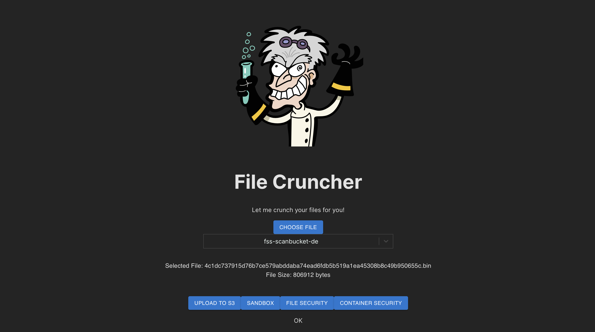
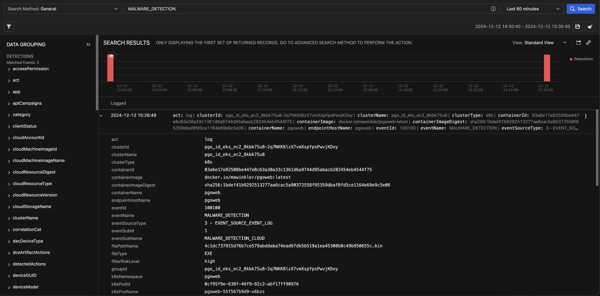

# Scenario: File Crunching with PGOWeb



## Prerequisites

- Vision One Cloud Security File Scanner API-Key with the following permissions:
    - Cloud Security Operations
        - File Security
            - Run file scan via SDK
    - Platform Capabilities
        - Threat Intelligence
            - Sandbox Analysis
                - View, filter, and search
                - Submit object
- If using the Sandbox, ensure to have credits assigned.
- Know your Vision One region.

Verify, that you have enabled PGOWeb in your configuration.

```sh
pgo --config
```

```sh
...
Section: Kubernetes Deployments
Please set/update your Integrations configuration
...
Deploy PGOWeb? [true]:
...
```

## About PGOWeb

PGOWeb is likely to become a central component of Playground One. Currently it's functionality is limited to scanning files using various technologies offered by Vision One:

- File Security for S3 Buckets secured by Vision One.
- Direct sending of files to the Vision One Sandbox.
- Scanning via the File Security SDK.
- Dropping files into the container to scan with Container Security Runtime Malware Scan. 

The GitHub Repository is located [here](https://github.com/mawinkler/playground-one-web-app).

## Usage

### Docker

```sh
docker run \
  -p 5000:5000 \
  -e AWS_ACCESS_KEY_ID=<AWS_ACCESS_KEY_ID> \
  -e AWS_SECRET_ACCESS_KEY=<AWS_SECRET_ACCESS_KEY> \
  -e V1_API_KEY=<V1_API_KEY> \
  mawinkler/pgoweb
```

### Docker-Compose

`docker-compose.yaml`:

```yaml
services:
  pgoweb:
    container_name: pgoweb
    image: mawinkler/pgoweb
    environment:
      - AWS_ACCESS_KEY_ID=<AWS_ACCESS_KEY_ID>
      - AWS_SECRET_ACCESS_KEY=<AWS_SECRET_ACCESS_KEY>
      - V1_API_KEY=<V1_API_KEY>
    ports:
      - 5000:5000
    restart: unless-stopped
```

```sh
docker compose up pgoweb
```

### Kubernetes with `eks-ec2`

If you've enabled PGOWeb in your configuration, it will be automatically deployed when the EKS EC2 Kubernetes cluster is created.

```sh
pgo --apply eks-ec2
```

The following outputs are created:

```sh
Outputs:

loadbalancer_dns_pgoweb = "k8s-pgoweb-pgowebin-69953cce7e-847792142.eu-central-1.elb.amazonaws.com"
```

Access it using your browser.

### Kubernetes with a Manifest

`pgoweb.yaml`:

```yaml
apiVersion: v1
kind: Service
metadata:
  name: pgoweb
  labels:
    app: pgoweb
spec:
  type: LoadBalancer
  ports:
  - port: 5000
    name: pgoweb
    targetPort: 5000
  selector:
    app: pgoweb
---
apiVersion: apps/v1
kind: Deployment
metadata:
  labels:
    app: pgoweb
  name: pgoweb
spec:
  replicas: 1
  selector:
    matchLabels:
      app: pgoweb
  strategy:
    type: RollingUpdate
    rollingUpdate:
      maxSurge: 1
      maxUnavailable: 1
  template:
    metadata:
      labels:
        app: pgoweb
    spec:
      containers:
      - name: pgoweb
        image: mawinkler/pgoweb
        imagePullPolicy: Always
        env:
        - name: AWS_ACCESS_KEY_ID
          value: <AWS_ACCESS_KEY_ID>
        - name: AWS_SECRET_ACCESS_KEY
          value: <AWS_SECRET_ACCESS_KEY>
        - name: V1_API_KEY
          value: <V1_API_KEY>
        ports:
        - containerPort: 5000
```

Deploy

```sh
kubectl apply -f pgoweb.yaml
```

## Start Crunching

When accessing the web application, PGOWeb will enumerate your S3 buckets. This may take a second or two.

After that you have the option to select a local file to scan.

If you want to scan the file with file security enabled on a specific S3 bucket, first select the bucket where you want to upload the file. Then press the `[UPLOAD TO S3]` button. `Use Cloud Security --> File Security` to check if the file was malicious or clean.

The `[SANDBOX]` button sends the file directly to the Vision One Sandbox. When the scan is complete, you should see some tags added to the file.


The `[FILE SECURITY]` button uses the File Security SDK to scan the file.

Finally, press the `[COMTAINER SECURITY]` button to drop the file into the running container. If you have Vision One Container Security with runtime scanning enabled, it should detect and report a malicious file. Check under `Search` or `Cloud Security --> Container Protection --> Events --> Kubernetes Runtime`.



🎉 Success 🎉
