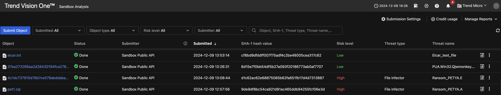
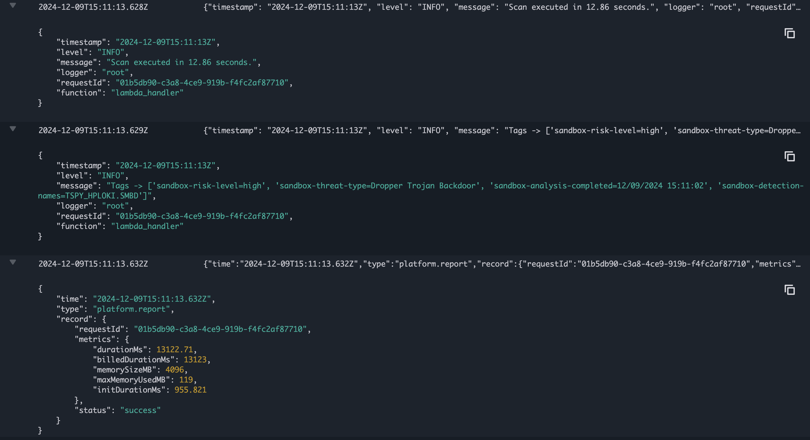
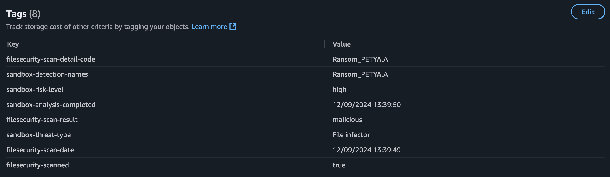

# Scenario: S3 Bucket Malware Scanning with Sandbox

## Prerequisites

- Vision One Cloud Security File Scanner API-Key with the following permissions:
    - Platform Capabilities
        - Threat Intelligence
            - Sandbox Analysis
                - View, filter, and search
                - Submit object
- If using the Sandbox, ensure to have credits assigned.
- Know your Vision One region.

!!! warning "PGO S3 Scanning"

    This scenario uses Playground Ones own S3 Bucket Scanner which is ***not*** the official solution component of Vision One. It uses the File Security Python SDK and/or Vision One API within a Lambda Function. Scan results will show up on the Vision One console.

Verify, that you have enabled the Bucket Scanner with `Sandbox` in your configuration.

```sh
pgo --config
```

```sh
...
Section: Vision One
Please set/update your Vision One configuration
...
Enable Bucket Scanner with File Security? [false]: 
Enable Bucket Scanner with Sandbox? [true]: 
...
```

## Architecture

The scanner consists out of the following components:

- A Lambda function triggered by `s3:ObjectCreated` events. It uses the RESTful API for Sandbox submission.
- The function uses a custom layer containing the required dependencies including the File Security Python SDK.
- An S3 Bucket with the permission to notify the Lambda.
- An IAM Role and Policy.
- The scanned files are tagged

> ***Note:*** The Lambda does use Python 3.11

## The Function Code

You can review the full function code [here](https://github.com/mawinkler/playground-one-bucket-scanner/blob/main/lambda/scanner.py).

## Deployment

Assuming you have set your Vision One API Key and Vision One region with the help of the config tool simply run

```sh
pgo --apply bucketscanner
```

The following outputs are created:

```sh
Outputs:

aws_lambda_function_name = "pgo-id-bucket-scanner-2kn1vopd"
aws_lambda_layer_arn = "arn:aws:lambda:eu-central-1:634503960501:layer:pgo-id-filesecurity-layer-2kn1vopd:1"
aws_s3_bucket_name = "pgo-id-scanning-bucket-2kn1vopd"
```

Feel free to review the Lambda function in the AWS console.

## Run Scans

Either head over to the S3 bucket via the console to upload files or use the AWS cli.

Download the `eicarcom2.zip` and upload it to the scanning bucket.

> ***Warning:*** Do not download malicious files on computers with a running anti malware engine!

```sh
# Set your bucket name from the outputs
SCANNING_BUCKET=pgo-id-scanning-bucket-2kn1vopd

wget https://secure.eicar.org/eicarcom2.zip
aws s3 cp eicarcom2.zip s3://${SCANNING_BUCKET}/eicarcom2.zip
```

## Example Tags with Sandbox

Malware | Key | Value
------- | --- | -----
Loki | sandbox-detection-names | TSPY_HPLOKI.SMBD
| sandbox-risk-level | high
| sandbox-analysis-completed | 12/09/2024 15:11:02
| sandbox-threat-type | Dropper Trojan Backdoor

## Check on Vision One

For the Sandbox analysis check `Threat Intelligence --> Sandbox Analysis`.



## Check on AWS

You can also check the CloudWatch logs of the function.



And lastly, the tags of the S3 Object(s).



🎉 Success 🎉
