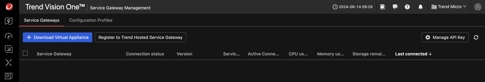

# Scenario: Deploy Vision One Service Gateway on AWS and connect AWS Managed AD - Automatically

***DRAFT***

## Prerequisites

- Playground One Network with Managed Active Directory enabled
- Activated Marketplace AMI for Trend Service Gateway BYOL

You need to have activated the Trend Service Gateway BYOL AMI in Marketplace once. To do this, on the AWS Console choose the service EC2 and navigate to `Images --> AMI Catalog`. Select the tab `AWS Marketplace AMIs` and seach for `Trend Micro Service Gateway`.


There should only be one AMI shown for your current region. Click on `[Select]` and `[Subscribe on instance launch]`. 


Now, check your Playground One configuration.

Verify, that you have `AWS MAD - create Managed Active Directory` and `AWS SG - create Service Gateway` enabled in your configuration.

```sh
pgo --config
```

```sh
...
AWS MAD - create Managed Active Directory [true]:
AWS SG - create Service Gateway [true]:
...
```

```sh
# With MAD and SG enabled
pgo --apply network
```

The Service Gateway gets a dedicated AWS Security Group assigned with allows SSH from your configured access IP(s) only. All other ports are only accessible from within the public and private subnets.

## Get the Vision One API Key

In Vision One head over to `Workflow and Automation -> Service Gateway Management` and click on `[Download Virtual Appliance]`.



You don't need to download the virtual appliance since we're going to use a AWS Marketplace AMI. Simply copy the Registration Token shown in the bottom right and save it to a secure place.


## Activate the Service Gateway

Back to your console/shell run the following command (adapt the parameters to your environment):

```sh
pgo --output network
```

```sh
...
sg_va_ssh = "ssh -i /home/markus/projects/opensource/playground/playground-one/pgo-key-pair-oaxuizlr.pem -o StrictHostKeyChecking=no admin@18.194.239.58"
...
mad_admin_password = XrJ*5VPDZGmhhL70
```

The interesting value here is `sg_va_ssh`. Run the given command to connect to the Service Gateway.

```sh
ssh -i /home/markus/projects/opensource/playground/playground-one/pgo-key-pair-oaxuizlr.pem -o StrictHostKeyChecking=no admin@18.194.239.58
```


*TODO: Screenshot needs update*

```sh
enable

register <your API Token from the first step>
```

## Connect the Managed Active Directory

Now to the last step. In Vision One head over to `Workflow and Automation -> Service Gateway Management` again. There should now be a Service Gateway listed. Select it, click on `Manage Services` just in the center, and download the `On-premise directory connection` to the gateway.


From within your console/shell run the following command (or find the output from the previous step):

```sh
pgo --output network
```

```sh
...
mad_id = "d-99677cba24"
mad_ips = toset([
  "10.0.0.37",
  "10.0.1.229",
])
...
key_name = "pgo-key-pair-oaxuizlr"
mad_admin_password = <sensitive>
...
mad_admin_password = XrJ*5VPDZGmhhL70
```

The interesting values are now `mad_ips` and the `mad_admin_password`.

Lastly, in the Connection Settings choose the following parameters:

- Server address: One of the private IPs out of `mad_ips`
- Encryption: `NONE` (the MAD built by Playground One does not have a certificate yet)
- Port: `389`
- Permission scope: `Read & write`
- User Name: `admin`
- Password: `mad_admin_password`


This should connect the Active Directory to Vision One via the Service Gateway.

🎉 Success 🎉
