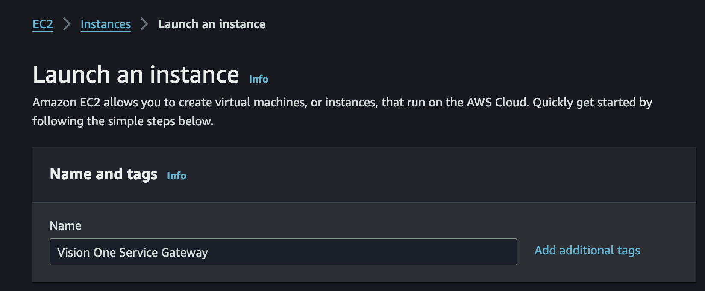

# Scenario: Deploy Vision One Service Gateway on AWS Manually

***DRAFT***

## Prerequisites

- Playground One Network

```sh
pgo --apply network
```

## Get the Vision One API Key

In Vision One head over to `Workflow and Automation -> Service Gateway Management` and click on `[Download Virtual Appliance]`.


You don't need to download the virtual appliance since we're going to use a AWS Marketplace AMI. Simply copy the Registration Token shown in the bottom right and save it to a secure place.


## Launch Instance on AWS

Now, on the AWS Console choose the service EC2 and navigate to `Images --> AMI Catalog`. Select the tab `AWS Marketplace AMIs` and seach for `Trend Micro Service Gateway`.


There should only be one AMI shown for your current region. Click on `[Select]` and `[Subscribe now]`. 


This will bring you to `Launch an instance`.



Give it a name, something like `Vision One Service Gateway` could make sense.


- Instance type: `c5.2xlarge`
- Key pair name: your Playground One key pair


- VPC: your Playground One VPC
- Subnet: one of the public Playground One subnets


Leave the security group settings for now as default.


Same to the storage.

Check the summary and click on `[Launch instance]`.

When the instance is up and running, get the public IP of the instance and proceed with the next step.

## Activate the Service Gateway

Back to your console/shell run the following command (adapt the parameters to your environment):

```sh
pgo --output network
```

```sh
...
mad_id = "d-99677cba24"
mad_ips = toset([
  "10.0.0.37",
  "10.0.1.229",
])
...
key_name = "pgo-key-pair-oaxuizlr"
mad_admin_password = <sensitive>
...
mad_admin_password = XrJ*5VPDZGmhhL70
```

The interesting value here is `key_name`.

```sh
key_name=<key_name>
public_ip=<public IP of your Security Gateway instance>

ssh -i ${ONEPATH}/${key_name}.pem admin@${public_ip}
```


*TODO: Screenshot needs update*

```sh
enable

register <your API Token from the first step>
```

It can take some time for the Service Gateway to show up in the console.

🎉 Success 🎉
