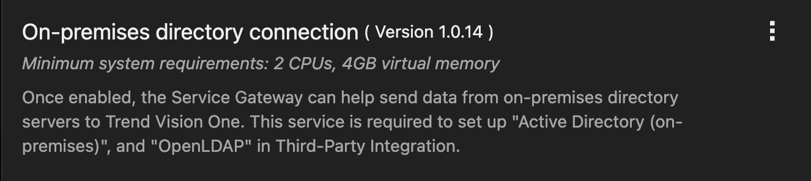

# Scenario: Integrate an Active Directory with Vision One via Service Gateway on AWS

***DRAFT***

## Prerequisites

- Playground One Network with PGO Active Directory and/or Managed Active Directory enabled

Verify, that you have `AWS AD - create PGO Active Directory` and/or `AWS MAD - create Managed Active Directory` enabled in your configuration.

```sh
pgo --config
```

```sh
...
AWS MAD - create Managed Active Directory [true]:
# and/or
AWS AD - create PGO Active Directory [true]:
...
```

```sh
pgo --apply network
```

## Connect an Active Directory

In Vision One head over to `Workflow and Automation -> Service Gateway Management` again. There should now be a Service Gateway listed. Select it, click on `Manage Services` just in the center, and download the `On-premise directory connection` to the gateway.




Since the Playground One is able to create two different Active Directories depending on what you have enabled in your configuration continue if the following chapters.

### Connect the PGO Active Directory

From within your console/shell run the following command (or find the output from the previous step):

```sh
pgo --output network
```

```sh
...
ad_ca_ip = "54.93.162.135"
ad_dc_ip = "3.71.102.69"
ad_dc_pip = "10.0.4.57"
...
ad_admin_password = TrendMicro.1
```

The interesting values are now `ad_dc_pip` and the `ad_admin_password`.

Lastly, in the Connection Settings choose the following parameters:

- Server Type: Microsoft Active Directory
- Server address: One of the private IPs out of `ad_dc_pip`
- Encryption: `SSL`
- Port: `636`
- Base Distinguished Name: `Specific`, value: `DC=<your environment name>, DS=local`
- Permission scope: `Read & write`
- User Name: `Administrator@<your environment name>.local`
- Password: `ad_admin_password`

Example with environment name `pgo-id`:


This should connect the Active Directory to Vision One via the Service Gateway.

### Connect the Managed Active Directory

From within your console/shell run the following command (or find the output from the previous step):

```sh
pgo --output network
```

```sh
...
mad_id = "d-99677cba24"
mad_ips = toset([
  "10.0.0.37",
  "10.0.1.229",
])
...
key_name = "pgo-key-pair-oaxuizlr"
mad_admin_password = <sensitive>
...
mad_admin_password = XrJ*5VPDZGmhhL70
```

The interesting values are now `mad_ips` and the `mad_admin_password`.

Lastly, in the Connection Settings choose the following parameters:

- Server address: One of the private IPs out of `mad_ips`
- Encryption: `NONE` (the MAD built by Playground One does not have a certificate yet)
- Port: `389`
- Permission scope: `Read & write`
- User Name: `admin`
- Password: `mad_admin_password`


This should connect the Active Directory to Vision One via the Service Gateway.

🎉 Success 🎉
