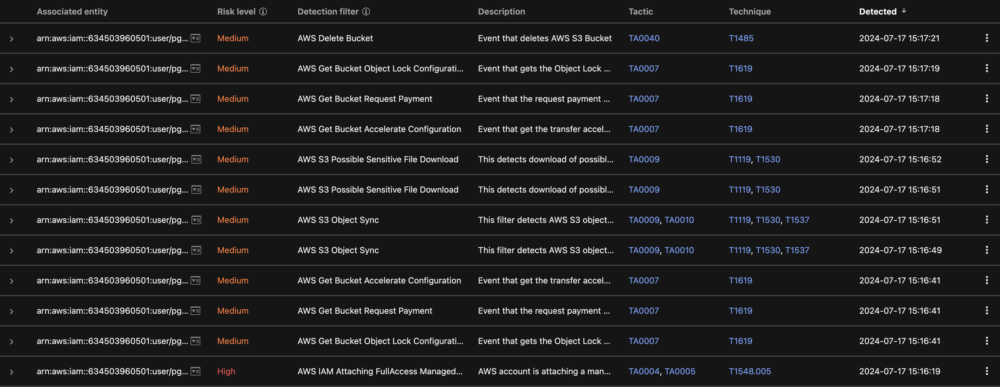

# Scenario: CloudTrail

## Prerequisites

- None

## Overview

Automated malicious actions are executed on running this scenario which lead to detections in Observed Attack Techniques and the generation of Workbenches.

## The story

Somehow an attacker gained the ability to create a user in your AWS account. The user he creates allows him to enumerate over your S3 buckets and to search for credentials to download.

Screenshot of generated OATs:



## Run the Attack

So, this is very simple :-)

```sh
# Create the user, search buckets, download credentials
pgo --apply scenarios-cloudtrail

# Delete the user again
pgo --destroy scenarios-cloudtrail
```

Review the detections in Vision One.

🎉 Success 🎉
