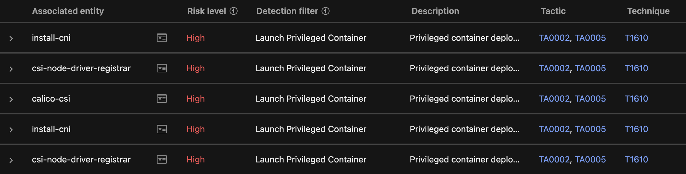

# Scenario: Detection Model Exceptions for Container Security

This scenario can be useful, if you don't want to use namespace exclusions in Container Security but don't want OATs/Workbenches generated for known as-designed behavior. In this example we're dealing with two exceptions for privileged containers created by Calico and Istio.

Without namespace exclusions the deployment of Calico and Istio would generate a couple of OATs in Vision One:




Here, we're going to set exceptions for these detections.

## Prerequisites

- Playground One EKS EC2
- Vision One Container Security

Verify, that you have `Deploy Calico` and `Deploy Istio` enabled in your configuration.

```sh
pgo --config
```

```sh
...
Section: Kubernetes Deployments
Please set/update your Integrations configuration
...
Deploy Calico? [true]:
...
Deploy Istio? [true]:
...
```


## Container Security

### Deploy Policy

Generally, one does not want to run privileged containers, but there might be some reasons for them. So below we're configuring a policy which blocks containers with extended privileges but allows them in two dedicated namespaces:

Below, the upper parts of the deployment policy:


### Runtime Rules

The runtime rules assigned to the policy do have rule `TM-00000031` assigned:


## Detection Model Management

### Detection Model Exception for Calico

Calico creates two violations against the runtime rule `TM-00000031` by the containers `flexvol-driver`, `csi-node-driver-registrar`, and `calico-csi`. This is by design and can be excluded.

Example on `calico-csi`:


This allows us to create an exception.

- Targets
    - Field: `ALL`
- Event Source
    - Event type: `ALL`
- Match Criteria
    - Field type: `detection_name`
    - Field: `ruleName`
    - Values: `.*Launch Privileged Container`
    - Edit using wildcards: Checked
- AND
    - Field type: `container_identifier`
    - Field: `k8sNamespace`
    - Values: `calico-system`
- AND
    - Field type: `container_identifier`
    - Field: `containerName`
    - Values: `calico-csi`

There are two more containers (`flexvol-driver` and `csi-node-driver-registrar`) triggering the same rule, so we simply add them to the filter. The resulting exception should look like this:


### Detection Model Exception for Istio

The deployment of Istio contains a CNI which runs as a privileged pod. This is by design and can be excluded with the exception below:


## Deploy the EKS Cluster

Create the PGO EKS-EC2 cluster by running

```sh
pgo --apply eks-ec2
```

## Verification

Amongst other namespaces you should have a couple of pods running inside the Calico and Istio namespaces:

```sh
kubectl get pods -A
```

```sh
NAMESPACE           NAME                                                         READY   STATUS    RESTARTS      AGE
calico-apiserver    calico-apiserver-546b9bf5dd-2f4pw                            1/1     Running   0             10m
calico-apiserver    calico-apiserver-546b9bf5dd-r249x                            1/1     Running   0             17m
calico-system       calico-kube-controllers-5cf8f69bdb-q47qt                     1/1     Running   0             10m
calico-system       calico-node-ltj46                                            1/1     Running   0             16m
calico-system       calico-node-qt52v                                            1/1     Running   0             18m
calico-system       calico-node-tp6mv                                            1/1     Running   0             10m
calico-system       calico-typha-59b58f479b-gwblv                                1/1     Running   0             10m
calico-system       calico-typha-59b58f479b-jp9mv                                1/1     Running   0             16m
calico-system       csi-node-driver-64tsw                                        2/2     Running   0             9m56s
calico-system       csi-node-driver-gzj9d                                        2/2     Running   0             18m
calico-system       csi-node-driver-w264r                                        2/2     Running   0             16m
istio-system        istio-cni-node-6xxlt                                         1/1     Running   0             16m
istio-system        istio-cni-node-96qpv                                         1/1     Running   0             10m
istio-system        istio-cni-node-kc98b                                         1/1     Running   0             18m
istio-system        istio-ingressgateway-9cc99c9db-g7qc4                         1/1     Running   0             10m
istio-system        istiod-68659fc5b5-trvn9                                      1/1     Running   0             19m
```

This proves, that Calico and Istio are up including their `cni` nodes.

Head over to `XDR Threat Investigation -> Observed Attack Techniques` and verify, that there are no OATs listed in regards Privileged Containers.

🎉 Success 🎉
