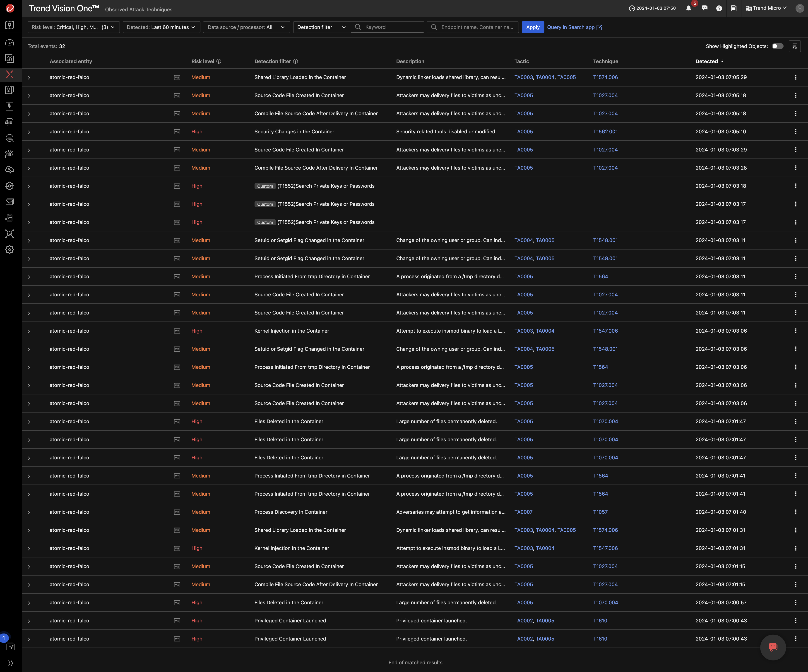

# Scenario: Automated Observed Attack Techniques Generation

***IN WORK***

## Prerequisites

- Playground One EKS EC2 or Fargate Cluster
- Vision One Container Security
- Playground One Scenarios

Ensure to have the EKS EC2 or Fargate Cluster including the Scenarios up and running:

```sh
# EC2 only
pgo --apply eks-ec2
pgo --apply scenarios-ec2
```

or

```sh
# Fargate
pgo --apply eks-fg
pgo --apply scenarios-fg
```

## Disclaimer

> ***Note:*** It is highly recommended to have the `awsone.access_ip` set to a single IP or at least a small CIDR before deploying the EKS cluster. This will prevent anonymous users playing with your environmnent. Remember: we're using vulnerable apps.

## Overview

Automated malicious actions are executed every full hour on your cluster which lead to detections in Container Security Observed Attack Techniques and the generation of Workbenches.

## The story

Several attack techniques will be detected after the deployment depending on your Container Security Runtime Policy. For full coverage enable all rules and set them to `Log`.

Since the attacks are executed every full hour there is no need to scroll through the detections.

Screenshot of generated OATs:



## Goals

Review the detections in Vision One.

🎉 Success 🎉
