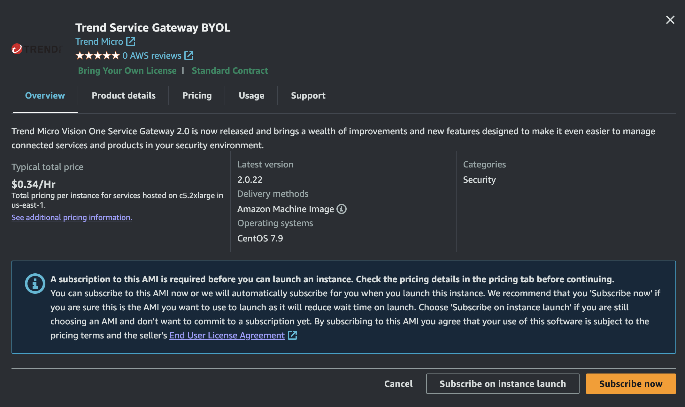
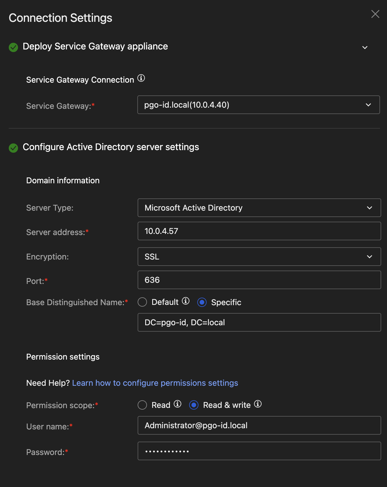

# Scenario: Zero Trust Secure Access Environment Setup

This scenario prepares an environment to play with Vision One Zero Trust Secure Access in AWS. It includes the following assets:

- Microsoft Windows Domain including a Certification Authority
- A Windows Server standalone
- A Windows Member Server
- A Linux host running a dockerized web application
- Vision One Service Gateway including Active Directory integration
- Vision One Private Access Gateway

## Prerequisites

- Playground One Network with PGO Active Directory
- Activated Marketplace AMI for Trend Service Gateway BYOL

You need to have activated the Trend Service Gateway BYOL AMI in Marketplace once. To do this, on the AWS Console choose the service EC2 and navigate to `Images --> AMI Catalog`. Select the tab `AWS Marketplace AMIs` and seach for `Trend Micro Service Gateway`.


There should only be one AMI shown for your current region. Click on `[Select]` and `[Subscribe on instance launch]`. 



Now, check your Playground One configuration.

Verify, that you have the following three services enabled in your configuration.

```sh
pgo --config
```

```sh
...
AD - create PGO Active Directory? [true]:
AWS SG - create Service Gateway [true]:
PAC - create Private Access Gateway? [true]:
...
```

```sh
pgo --apply network
```

The Service Gateway gets a dedicated AWS Security Group assigned which allows SSH from your configured access IP(s) only. All other ports are only accessible from within the public and private subnets.

The above `pgo --apply` will create some output:

```sh
ad_admin_password = <sensitive>
ad_ca_ip = "54.93.162.135"  # Public IP of the Certification Authority
ad_dc_ip = "3.71.102.69"  # Public IP of the Domain Controller
ad_dc_pip = "10.0.4.57"  # Private IP of the Domain Controller
ad_domain_admin = "Administrator"
ad_domain_name = "pgo-id.local"
...
sg_ami = "ami-076cc3a0b6e31d873"  # AMI used for the Service Gateway
sg_va_ip = "18.194.239.58"  # Public IP of the Service Gateway
sg_va_ssh = "ssh -i /home/markus/projects/opensource/playground/playground-one/pgo-key-pair-oaxuizlr.pem -o StrictHostKeyChecking=no admin@18.194.239.58"  # SSH Connection to Service Gateway
...
ad_admin_password = TrendMicro.1  # Administrator Password for Active Directory
```

!!! info "Log in to Domain Controller"

    After the network has been set up, the service gateway has been deployed, and Active Directory has stabilized after about 10 minutes, you must authenticate to the domain controller using RDP at least once. Don't ask why. 

    Use the public IP of the domain controller `ad_dc_ip` and the username `Administrator@<your environment name>.local` and connect via RDP.

## Configure the Service Gateway

### Get the Vision One API Key for the Service Gateway

In Vision One head over to `Workflow and Automation -> Service Gateway Management` and click on `[Download Virtual Appliance]`.


In this scenario, you do not need to download the virtual appliance as we will be using an AWS Marketplace AMI. Simply copy the registration token shown at the bottom right and save it in a safe place.


### Activate the Service Gateway

Back to your console/shell run the following command (adapt the parameters to your environment):

```sh
pgo --output network
```

```sh
...
sg_va_ssh = "ssh -i /home/markus/projects/opensource/playground/playground-one/pgo-key-pair-oaxuizlr.pem -o StrictHostKeyChecking=no admin@18.194.239.58"
...
mad_admin_password = XrJ*5VPDZGmhhL70
```

The interesting value here is `sg_va_ssh`. Run the given command to connect to the Service Gateway.

```sh
ssh -i /home/markus/projects/opensource/playground/playground-one/pgo-key-pair-oaxuizlr.pem -o StrictHostKeyChecking=no admin@18.194.239.58
```


```sh
enable

# Optionally
configure endpoint <some name, e.g. pgozt>

register <your API Token from the first step>
```

It can take some time for the Service Gateway to show up in the console.

### Install On-premise directory connection

In Vision One head over to `Workflow and Automation -> Service Gateway Management` again. There should now be a Service Gateway listed. Select it, click on `Manage Services` just in the center, and download the `On-premise directory connection` to the gateway.


Since the Playground One is able to create two different Active Directories depending on what you have enabled in your configuration continue if the following chapters.

## Deploy the Instances and the Private Access Gateway

Run

```sh
pgo --apply scenarios-zerotrust
```

The above will create the following instances:

- A ubuntu based Linux server running a docker based Jellyfish web application
- A standalone windows server 2022
- A domain joined windows server 2022
- A Private Access Gateway

All relevant information is shown in the output:

```sh
ad_admin_password = <sensitive>
ad_ca_ip = "54.93.162.135"
ad_dc_ip = "3.71.102.69"
ad_dc_pip = "10.0.4.57"
ad_domain_admin = "Administrator"
ad_domain_name = "pgo-id.local"
ad_users_dn = "CN=Users,DC=pgo-id,DC=local"
linux_pip = [
  [
    "10.0.4.19",
  ],
]
linux_ssh = [
  tolist([
    "ssh -i /home/markus/projects/opensource/playground/playground-one/pgo-id-key-pair-ee6i8qnb.pem -o StrictHostKeyChecking=no ubuntu@3.123.129.154",
  ]),
]
pac_ami = "ami-029c673cf28a3d376"
pac_va_ip = "18.185.79.240"
pac_va_ssh = "ssh -i /home/markus/projects/opensource/playground/playground-one/pgo-zt-key-pair-rmh0wu4t.pem -o StrictHostKeyChecking=no admin@18.185.79.240"
win_dns_names = [
  [
    "ec2-18-159-52-223.eu-central-1.compute.amazonaws.com",
    "ec2-18-192-22-223.eu-central-1.compute.amazonaws.com",
  ],
]
win_ips = [
  [
    "18.159.52.223",
    "18.192.22.223",
  ],
]
win_local_admin_password = <sensitive>
win_local_admin_username = "admin"
win_pips = [
  [
    "10.0.4.158",
    "10.0.4.119",
  ],
]
ad_admin_password = TrendMicro.1
win_local_admin_password = dfE[ENw+$v9XfCB+
```

Here you see two public, private and dns_names for the windows machines. The first refers to the standalone server, the second to the domain joined instance.

## Connect the PGO Active Directory

From within your console/shell run the following command (or find the output from the previous step):

```sh
pgo --output network
```

```sh
...
ad_ca_ip = "54.93.162.135"
ad_dc_ip = "3.71.102.69"
ad_dc_pip = "10.0.4.57"
...
ad_admin_password = TrendMicro.1
```

The interesting values are now `ad_dc_pip` and the `ad_admin_password`.

Lastly, in the Connection Settings choose the following parameters:

- Server Type: Microsoft Active Directory
- Server address: One of the private IPs out of `ad_dc_pip`
- Encryption: `SSL`
- Port: `636`
- Base Distinguished Name: `Specific`, value: `DC=<your environment name>, DC=local`
- Permission scope: `Read & write`
- User Name: `Administrator@<your environment name>.local`
- Password: `ad_admin_password`

Example with environment name `pgo-id`:



This should connect the Active Directory to Vision One via the Service Gateway.

!!! info "Connect does not work"
    
    If connecting to the Active Directory via the Third-Party Integration does still not work reboot the Domain Controller once.

### (Optionally) Install Security Event Forwarding

Using the PGO Active Directory allows you to utilize the Security Event Forwarding. For this functionality you need to download the current installation package on the Domain Controller and walk through the installation procedure. For this scenario the setup package is already available in the downloads folder of the Domain Member Server.

To access the downloads folder from the Domain Controller open the explorer and point to `\\10.0.4.119\C$\Downloads`.

Run `trend-micro-vision-one-ad-connector` and install. 


Follow the workflow and file in the IP and API Key of your Service Gateway.


Heading back to the Active Directory integration of Vision One the agent should be listed after a short period of time.


Your environment should now be ready to play with Zero Trust Secure Access.

## Configure the Private Access Gateway

### Get the Vision One API Key for the Private Access Gateway

In Vision One head over to `Zero Trust Secure Access -> Secure Access Conifugraion -> Private Access Configuration` and click on `[Add Private Access Connector Group]`.


Click the `[+]` and copy the registration token shown at the bottom right and save it in a safe place.


### Activate the Private Access Gateway

Back to your console/shell run the following command (adapt the parameters to your environment):

```sh
pgo --output scenarios-zertrust
```

```sh
...
pac_va_ssh = "ssh -i /home/markus/projects/opensource/playground/playground-one/pgo-zt-key-pair-rmh0wu4t.pem -o StrictHostKeyChecking=no admin@18.185.79.240"
...
```

The interesting value here is `pac_va_ssh`. Run the given command to connect to the Service Gateway.

```sh
ssh -i /home/markus/projects/opensource/playground/playground-one/pgo-zt-key-pair-rmh0wu4t.pem -o StrictHostKeyChecking=no admin@18.185.79.240
```

!!! warning "Register"

    Not fully functional yet

```sh
 ********************************************
 *      WARNING: Authorized Access Only     *
 ********************************************
        
Mon Oct 21 04:43:47 PDT 2024

Company ID: 0fcd4xxx-xxxx-xxxx-xxxx-xxxxxxxxxxxx
Connector ID: e126exxx-xxxx-xxxx-xxxx-xxxxxxxxxxxx
> passwd
New password: 
Retype new password: 
Password changed successfully.
Run the "enable" command to enter privileged mode.
> enable
Password: 

Entering privileged mode...
# register <registration token>
```

It can take some time for the Private Access Gateway to show up in the console.

## Test Access the Web Application

A dockerized Jellyfin is deployed on the Linux server. At any time you can retrieve it's private IP address by running

```sh
pgo --output scenarios-zerotrust
```

```sh
...
linux_pip = [
  [
    "10.0.4.19",
  ],
]
...
```

On any of the windows machines open the URL `http://<linux_ip>:8096`


Set a username and password and follow the initial configuration and optionally add a Media Library.


🎉 Success 🎉
